# Billing & Quota Plan — Decision Document

**Encore Mortgage CRM Platform** · June 2026  
**Purpose:** Align product, finance, and engineering on platform-owner billing, usage quotas, and margins before implementation.

**Status:** Draft for decisions — not yet implemented in code.

**North star:** **One integrated billing & quota system** for platform_owner — SMS, voice, email, scheduler, broadcast, **Mortgi AI**, and database visibility — not parallel silos.

**Rollout:** Ship behind **per-tenant DB feature flags** (§16). Default **`off`** until you deliberately advance modes. **No deploy required to turn on** — only SQL/settings updates once code is live.

**Stripe gate:** **`enforce`**, platform fee collection ($499/mo), and overage top-ups **must not** be enabled until **Stripe** is integrated (D9a). Safe pre-Stripe modes: `off` · `shadow` · `warn` (meter + UI only — no blocks, no charges).

---

## Table of contents

0. [Activation brief — how to turn it on](#0-activation-brief--how-to-turn-it-on)
1. [Executive summary](#1-executive-summary)
2. [Integrated architecture](#2-integrated-architecture) — **all channels, including broadcast**
3. [Flow & profit diagrams](#3-flow--profit-diagrams) — **billing cycle, channels, margins**
4. [Usage & cost flow](#4-usage--cost-flow)
5. [Current state in the codebase](#5-current-state-in-the-codebase)
6. [Vendor COGS (unit economics)](#6-vendor-cogs-unit-economics)
7. [Observed usage (tenant 1, last 30 days)](#7-observed-usage-tenant-1-last-30-days)
8. [Monthly spend model](#8-monthly-spend-model)
9. [Proposed quota model (TiDB Cloud–style)](#9-proposed-quota-model-tidb-cloudstyle)
10. [Broadcast economics](#10-broadcast-economics) — incl. [§10.5 Mortgi AI](#105-mortgi-ai--dedicated-billing-section)
11. [Twilio phone numbers](#11-twilio-phone-numbers)
12. [Decision log](#12-decision-log)
13. [Implementation phases](#13-implementation-phases)
14. [Open questions](#14-open-questions)
15. [Platform owner budget calculator](#15-platform-owner-budget-calculator)
16. [Feature flags & safe rollout](#16-feature-flags--safe-rollout)

---

## 0. Activation brief — how to turn it on

Use this section when implementation is done. Until then, everything below is **planned behavior**.

### What you are turning on (5 quota dimensions + UI)

| Layer | Flag / control | What it does when ON |
|-------|----------------|----------------------|
| **1. UI** | `billing_ui_enabled` | `/admin/billing` visible to `platform_owner` (meters, broadcast section, calculator) |
| **2. Metering** | `billing_quota_mode` ≥ `shadow` | Records usage in `tenant_usage_period` + ledger; **does not block sends** in shadow/warn |
| **3. Warnings** | `billing_quota_mode` = `warn` | 80% banners + optional email to platform_owner |
| **4. Enforcement** | `billing_quota_mode` = `enforce` | Blocks at 100% unless top-up / overage; broadcast uses unified reserve |
| **5. Mortgi AI** | Same mode as above | `mortgi_ai_tokens` pool; per-user 50/day cap always on |

### Rollout ladder (recommended order)

```text
Step 0  Deploy code          billing_quota_mode = off     (production unchanged)
Step 1  Shadow metering      billing_quota_mode = shadow  (record only, zero blocks)
Step 2  Show dashboard       billing_ui_enabled = true    (read-only + calculator)
Step 3  Warn owners          billing_quota_mode = warn      (banners, still no blocks)
Step 4  Enforce quotas       billing_quota_mode = enforce   (blocks when over 100%)
```

### One-page cheat sheet

| Goal | Set these (tenant 1 example) |
|------|------------------------------|
| **Do nothing (today)** | `billing_quota_mode` = `off` |
| **Test in prod safely** | `shadow` + `billing_ui_enabled` = true |
| **Owner sees warnings only** | `warn` + `billing_ui_enabled` = true |
| **Full billing (GA)** | `enforce` + Stripe live + `$499/mo` in `tenant_subscription` |
| **Emergency off** | `billing_quota_mode` = `off` (instant, no deploy) |

**Do not set `enforce` until Stripe is live** — otherwise owners hit hard blocks at 100% with no way to pay.

**Included monthly quotas (GA):** 1,000 SMS · 1,500 voice min · 5,000 email · 100 scheduler · **500,000 Mortgi tokens** · $499 platform fee.

### SQL to flip flags (after migration adds keys)

```sql
-- Tenant 1 — Encore (adjust tenant_id)
SET @tid = 1;

-- Step 1: shadow (safe — no blocks)
UPDATE system_settings SET setting_value = 'shadow'
  WHERE tenant_id = @tid AND setting_key = 'billing_quota_mode';
INSERT IGNORE INTO system_settings (tenant_id, setting_key, setting_value, setting_type, description)
VALUES (@tid, 'billing_quota_mode', 'shadow', 'string', 'off|shadow|warn|enforce — quota enforcement mode');

-- Step 2: show billing page
UPDATE system_settings SET setting_value = 'true'
  WHERE tenant_id = @tid AND setting_key = 'billing_ui_enabled';
INSERT IGNORE INTO system_settings (tenant_id, setting_key, setting_value, setting_type, description)
VALUES (@tid, 'billing_ui_enabled', 'true', 'boolean', 'Show /admin/billing to platform_owner');

-- Step 5: enforce (only when ready)
-- UPDATE system_settings SET setting_value = 'enforce'
--   WHERE tenant_id = @tid AND setting_key = 'billing_quota_mode';

-- Emergency rollback
-- UPDATE system_settings SET setting_value = 'off'
--   WHERE tenant_id = @tid AND setting_key = 'billing_quota_mode';
```

### What still works when flags are `off`

- All SMS, email, voice, scheduler, broadcasts (unchanged)
- `broadcast_daily_*` abuse caps (unchanged)
- TiDB `DatabaseQuotaBanner` (unchanged)

### What changes when `enforce` is on

- Sends that exceed monthly included quota return **402 / quota_exceeded** (unless overage enabled)
- Broadcast pre-send **reserve** checks unified SMS/email pool (same as conversational)
- `/admin/billing` shows **Increase quota** / top-up flow

### Who can change flags

| Actor | How |
|-------|-----|
| **Engineering** | SQL on `system_settings` or migration seed |
| **Platform owner (future)** | Settings → Billing (optional UI for `warn` only; `enforce` changes require engineering/finance) |

### Go / no-go before `enforce`

- [ ] **Stripe integrated** — Checkout, Customer Portal, webhooks for platform fee + overage packs (D9a)
- [ ] Shadow run ≥ 7 days; meter totals match Twilio/Resend within ~10%
- [ ] Finance approved $499 + included quotas (§9, D1–D6)
- [ ] `$499/mo` platform fee configured in `tenant_subscription` + Stripe price/product
- [ ] Platform owner trained on broadcast orange section + blast COGS estimate
- [ ] Rollback tested: `off` restores prior behavior in &lt; 1 min

---

## 1. Executive summary

| Topic | Recommendation (pending approval) |
|-------|-----------------------------------|
| **Who pays** | `platform_owner` per tenant (mortgage company), not individual brokers |
| **Platform fee** | **$499/mo** per tenant (~$144 above ~$355 COGS at current Encore volume — revisit when Zoom seats grow) |
| **Quota style** | **Single `QuotaService`** — all billable actions (including broadcast) call the same API |
| **Integration** | Broadcast uses **same** SMS/email meters as everything else — one pool, `source=broadcast` breakdown in UI |
| **Broadcast** | Pre-send `QuotaService.reserve()` on SMS/email segments; `broadcast_daily_*` stays as 24h abuse cap only |
| **Diagrams** | **§3** — flows, profit, top-up, broadcast, rollout (for reviews) |
| **Budget calculator** | **§15** — formulas + interactive Canvas (ship in `/admin/billing` later) |
| **Safety** | Keep `broadcast_daily_*` as **abuse guardrails** only; monthly limits come from unified plan |
| **Unit cost** | **$0.012/SMS segment** for planning, reserve, and overage packs |
| **Email vendor** | Code uses **Resend** (not SendGrid) for outbound — finance docs should align |
| **Twilio numbers** | ~**2 active numbers** today (1 shared + 1 broker-assigned), not one per broker |
| **Rollout** | Default **`off`** (no behavior change) → `shadow` → `warn` (pre-Stripe OK) → **`enforce` only after Stripe** (§0, §16) |

**Net:** At current volume, platform fee at $499 yields ~**$144/mo** gross margin per tenant before overages; additional profit from overage packs, extra phone lines, and multi-tenant scale. One dashboard, one “increase quota” flow. **Turn on without redeploy** via `system_settings` once built.

---

## 2. Integrated architecture

### 2.1 One system — target state

Every billable action goes through **`QuotaService`** before the vendor is called. The admin billing page reads **one** usage API. Broadcast is not a side door.

```mermaid
flowchart TB
  subgraph AdminUI["/admin/billing — single dashboard"]
    PO[platform_owner]
    PO --> Plan[Plan + subscription]
    PO --> Meters[Unified meters + breakdown by source]
    PO --> TopUp[Increase quota — one flow per dimension]
    PO --> TwilioN[Twilio numbers]
  end

  subgraph QuotaLayer["QuotaService — api/lib/quota.ts"]
    Q[consume / reserve / release / getUsage]
    Q --> SMS[sms_segments]
    Q --> VOX[voice_minutes]
    Q --> EM[email_sends]
    Q --> SCH[scheduler_bookings]
    Q --> MG[mortgi_ai_tokens]
    Q --> DBQ[database — TiDB passthrough]
  end

  subgraph Callers["All product entry points"]
    C1[sendSMSMessage]
    C2[Voice / calls]
    C3[Resend / email]
    C4[Scheduler book]
    C5[realtor-broadcasts send]
    C6[reminder flows cron]
    C7[POST /api/ai/chat — Mortgi]
  end

  subgraph Storage["TiDB"]
    Sub[tenant_subscription]
    Period[tenant_usage_period]
    Ledger[tenant_usage_ledger]
    Reserve[tenant_usage_reservations]
    Comms[(communications.cost)]
  end

  C1 & C2 & C3 & C4 & C5 & C6 & C7 --> Q
  PO --> GET["GET /api/billing/usage"] --> Period
  PO --> POST["POST /api/billing/top-up"] --> Period

  Q --> Period
  Q --> Ledger
  Q --> Reserve

  C5 -.->|abuse only| Daily[broadcast_daily_* caps]

  C1 & C5 --> Twilio[Twilio]
  C3 & C4 & C5 --> Resend[Resend]
  DBQ --> TiDB[TiDB Cloud]
```

### 2.2 Unified dimensions (what the owner buys)

| Dimension | `tenant_usage_period` key | Counted when | Includes broadcast? |
|-----------|---------------------------|--------------|---------------------|
| SMS | `sms_segments` | Every outbound SMS segment (convo, flow, OTP, **blast**) | **Yes** — same bucket |
| Voice | `voice_minutes` | Call duration billed | No |
| Email | `email_sends` | Every outbound email (convo, flow, scheduler, **blast**) | **Yes** — same bucket |
| Scheduler | `scheduler_bookings` | New `scheduled_meetings` row | No |
| **Mortgi AI** | `mortgi_ai_tokens` | Groq tokens on `POST /api/ai/chat` (`tokens_used` in `ai_chat_sessions`) | No — **separate** from SMS |
| Database | — | TiDB native quota | Separate banner (unchanged) |

**Billing UI breakdown (read-only, not separate limits):**  
Ledger rows carry `source`: `conversation` | `reminder_flow` | `broadcast` | `scheduler` | `otp` | `mortgi` so the owner sees *where* usage went without managing separate meters per channel.

**Why one SMS bucket is correct for your data:**  
Last 30d tenant 1 had **831** outbound SMS **segments** (**418** broadcast + **413** conversational). One pool matches Twilio’s invoice.

**Burst safety (monthly plan + daily caps):**

1. **`QuotaService.reserve()`** before a broadcast starts (estimated segments + emails).  
2. **`release()` / `capture()`** per recipient (reuse today’s reserve/capture pattern).  
3. **`broadcast_daily_*`** stays as 24h abuse cap (not the monthly plan).  
4. Optional plan flag: `max_recipients_per_blast` (product decision).

---

### 2.3 Unified quota sequence (all channels including broadcast)

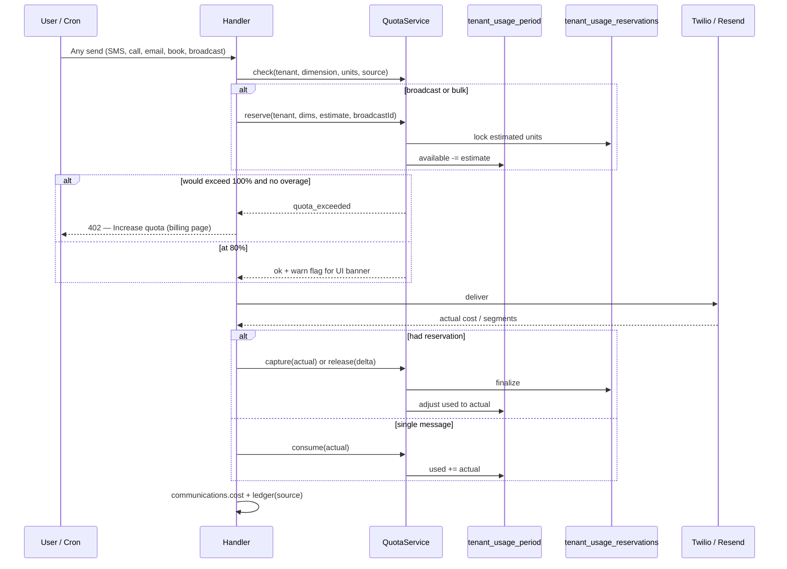

---

### 2.4 Broadcast under unified quota

Broadcast is **not** a separate billing product. It draws from the tenant’s included SMS/email pools like any other outbound send.

| Step | Behavior |
|------|----------|
| **Estimate** | `recipients × segments_per_body` (+ email if `channel=both`) |
| **Reserve** | `QuotaService.reserve(tenantId, { sms_segments, email_sends }, source: broadcast)` before send starts |
| **Capture** | On successful delivery; **release** on failure |
| **UI** | Orange “Broadcasting” section on `/admin/billing` — same quotas, visible breakdown |
| **Abuse** | `broadcast_daily_*` caps (24h) — independent of monthly plan |

Broadcast Center confirm modal shows **remaining SMS segments** from the unified pool, not a separate dollar balance.

---

### 2.5 Revenue vs COGS (conceptual)

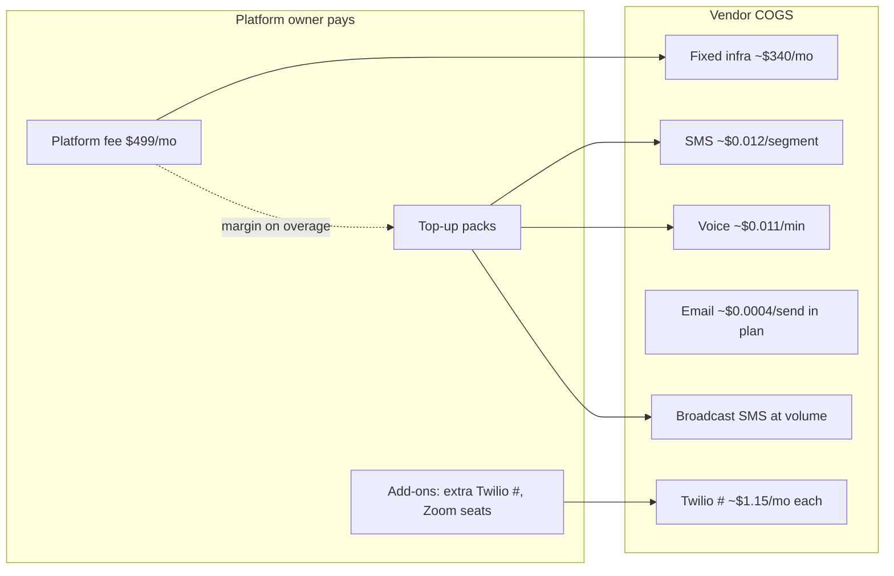

---

## 3. Flow & profit diagrams

Visual reference for stakeholders. All flows assume **integrated `QuotaService`** (§2).

---

### 3.1 Platform owner — billing lifecycle

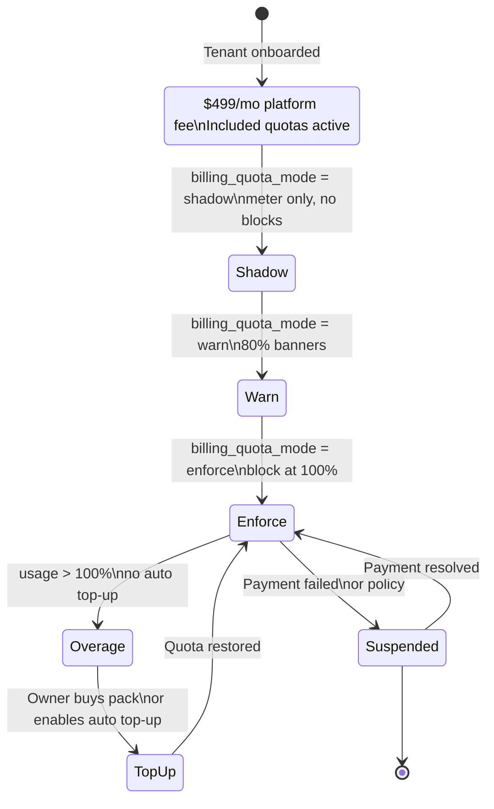

---

### 3.2 Money flow — who pays whom

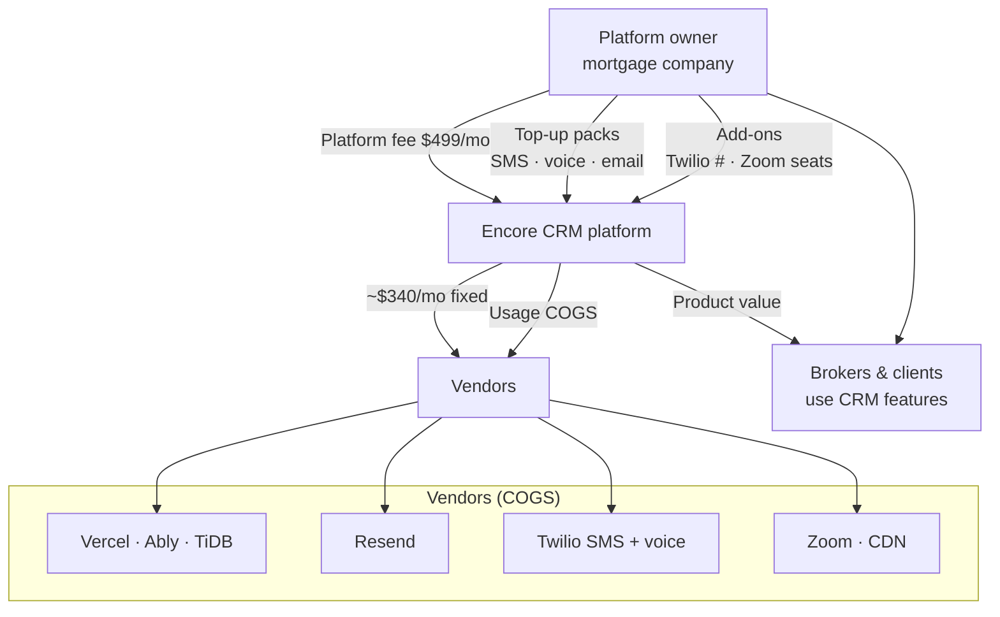

---

### 3.3 Profit waterfall (monthly, Encore-scale example)

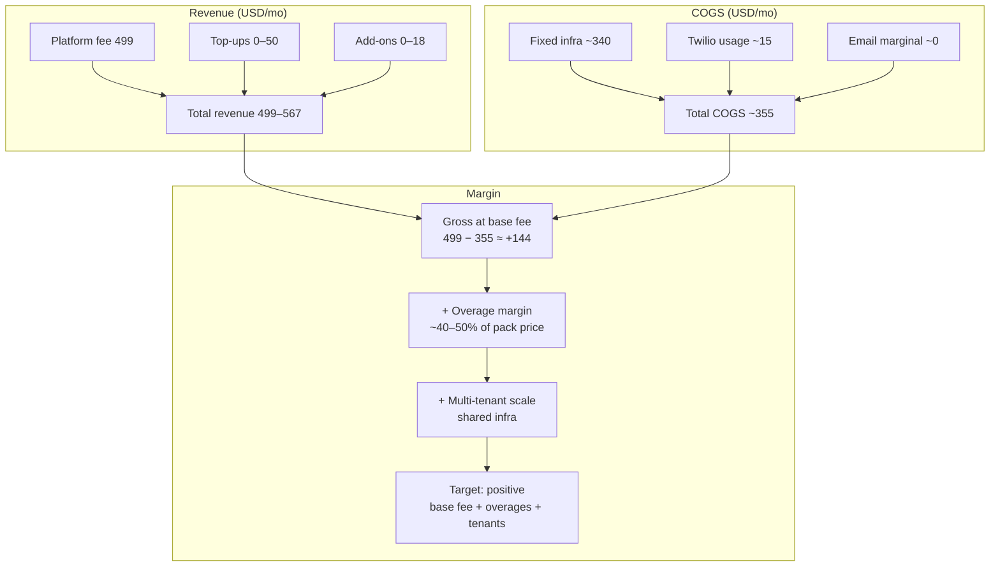

| Scenario | Revenue | COGS | Gross margin | Notes |
|----------|---------|------|--------------|-------|
| Base plan only | $499 | ~$355 | **~+$144** | Platform fee covers COGS with headroom |
| Plan + $36 SMS top-up | $535 | ~$367 | **~+$168** | ~50% margin on $18 pack COGS ~$12 |
| 3 tenants @ $499 | $1,497 | ~$500–600 | **~+$900** | Infra sub-linear |

---

### 3.4 Unit economics — retail vs COGS per pack

```mermaid
flowchart LR
  subgraph SMS["+1,000 SMS segments"]
    SC[COGS ~$12]
    SR[Retail $18]
    SM[Margin ~$6 · 50%]
    SC --> SR --> SM
  end

  subgraph VOX["+1,000 voice minutes"]
    VC[COGS ~$11]
    VR[Retail $18]
    VM[Margin ~$7 · 64%]
    VC --> VR --> VM
  end

  subgraph EM["+1,000 emails"]
    EC[COGS ~$1]
    ER[Retail $5]
    EM[Margin ~$4 · high]
    EC --> ER --> EM
  end

  subgraph Plat["Platform fee $499"]
    PF[Covers fixed infra ~$340]
    PU[Usage included:\n1k SMS · 1.5k min · 5k email]
    PF --- PU
  end
```

---

### 3.5 Integrated quota flow — every channel

```mermaid
flowchart TD
  Start([Billable action]) --> Which{Channel?}

  Which -->|SMS| S1[sendSMSMessage / flow / OTP / Mortgi]
  Which -->|Voice| V1[Call start/end]
  Which -->|Email| E1[Resend send]
  Which -->|Scheduler| Sch1[Book meeting]
  Which -->|Broadcast| B1[POST realtor-broadcasts]

  S1 & V1 & E1 & Sch1 --> Q[QuotaService.check]
  B1 --> Daily{broadcast_daily_* OK?}
  Daily -->|no| Block1[429 daily cap]
  Daily -->|yes| Q

  Q --> Pct{Usage %?}
  Pct -->|< 80%| OK[consume or reserve]
  Pct -->|80–99%| Warn[consume + warn banner]
  Pct -->|100%| Ovg{Overage or top-up?}
  Ovg -->|yes| OK
  Ovg -->|no| Block2[402 Increase quota]

  OK --> Vendor[Twilio / Resend]
  Vendor --> Ledger[tenant_usage_ledger\n+ communications.cost]
  Ledger --> UI[/admin/billing meters]
```

---

### 3.6 Broadcast flow (integrated — reserve → send → capture)

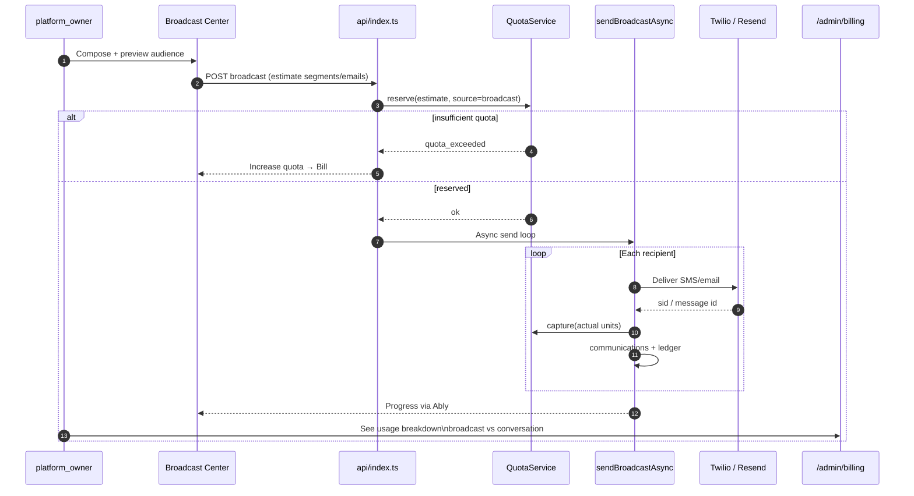

---

### 3.7 Conversational SMS / email flow (non-broadcast)

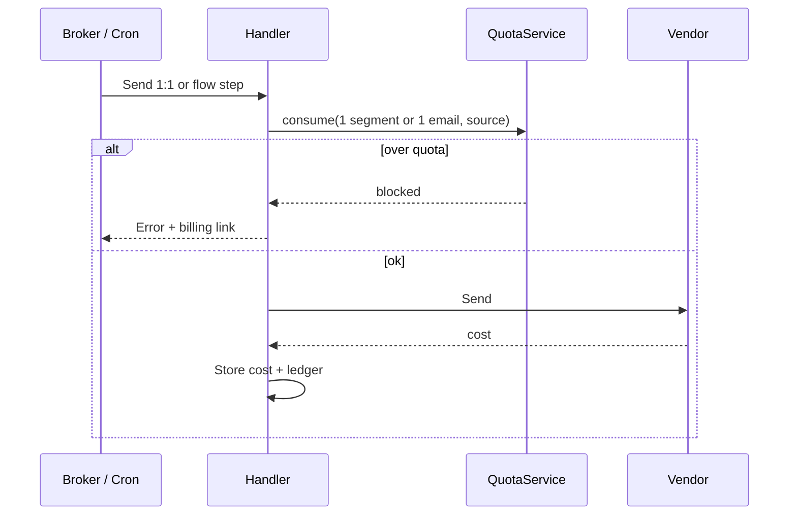

---

### 3.8 Monthly billing period reset

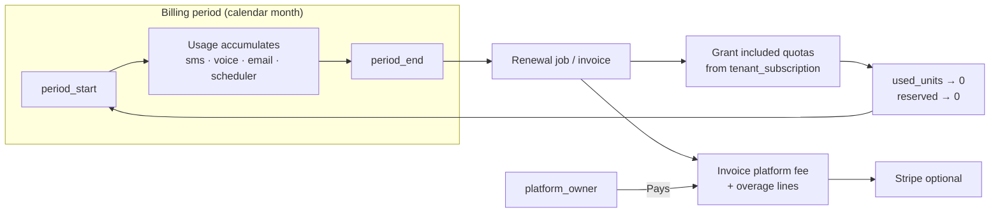

---

### 3.9 Top-up / “increase quota” flow

```mermaid
flowchart TD
  A[Owner sees 80% or 100% banner] --> B{At 100%?}
  B -->|yes| C[Send blocked until action]
  B -->|no| D[Can still send + warning]
  C & D --> E[/admin/billing]
  E --> F[Choose pack:\nSMS · voice · email]
  F --> G{Payment}
  G -->|Stripe| H[Checkout success webhook]
  G -->|Manual| I[Finance applies top_up ledger]
  H & I --> J[QuotaService.grant\nbonus units]
  J --> K[Meters refresh\nowner continues]
```

---

### 3.10 COGS vs retail — one blast example (500 recipients, 2 segments)

```mermaid
flowchart TB
  subgraph Blast["Broadcast: 500 × 2 SMS segments = 1,000 segments"]
    U[Units: 1,000 sms_segments]
  end

  U --> Cogs[COGS: 1000 × $0.012 = $12.00]
  U --> Incl{Within 1,000\nincluded/mo?}
  Incl -->|yes| R0[Owner pays $0 marginal\nalready in platform fee]
  Incl -->|no| Over[Need +1,000 pack]
  Over --> Retail[Retail pack $18]
  Over --> Margin[Margin ~$6 on blast overage]

  Cogs -.->|if under-segmented| Loss[Underestimate blast cost\n— use ceil(len/160)]
```

---

### 3.11 Quota rollout decision flow (operations)

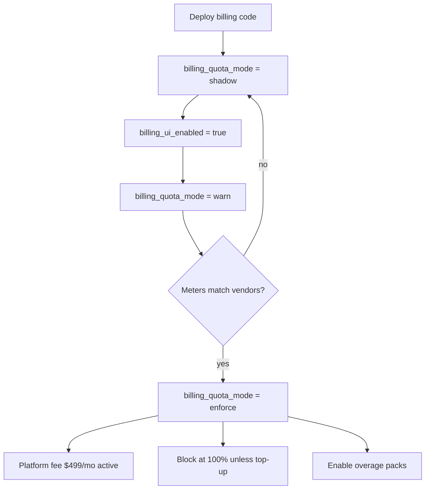

---

### 3.12 Diagram index

| § | Diagram | Use in meetings |
|---|---------|-----------------|
| 3.1 | Billing lifecycle | When does owner start paying? |
| 3.2 | Money flow | Who pays whom |
| 3.3 | Profit waterfall | Finance / margin discussion |
| 3.4 | Unit economics | Pricing packs |
| 3.5 | Quota flow all channels | Engineering integration |
| 3.6 | Broadcast sequence | Blast + quota |
| 3.7 | Convo send sequence | Day-to-day CRM |
| 3.8 | Period reset | Cron / billing ops |
| 3.9 | Top-up flow | UX + Stripe |
| 3.10 | Blast COGS example | Why broadcast pricing matters |
| 3.11 | Quota rollout | Go-live checklist |

---

## 4. Usage & cost flow

### 4.1 Dimensions map to product features

| Quota dimension | Product surface | Primary vendor |
|-----------------|-----------------|----------------|
| **SMS** | Conversations, reminder flows, OTP, Mortgi | Twilio |
| **Voice** | In-browser / Twilio voice, voicemail | Twilio |
| **Email** | Conversations, flows, scheduler invites, templates | Resend |
| **Scheduler** | Public booking, reminders, O365 sync jobs | Resend + platform compute |
| **Broadcast** | Realtor Broadcast Center (platform_owner) | Twilio SMS + Resend email |
| **Database** | All features | TiDB Cloud (existing quota banner) |

### 4.2 Enforcement matrix (today → integrated target)

| Dimension | Today | Integrated target (`QuotaService`) |
|-----------|-------|----------------------------------|
| **SMS (all sources)** | ❌ No tenant quota | ✅ `sms_segments` — convo + flow + broadcast + OTP |
| **Email (all sources)** | Daily broadcast cap only | ✅ `email_sends` — convo + flow + broadcast + scheduler |
| **Voice** | ❌ None | ✅ `voice_minutes` |
| **Scheduler** | ❌ None | ✅ `scheduler_bookings` |
| **Broadcast abuse** | ✅ `broadcast_daily_*` | ✅ Keep as 24h guardrail (not monthly plan) |
| **Database** | ✅ TiDB → `DatabaseQuotaBanner` | ✅ Unchanged — linked from same billing page |
| **Mortgi AI** | ✅ Per-user daily cap (50) + Groq 429 flag | ✅ `mortgi_ai_tokens` tenant pool + keep `mortgi_daily_message_limit` as abuse cap |

### 4.3 What is *not* in broker-level billing (v1)

- Per-broker invoices (only platform_owner tenant billing in v1)
- Per-client billing
- WhatsApp (if enabled later — add dimension)

---

## 5. Current state in the codebase

| Capability | Location | Notes |
|------------|----------|-------|
| Broadcast reserve | `realtor-broadcasts` send paths | Wire to `QuotaService.reserve` / `capture` (§2.4) at billing launch |
| Daily broadcast caps | `broadcast_daily_*` | Keep as 24h abuse guardrail alongside monthly quota |
| DB quota UX | `shared/database-quota.ts`, `DatabaseQuotaBanner` | TiDB ER 1105 |
| Mortgi daily cap | `mortgi_daily_message_limit` | Default 50; Groq quota flag |
| Platform owner role | `brokers.role = 'platform_owner'` | Broadcast + settings gated |
| Cost on communications | `communications.cost` column | **Not populated** from Twilio price today |
| Infra cost audit | `docs/INFRASTRUCTURE_COST_AUDIT.md` | Excludes Twilio |
| Finance intake | `docs/FINANCE_TEAM_INTAKE.md` | References SendGrid — **outdated vs code** |

**Gaps to build:** `QuotaService`, `tenant_subscription`, `tenant_usage_period`, `tenant_usage_ledger`, `tenant_usage_reservations`, `/admin/billing`, **Stripe** (required before `enforce`).

### 5.1 Proposed tables (integrated)

```sql
-- Plan + billing period (per tenant)
tenant_subscription (
  tenant_id, plan_code, status, platform_fee_usd,
  period_start, period_end,
  included_sms_segments, included_voice_minutes, included_email_sends,
  included_scheduler_bookings,
  overage_enabled, stripe_customer_id, ...
)

-- One row per tenant per period per dimension (or JSON blob — team choice)
tenant_usage_period (
  tenant_id, period_start,
  dimension ENUM('sms_segments','voice_minutes','email_sends','scheduler_bookings','mortgi_ai_tokens'),
  included_units, used_units, reserved_units,
  PRIMARY KEY (tenant_id, period_start, dimension)
)

-- Immutable audit (powers UI breakdown by source)
tenant_usage_ledger (
  id, tenant_id, dimension, units, source, ref_type, ref_id,
  action ENUM('grant','consume','reserve','capture','release','top_up'),
  created_at, metadata_json
)

-- In-flight broadcast / bulk jobs
tenant_usage_reservations (
  id, tenant_id, broadcast_id NULL, units_json, expires_at, status
)
```

---

## 6. Vendor COGS (unit economics)

### 6.1 SMS (US long code, outbound)

| Component | USD / segment |
|-----------|----------------|
| Twilio base | $0.0083 |
| Carrier fee (typical) | $0.003 – $0.0065 |
| **Planning rate (all-in)** | **$0.012** |
| Planning rate (billing) | $0.012 |

Multi-segment: `ceil(body_length / 160)` segments.

### 6.2 Voice (US, blended)

| Direction | ~USD / minute |
|-----------|----------------|
| Outbound | $0.014 |
| Inbound (local) | $0.0085 |
| **Planning rate** | **$0.011** |

### 6.3 Email (Resend Pro)

| Item | Value |
|------|--------|
| Plan | $20/mo for 50,000 emails |
| Effective | ~$0.0004 / email |
| Overage | $0.90 / 1,000 emails |

### 6.4 Fixed infrastructure (single tenant, mid scenario)

See `docs/INFRASTRUCTURE_COST_AUDIT.md` — **~$260–380/mo** without Twilio (Vercel, Ably, TiDB, Resend, CDN, Zoom for ~10 brokers).

### 6.5 Twilio numbers

| Item | USD / month |
|------|----------------|
| US local number | ~$1.15 each |
| 10DLC registration | One-time + campaign fees (amortize ~$5–15/mo) |

### 6.6 Mortgi AI (Groq — `llama-3.3-70b-versatile`)

| Item | Value |
|------|--------|
| Provider | Groq API (`GROQ_API_KEY`) |
| Model | `llama-3.3-70b-versatile`, `max_tokens: 1024`, up to 5 tool rounds |
| Meter in DB | `ai_chat_sessions.tokens_used` (summed per tenant) |
| **Planning COGS** | **~$0.70 / 1M tokens** blended (~$0.0000007/token) |
| Typical exchange | **~400–1,200 tokens** per user message (higher with tools) |
| Per-user abuse cap (today) | `mortgi_daily_message_limit` = **50** messages/day (unchanged) |
| Platform kill switch | `mortgi_quota_exceeded` when Groq returns **429** (unchanged) |

At Encore volume (**802 tokens / 30d**), Mortgi COGS ≈ **$0.001/mo** — negligible vs SMS/voice; quota is for **fair use + future growth**, not current spend.

---

## 7. Observed usage (tenant 1, last 30 days)

Snapshot from production DB (June 2026). Use for calibration; re-run before locking quotas.

| Meter | 30-day value |
|-------|----------------|
| Outbound SMS segments (all) | 831 |
| Broadcast SMS segments | 418 |
| Conversational SMS segments | 413 |
| Outbound emails | 1,036 |
| Calls logged | 329 (244 inbound, 85 outbound) |
| Recorded call duration (subset) | ~177 minutes (103 calls with `recording_duration`) |
| Scheduler bookings created | 7 |
| **Mortgi AI tokens** | **802** |
| **Mortgi sessions** | **1** |
| **Mortgi user messages (est.)** | **~1** |
| Brokers in tenant | 224 |
| Brokers with `twilio_phone_sid` | 1 |
| Brokers with `twilio_caller_id` only | 1 |
| `communications.cost` populated | No (zeros) |

**Heuristic:** Included quotas below use **~2.5× observed** rounded to clean numbers.

---

## 8. Monthly spend model

### 8.1 COGS estimate (Encore-scale today)

| Line item | Estimate (USD/mo) |
|-----------|-------------------|
| Infra (audit mid-case) | ~340 |
| Twilio numbers (×2) | ~2 |
| SMS (831 × $0.012) | ~10 |
| Voice (~694 min est. × $0.011) | ~8 |
| Email (1,037 in Resend plan) | ~0 marginal |
| Mortgi AI (802 tokens × $0.0000007) | ~0 |
| **Total COGS** | **~358** |

### 8.2 Platform fee & quotas

| Item | Value |
|------|-------|
| **Platform fee** | **$499/mo** (charged from billing go-live) |
| **Included quotas** | SMS, voice, email, scheduler, Mortgi — see §9.1 |
| **Enforcement** | Gradual via `billing_quota_mode`: `shadow` → `warn` → `enforce` |
| **Abuse guardrails** | `broadcast_daily_*` + Mortgi per-user daily cap (always on) |

---

## 9. Proposed quota model (TiDB Cloud–style)

### 9.1 Included monthly buckets (integrated — single plan)

All sources share the same counters. Observed 30d already **includes** broadcast inside SMS/email totals.

| Dimension | Observed 30d (total) | Proposed included | Notes |
|-----------|----------------------|-------------------|-------|
| **SMS segments** | **831** (413 convo + 418 broadcast) | **1,000** | One meter; UI splits by `source` |
| **Voice minutes** | ~177–1000 est. | **1,500** | |
| **Email sends** | **1,036** (incl. broadcast email when used) | **5,000** | |
| **Scheduler bookings** | 7 | **100** | |
| **Mortgi AI tokens** | **802** | **500,000** | ~625 user msgs/mo at 800 tok/msg |
| **Database** | — | **Pass-through** | TiDB banner + link from billing |

### 9.2 Overage / top-up retail (proposal)

| Pack | COGS (approx) | Retail (proposal) | Margin |
|------|---------------|-------------------|--------|
| +1,000 SMS segments | ~$12 | **$18** | ~50% |
| +1,000 voice minutes | ~$11 | **$18** | ~64% |
| +1,000 emails | ~$1 | **$5** | high |
| +50 scheduler bookings | ~$0 | **$10** | policy |
| +100,000 Mortgi AI tokens | ~$0.07 | **$5** | high margin |
| Extra Twilio number | ~$1.15+ | **$9/mo** add-on | covers admin |

No separate “broadcast wallet” top-up — owner buys **+1,000 SMS** or **+1,000 emails** (same packs as conversational).

### 9.3 Internal units (one ledger)

```
sms_segments      = ceil(body/160) per outbound SMS (any source)
voice_minutes     = ceil(duration_sec / 60)
email_sends       = 1 per outbound email (any source)
scheduler_bookings = 1 per new scheduled_meeting
mortgi_ai_tokens   = completion.usage.total_tokens per /api/ai/chat (incl. tool rounds)

ledger.source     = conversation | reminder_flow | broadcast | scheduler | otp | mortgi_broker | mortgi_client
```

### 9.4 UX thresholds (match TiDB pattern)

| Threshold | Action |
|-----------|--------|
| **80%** | Banner + optional email to platform_owner |
| **100%** | Block sends OR auto top-up if payment method on file |
| **DB quota** | Existing `DatabaseQuotaBanner` (unchanged) |

---

## 10. Broadcast economics

### 10.1 Why broadcast feels expensive

1. **Multi-segment bodies** — STOP footer + long copy → 2+ segments per recipient.
2. **Burst volume** — 500 recipients × $0.012 ≈ **$6** per blast (2 segments each) ≈ **$12**.
3. **Share of pool** — tenant 1: 418 / 831 SMS segments (50%) from broadcast in 30d.
4. **Compliance** — A2P, STOP handler, opt-in; operational cost beyond Twilio.

### 10.2 Example blast costs (planning)

| Recipients | 1 segment | 2 segments |
|------------|-----------|------------|
| 100 | $1.20 | $2.40 |
| 500 | $6.00 | $12.00 |
| 2,000 | $24.00 | $48.00 |

### 10.3 Broadcast under integrated quotas

| Concern | Mitigation |
|---------|------------|
| One blast uses entire SMS bucket | **Pre-flight `reserve()`** + confirmation UI shows segment estimate; owner must top up before send |
| Hard to see broadcast vs convo cost | Ledger `source=broadcast` + billing page breakdown (not separate wallets) |
| Compliance / burst | Keep `broadcast_daily_*` + optional `max_recipients_per_blast` |

**Recommendation:** Integrated SMS/email meters (§2.2) + reserve/capture + daily abuse caps. One pool, orange broadcast breakdown on `/admin/billing`.

### 10.4 Dedicated “Broadcasting” section in billing UI

Broadcasting stays on the **same SMS/email quotas** (§2.2), but the billing page gives it a **prominent own section** because it is usually the **largest variable cost** (tenant 1: **418 / 831 segments = 50%** from broadcast in the last 30 days).

```
┌──────────────────────────────────────────────────────────────┐
│  📣 BROADCASTING — highest cost area                        │
├──────────────────────────────────────────────────────────────┤
│  Expended (30d)          │  Forecast (your inputs)          │
│  418 SMS segments        │  400 segments (2×100×2)          │
│  COGS ~$5.02             │  COGS ~$4.80 / mo                │
│  42% of SMS included     │  40% of SMS included alone       │
│  ─────────────────────────────────────────────────────────── │
│  [████████████░░░░░░] 418/1000 broadcast-only bar (orange)   │
│  Per blast COGS: ~$2.40 (100 recv × 2 seg × $0.012)         │
│  Before send: reserve + confirm (QuotaService)               │
│  Daily guardrail: 200 SMS / 500 email per 24h                │
└──────────────────────────────────────────────────────────────┘
```

| UI element | Purpose |
|------------|---------|
| **Orange usage bar** | Broadcast SMS only vs 1,000 included (not hidden inside total SMS) |
| **Stacked SMS bar** | Blue = conversational, orange = broadcast, red = overage |
| **COGS per blast** | `recipients × segments × $0.012` (+ email if enabled) |
| **% of variable COGS** | Shows broadcast share of Twilio/Resend variable spend |
| **Pre-send estimate** | Broadcast Center confirm modal uses same math as `computeBroadcastEconomics()` |

**Calculator:** Canvas + `shared/billing-calculator.ts` → `computeBroadcastEconomics()`.

**Optional plan knob (D13b):** cap broadcast at e.g. **500 SMS segments/mo** inside the 1,000 SMS pool — only if finance wants a hard sub-limit.

### 10.5 Mortgi AI — dedicated billing section

Mortgi is **not SMS** — it bills **Groq tokens** via `ai_chat_sessions.tokens_used`. Give it its own **purple** meter on `/admin/billing` (broadcast uses **orange** for SMS burst cost).

| UI element | Source |
|------------|--------|
| Tokens used / included | `SUM(tokens_used)` per billing period |
| Sessions | `COUNT(*)` from `ai_chat_sessions` |
| COGS | tokens × $0.0000007 (~$0.70 / 1M) |
| Per-user cap (abuse) | `mortgi_daily_message_limit` (50/day) — **not** the monthly plan |
| Kill switch | `mortgi_quota_exceeded` on Groq 429 — disables Mortgi globally |

**Wire point (when built):** after successful `groqClient.chat.completions.create` in `/api/ai/chat`:

```typescript
await quotaService.consume(tenantId, {
  dimension: "mortgi_ai_tokens",
  units: tokensUsed,
  source: userType === "broker" ? "mortgi_broker" : "mortgi_client",
  ref_type: "ai_chat_session",
  ref_id: sessionId,
});
```

**Enforcement order:** (1) per-user daily message limit (existing), (2) tenant monthly token pool (new), (3) Groq 429 → `mortgi_quota_exceeded` (existing).

**Expended (tenant 1, 30d):** **802 tokens** = **0.16%** of 500K included · COGS **~$0.001** · 1 session.

```
┌──────────────────────────────────────────────────────────────┐
│  🤖 MORTGI AI — Groq tokens (separate from SMS)             │
├──────────────────────────────────────────────────────────────┤
│  Expended (30d)          │  Forecast (your inputs)          │
│  802 tokens              │  50,000 tokens / mo              │
│  COGS ~$0.001            │  COGS ~$0.04 / mo                │
│  0.2% of included        │  10% of 500K included            │
│  ─────────────────────────────────────────────────────────── │
│  [█░░░░░░░░░░░░░░░░░] 802/500,000 (purple bar)              │
│  Per-user guardrail: 50 messages/day (unchanged)            │
│  Overage pack: +100,000 tokens → $5 retail                    │
└──────────────────────────────────────────────────────────────┘
```

---

## 11. Twilio phone numbers

### 11.1 Current inventory (expected)

| Number role | E.164 (from migration) | Assigned to |
|-------------|------------------------|-------------|
| Shared / company line | +1 562 337 0000 | No broker (`otp_from_number` / shared voice) |
| Personal broker line | +1 562 449 0000 | One broker (e.g. id=3) |

**DB:** 1 broker with `twilio_phone_sid`, 1 with `twilio_caller_id` only.  
**API:** Lists up to 50 numbers from Twilio account.

### 11.2 Scaling rule

Do **not** assume 1 number per broker (224 brokers ≠ 224 numbers).  
Charge **+$9/mo** per additional dedicated line if product offers per-broker caller ID.

---

## 12. Decision log

Record choices here after stakeholder review. Check one option per row.

### D1 — Platform fee

- [ ] **D1a** — **$499/mo** (recommended)  
- [ ] **D1b** — $399/mo (lower margin)  
- [ ] **D1c** — $549/mo (higher margin)  
- [ ] **D1d** — Custom: ___________

### D2 — Included SMS segments / month

- [ ] **D2a** — 1,000 (recommended)  
- [ ] **D2b** — 500 (tighter)  
- [ ] **D2c** — 2,500 (generous)  
- [ ] **D2d** — Custom: ___________

### D3 — Included voice minutes / month

- [ ] **D3a** — 1,500 (recommended)  
- [ ] **D3b** — 500  
- [ ] **D3c** — 3,000  
- [ ] **D3d** — Custom: ___________

### D4 — Included emails / month

- [ ] **D4a** — 5,000 (recommended)  
- [ ] **D4b** — 2,000  
- [ ] **D4c** — 10,000  
- [ ] **D4d** — Custom: ___________

### D5 — Scheduler bookings / month

- [ ] **D5a** — 100 (recommended)  
- [ ] **D5b** — Unlimited (no cap)  
- [ ] **D5c** — 50  
- [ ] **D5d** — Custom: ___________

### D6 — SMS bucket includes broadcast?

- [ ] **D6a** — **Yes — one `sms_segments` bucket** ← recommended (matches Twilio invoice + §2.2)  
- [ ] **D6b** — Split: X% reserved for broadcast only (more complex)  

### D8 — Behavior at 100% quota

- [ ] **D8a** — Hard block until top-up (recommended for GA)  
- [ ] **D8b** — Auto top-up if card on file  
- [ ] **D8c** — Soft block (warn only) until owner acknowledges; hard block after  

### D9 — Payment provider (required before `enforce`)

- [ ] **D9a** — **Stripe Checkout + Customer Portal + webhooks** (recommended — gate for GA)  
- [ ] **D9b** — Manual invoice (wire/ACH) — `shadow`/`warn` only; not sufficient for `enforce`  
- [ ] **D9c** — Other: ___________

### D10 — Extra Twilio number pricing

- [ ] **D10a** — $9/mo add-on (recommended)  
- [ ] **D10b** — Included up to N numbers: ___________  
- [ ] **D10c** — Pass-through $1.15 only  

### D11 — Multi-tenant SaaS pricing (future)

- [ ] **D11a** — Same plan per tenant ($499 + usage)  
- [ ] **D11b** — Tiered: Starter / Growth / Enterprise  
- [ ] **D11c** — Defer — single tenant only for 2026  

### D12 — Email vendor documentation

- [ ] **D12a** — Update finance docs to Resend (matches code)  
- [ ] **D12b** — Migrate code to SendGrid  
- [ ] **D12c** — Use both (not recommended)  

### D13 — Integration approach (primary architectural decision)

- [ ] **D13a** — **Full integration** — `QuotaService` for all channels; broadcast uses same SMS/email meters ← **recommended**  
- [ ] **D13b** — Integration + **separate sub-limits** on plan (e.g. max 500 broadcast segments/mo)  

---

## 13. Implementation phases

| Phase | Scope | Depends on |
|-------|--------|------------|
| **0** | Approve integrated model (D13a, D6a) + FF design (§16) | — |
| **1** | DB migration + `system_settings` billing flags (default **`off`**) + `QuotaService` + tables | §16 |
| **2** | Persist `communications.cost`; wire send paths in **`shadow`** mode only | D13 |
| **3** | Broadcast send → `QuotaService.reserve` / `capture` (§2.4) | D6 |
| **4** | `/admin/billing` gated by `billing_ui_enabled` | §0 |
| **5** | Flip tenant to **`warn`** in DB; monitor 1–2 weeks | Finance |
| **6** | **Stripe** (platform fee + overage) then **`enforce`** | D8, D9a |
| **7** | Multi-tenant plan tiers | D11 |

**Out of scope for v1:** Per-broker billing, client-facing invoices, WhatsApp quota.

**Rule:** Every phase must work with `billing_quota_mode = off` (production fallback).

---

## 14. Open questions

1. **Zoom licenses** — How many broker Zoom seats should the platform fee include vs add-on?  
2. ~~**Mortgi / Groq**~~ — **Resolved:** separate `mortgi_ai_tokens` pool (§10.5, D17a); keep per-user daily cap.  
3. **TiDB overage** — Pass-through to owner or absorb in platform fee?  
4. **Re-run usage SQL** — Refresh Section 6 before GA (volumes growing with broadcast).  
5. **Legal** — TCPA/SMS compliance costs in broadcast margin?  

### SQL to refresh usage (run monthly)

```sql
-- Tenant 1 usage snapshot (adjust tenant_id)
SELECT 'sms_30d' AS m, COUNT(*) AS v FROM communications
  WHERE tenant_id=1 AND communication_type='sms' AND direction='outbound'
  AND sent_at >= DATE_SUB(NOW(), INTERVAL 30 DAY);

SELECT 'email_30d', COUNT(*) FROM communications
  WHERE tenant_id=1 AND communication_type='email' AND direction='outbound'
  AND sent_at >= DATE_SUB(NOW(), INTERVAL 30 DAY);

SELECT 'calls_30d', COUNT(*) FROM communications
  WHERE tenant_id=1 AND communication_type='call'
  AND sent_at >= DATE_SUB(NOW(), INTERVAL 30 DAY);

SELECT 'broadcast_sms_30d', COUNT(*) FROM realtor_broadcast_recipients
  WHERE tenant_id=1 AND sms_status IN ('sent','delivered')
  AND sent_at >= DATE_SUB(NOW(), INTERVAL 30 DAY);

SELECT 'meetings_30d', COUNT(*) FROM scheduled_meetings
  WHERE tenant_id=1 AND created_at >= DATE_SUB(NOW(), INTERVAL 30 DAY);

SELECT 'twilio_assigned', COUNT(*) FROM brokers
  WHERE tenant_id=1 AND twilio_phone_sid IS NOT NULL AND twilio_phone_sid != '';
```

---

## 15. Platform owner budget calculator

Lets the platform_owner **predict monthly spend** before sending blasts or scaling team usage. Uses the **integrated** quotas from §9 (broadcast counts toward SMS/email).

### 15.1 Interactive tool (now)

Open the Cursor Canvas beside this doc:

**`platform-owner-budget-calculator.canvas.tsx`**  
(path: `.cursor/projects/.../canvases/platform-owner-budget-calculator.canvas.tsx`)

**Pre-filled with tenant-1 defaults (live DB mirror):** 413 convo SMS segments, 1,037 emails, 694 voice min est., 2 blasts × 100 × 2 segments.

**Refresh from DB:** `npx tsx scripts/refresh-billing-snapshot.ts`

**Outputs:**

- **Actual expended** — last 30 days from DB (usage units + COGS + owner total)
- Usage vs included bars (SMS, voice, email, scheduler, **Mortgi AI**)
- **Total owner pays / month** (forecast) = platform fee + overage packs + add-ons
- Optional internal COGS / margin (for finance reviews)

Logic is also in **`shared/billing-calculator.ts`** (`computeActualExpenditure`, `computeBudgetForecast`) for the future `/api/billing` endpoints.

### 15.2 What the platform owner has expended (tenant 1, last 30 days)

Snapshot **2026-05-06 → 2026-06-05** (refresh: `npx tsx scripts/refresh-billing-snapshot.ts`).

#### Usage consumed (against proposed monthly included quotas)

| Quota | Expended (units) | Included / mo | % used | Breakdown |
|-------|------------------|---------------|--------|-----------|
| **SMS segments** | **831** | 1,000 | **83%** | 413 conversational · **418 broadcast** |
| **Voice minutes** | **158** recorded · **~694** est.* | 1,500 | **11%** · **46%*** | 289 calls logged |
| **Email sends** | **1,037** | 5,000 | **21%** | 0 broadcast email in period |
| **Scheduler bookings** | **7** | 100 | **7%** | |
| **Mortgi AI tokens** | **802** | 500,000 | **0.2%** | 1 session; broker + client portals |

\*Many calls lack `recording_duration`; **694 min** assumes ~2.4 min/call for COGS planning. Billing UI should show **both** recorded and estimated.

#### Dollars (what that usage represents)

| Line | USD | Notes |
|------|-----|-------|
| Variable usage COGS (SMS + voice est. + email + Mortgi) | **~$18.02** | 831×$0.012 + 694×$0.011 + 1037×$0.0004 + 802×$0.0000007 |
| Fixed infra COGS (allocated) | **~$340** | Vercel, Ably, TiDB, Resend, Zoom, CDN — see infra audit |
| **Total platform COGS** | **~$358** | What it costs to run the tenant this month |
| Overage retail | **$0** | All dimensions under included caps |
| Platform fee | **$499** | Monthly subscription |
| Add-ons (e.g. 10 Zoom) | **~$133** | Often paid outside CRM invoice |
| **Owner total** | **~$632** | $499 + $0 overage + ~$133 Zoom |
| **Est. margin** | **~+$274** | Owner total − platform COGS |

#### Broadcasting expended (dedicated — highest cost)

| Metric | Last 30 days |
|--------|----------------|
| Broadcast SMS segments | **418** |
| Broadcast emails | **0** |
| **Broadcast COGS** | **~$5.02** (418 × $0.012) |
| **Share of all SMS** | **50%** (418 / 831) |
| **Share of variable COGS** | **~28%** (broadcast SMS only ÷ SMS+voice+email variable) |
| **% of included SMS pool** | **42%** (418 / 1,000) |
| Conversational SMS (remainder) | **413** |

One typical blast at 100 recipients × 2 segments ≈ **$2.40 COGS** per send.

#### `/admin/billing` — “Expended this period” (target UI)

```
┌─────────────────────────────────────────────────────────┐
│  Billing period: May 3 – Jun 2, 2026                   │
├─────────────────────────────────────────────────────────┤
│  📣 BROADCASTING (section)                               │
│  Expended: 418 SMS · COGS ~$5.02 · 50% of all SMS        │
│  Forecast: [blasts × recipients × segments]              │
├─────────────────────────────────────────────────────────┤
│  ALL CHANNELS                                            │
│  SMS      831 / 1,000  83%  (blue convo + orange bcast)  │
│  Voice    694 / 1,500  46%  │  Forecast total: ~$632    │
│  Email  1,037 / 5,000  21%  │                           │
│  Sched      7 / 100     7%  │                           │
├─────────────────────────────────────────────────────────┤
│  Owner total: ~$632  │  Platform COGS: ~$358  │  Margin: ~+$274 │
└─────────────────────────────────────────────────────────┘
```

### 15.3 Forecast inputs

| Input | Symbol | Example |
|-------|--------|---------|
| Conversational SMS segments / mo | `C_sms` | 413 |
| Emails / mo | `C_em` | 1,037 |
| Voice minutes / mo | `C_vox` | 694 |
| Scheduler bookings / mo | `C_sch` | 7 |
| Blasts / mo | `B` | 2 |
| Recipients per blast | `R` | 100 |
| SMS segments per recipient | `S` | 2 |
| Email per blast? | 0 or 1 | 0 |
| Extra Twilio numbers | `N_tw` | 0 |
| Zoom broker licenses | `N_zoom` | 10 |
| Mortgi AI tokens / mo | `T_mg` | 50,000 (forecast) / **802** (actual) |

### 15.4 Formulas

**Usage totals (integrated — broadcast inside SMS/email):**

```
blast_sms   = B × R × S
blast_email = B × R × (1 if email per blast else 0)

total_sms   = C_sms + blast_sms
total_email = C_em + blast_email
total_voice = C_vox
total_sched = C_sch
total_mortgi = T_mg   # from ai_chat_sessions.tokens_used
```

**Overage units (after included plan from §9.1):**

```
over_sms   = max(0, total_sms   − 1_000)
over_vox   = max(0, total_voice − 1_500)
over_em    = max(0, total_email − 5_000)
over_sch   = max(0, total_sched − 100)
over_mortgi = max(0, total_mortgi − 500_000)
```

**Overage retail (USD):**

```
overage_usd = ceil(over_sms / 1000) × $18
              + ceil(over_vox / 1000) × $18
              + ceil(over_em  / 1000) × $5
              + ceil(over_sch / 50)   × $10
              + ceil(over_mortgi / 100_000) × $5
```

**Owner monthly budget:**

```
platform_fee = $499

addons = N_tw × $9 + N_zoom × $13.33   // Zoom ≈ annual Pro avg

owner_total = platform_fee + overage_usd + addons
```

**Internal COGS estimate (optional):**

```
cogs ≈ $340 + total_sms×$0.012 + total_voice×$0.011 + total_email×$0.0004 + total_mortgi×$0.0000007 + N_tw×$1.15
margin ≈ owner_total − cogs
```

**Actual expenditure (from usage snapshot):**

```
variable_cogs = total_sms×$0.012 + voice_min×$0.011 + total_email×$0.0004
total_cogs    = $340 + variable_cogs
owner_total      = $499 + overage_retail + addons
estimated_margin = owner_total − total_cogs
```

### 15.5 Worked example (Encore defaults in Canvas)

| Line | Calculation | USD |
|------|-------------|-----|
| Blast SMS | 2 × 100 × 2 | 400 segments |
| Total SMS | 132 + 400 | 532 (under 1,000) |
| Platform fee | | $499.00 |
| Overage | none | $0.00 |
| Add-ons | 10 × $13.33 Zoom | $133.30 |
| **Owner total** | | **~$632.30** |

*(Zoom is often the largest add-on; adjust `N_zoom` in the calculator.)*

### 15.6 Heavy blast scenario (planning)

| Assumption | Value |
|------------|-------|
| 4 blasts / mo, 300 recipients, 2 segments | blast_sms = 2,400 |
| Convo SMS | 200 |
| **Total SMS** | **2,600** → over **1,600** |

| Line | USD |
|------|-----|
| Platform fee | $499 |
| SMS overage | ceil(1600/1000) × $18 = **$36** |
| **Subtotal** | **$535** (+ voice/email/add-ons if over) |

### 15.7 Product placement (after build)

| Surface | Purpose |
|---------|---------|
| **`/admin/billing`** tab “Estimate budget” | Same logic as Canvas; `platform_owner` only |
| **Broadcast confirm modal** | Live estimate: `B×R×S` segments against remaining SMS quota |
| **API** `POST /api/billing/estimate` | Optional JSON for mobile / integrations |

Shared module: **`shared/billing-calculator.ts`** — `computeActualExpenditure()`, `computeBudgetForecast()`, `TENANT_1_ACTUAL_30D`.

**API (planned):**

| Endpoint | Returns |
|----------|---------|
| `GET /api/billing/usage` | Current period: expended units, % of included, COGS, owner paid, subsidy |
| `GET /api/billing/estimate` | POST body → forecast breakdown (calculator) |

### 15.8 Refresh actual expenditure (live DB mirror)

**Recommended:** run the refresh script (updates `shared/billing-calculator.ts` + canvas):

```bash
npx tsx scripts/refresh-billing-snapshot.ts
# optional: npx tsx scripts/refresh-billing-snapshot.ts --tenant 2
```

SMS is counted as **segments** (`ceil(len/160)`), not message rows — matches §9.3 billing units.

**Manual SQL** (see `database/queries/tenant_billing_usage_30d.sql`):

```sql
-- Run for tenant_id = 1; last 30 days UTC
SET @tid = 1;
SET @since = DATE_SUB(UTC_TIMESTAMP(), INTERVAL 30 DAY);

SELECT 'convo_sms_segments' AS k, COALESCE(SUM(CEIL(GREATEST(CHAR_LENGTH(COALESCE(c.body,'')),1)/160.0)),0) AS v
  FROM communications c WHERE tenant_id = @tid AND communication_type = 'sms' AND direction = 'outbound'
  AND COALESCE(sent_at, created_at) >= @since
  AND NOT EXISTS (SELECT 1 FROM realtor_broadcast_recipients r WHERE r.tenant_id = @tid AND r.sms_ext_id = c.external_id);

SELECT 'broadcast_sms_segments' AS k, COALESCE(SUM(CEIL(GREATEST(CHAR_LENGTH(COALESCE(rb.body_sms,'')),1)/160.0)),0) AS v
  FROM realtor_broadcast_recipients r JOIN realtor_broadcasts rb ON rb.id = r.broadcast_id
  WHERE r.tenant_id = @tid AND r.sms_status IN ('sent','delivered') AND r.sent_at >= @since;

SELECT 'email_total' AS k, COUNT(*) AS v FROM communications
  WHERE tenant_id = @tid AND communication_type = 'email' AND direction = 'outbound'
  AND sent_at >= @since;

SELECT 'broadcast_email' AS k, COUNT(*) AS v FROM realtor_broadcast_recipients
  WHERE tenant_id = @tid AND email_status = 'sent' AND sent_at >= @since;

SELECT 'calls' AS k, COUNT(*) AS v FROM communications
  WHERE tenant_id = @tid AND communication_type = 'call' AND sent_at >= @since;

SELECT 'voice_min_recorded' AS k, COALESCE(SUM(recording_duration),0)/60 AS v
  FROM communications
  WHERE tenant_id = @tid AND communication_type = 'call' AND sent_at >= @since;

SELECT 'scheduler_bookings' AS k, COUNT(*) AS v FROM scheduled_meetings
  WHERE tenant_id = @tid AND created_at >= @since;

SELECT 'mortgi_tokens_30d' AS k, COALESCE(SUM(tokens_used),0) AS v
  FROM ai_chat_sessions WHERE tenant_id = @tid AND updated_at >= @since;

SELECT 'mortgi_sessions_30d', COUNT(*) FROM ai_chat_sessions
  WHERE tenant_id = @tid AND created_at >= @since;

SELECT 'mortgi_messages_30d', COALESCE(SUM(JSON_LENGTH(messages)/2),0)
  FROM ai_chat_sessions WHERE tenant_id = @tid AND updated_at >= @since;
```

The script writes `TENANT_1_ACTUAL_30D` in `shared/billing-calculator.ts` and `ACTUAL_30D` in the budget canvas automatically.

### 15.9 Decision

- [ ] **D14a** — Ship calculator in **Canvas + doc** only until `/admin/billing` exists ← interim  
- [ ] **D14b** — Require calculator in **Phase 4** `/admin/billing` MVP  
- [ ] **D14c** — Show estimate in **broadcast confirm** step (recommended with D14b)  

### D15 — Feature flag storage

- [ ] **D15a** — `system_settings` keys per tenant (recommended for v1) ← matches `enable_sms` pattern  
- [ ] **D15b** — Only on `tenant_subscription` row  
- [ ] **D15c** — Both (settings override subscription default)  

### D17 — Mortgi AI monthly quota

- [ ] **D17a** — **500,000 tokens / month** tenant pool (recommended; ~625 msgs at 800 tok)  
- [ ] **D17b** — **1,000,000 tokens / month** (more headroom)  
- [ ] **D17c** — Bundle unlimited into platform fee (meter only, no enforce)  
- [ ] **D17d** — Custom: ___________ tokens  

---


## 16. Feature flags & safe rollout

### 16.1 Why modes, not a single boolean

| Approach | Problem |
|----------|---------|
| `billing_enabled = true` | Instantly turns on UI + hard blocks together — risky |
| **`billing_quota_mode` enum** | Turn on metering, then UI, then enforcement **independently** |

### 16.2 Settings keys (per tenant)

| Key | Type | Default | Values |
|-----|------|---------|--------|
| `billing_quota_mode` | string | **`off`** | `off` · `shadow` · `warn` · `enforce` |
| `billing_ui_enabled` | boolean | **`false`** | Show `/admin/billing` |
| `billing_overage_enabled` | boolean | **`false`** | Auto top-up / allow overage packs when over 100% |
| `billing_enforce_broadcast_daily` | boolean | **`true`** | Keep `broadcast_daily_*` even in enforce (recommended) |

Seed SQL example:

```sql
INSERT IGNORE INTO system_settings (tenant_id, setting_key, setting_value, setting_type, description)
VALUES
  (1, 'billing_quota_mode', 'off', 'string', 'off|shadow|warn|enforce'),
  (1, 'billing_ui_enabled', 'false', 'boolean', 'Show /admin/billing'),
  (1, 'billing_overage_enabled', 'false', 'boolean', 'Allow usage beyond included quota');
```

### 16.3 Runtime behavior matrix

| Mode | Record usage | Show UI (if enabled) | 80% warn | Block at 100% | Broadcast reserve |
|------|--------------|----------------------|----------|---------------|-------------------|
| **off** | No | If UI on, static/empty or “coming soon” | No | No | No quota check |
| **shadow** | Yes, ledger | Live meters | No | **No** | Log only |
| **warn** | Yes | Live meters + banners | **Yes** | **No** | Warn + log |
| **enforce** | Yes | Full + top-up | Yes | **Yes** | Unified SMS/email reserve |

### 16.4 `QuotaService` pseudocode

```typescript
async function checkQuota(tenantId: number, req: ConsumeRequest): Promise<QuotaResult> {
  const mode = await getSetting(tenantId, "billing_quota_mode", "off");
  if (mode === "off") return { allowed: true };

  const usage = await recordAndEvaluate(tenantId, req); // always in shadow+

  if (mode === "shadow") return { allowed: true, usage };

  if (mode === "warn") {
    return {
      allowed: true,
      usage,
      warn: usage.pct >= 80,
    };
  }

  // enforce
  if (usage.pct >= 100 && !(await isOverageEnabled(tenantId)))
    return { allowed: false, quota_exceeded: true, usage };

  return { allowed: true, usage };
}

async function reserveBroadcast(tenantId: number, estimate: Units) {
  const mode = await getSetting(tenantId, "billing_quota_mode", "off");
  if (mode === "off") return { allowed: true };

  return quotaService.reserve(tenantId, estimate, { source: "broadcast" });
}
```

### 16.5 API: expose mode to client (optional)

`GET /api/broker/profile` or `GET /api/billing/config` for `platform_owner`:

```json
{
  "billing_quota_mode": "warn",
  "billing_ui_enabled": true,
  "platform_fee_usd": 499
}
```

Client shows `DatabaseQuotaBanner`-style **`BillingQuotaBanner`** when `warn` or blocked.

### 16.6 Rollback playbook

| Incident | Action | Time |
|----------|--------|------|
| False blocks | `billing_quota_mode` → `off` | &lt; 1 min |
| UI confusion | `billing_ui_enabled` → `false` | &lt; 1 min |
| Broadcast failures | `billing_quota_mode` → `off` | &lt; 1 min |
| Bad meter data | `shadow` only while fixing ledger | No user impact |

No code deploy required for rollback if flags are in DB.

### 16.7 Diagram — flag states

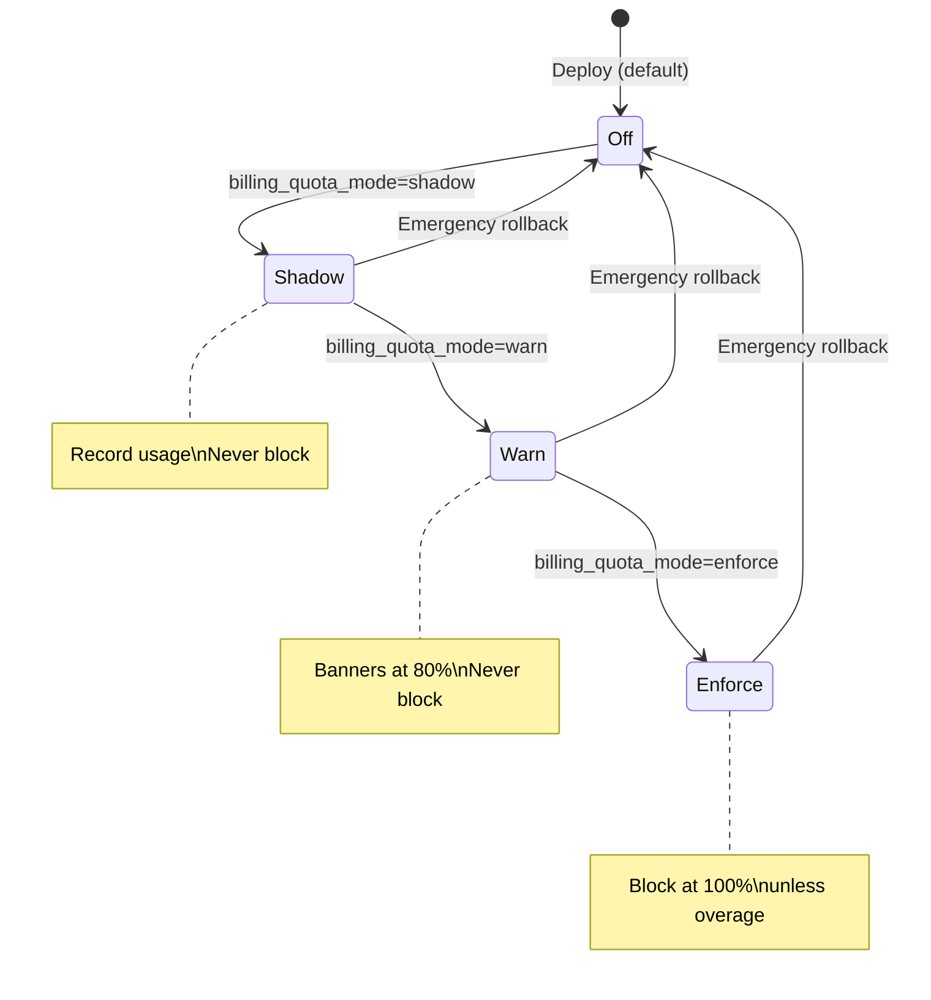

---

## References

| Document | Path |
|----------|------|
| Budget calculator (Canvas) | `canvases/platform-owner-budget-calculator.canvas.tsx` |
| Budget math (shared) | `shared/billing-calculator.ts` |
| Infrastructure cost audit | `docs/INFRASTRUCTURE_COST_AUDIT.md` |
| Finance team intake | `docs/FINANCE_TEAM_INTAKE.md` |
| Broadcast proposal & caps | `docs/REALTOR_BROADCAST_PROPOSAL.md` |
| DB quota helper | `shared/database-quota.ts` |
| Activation / feature flags | §0, §16 |

---

_Prepared for internal decision-making · Update decision log (Section 11) after review meeting. **Turn-on guide: §0.**_
