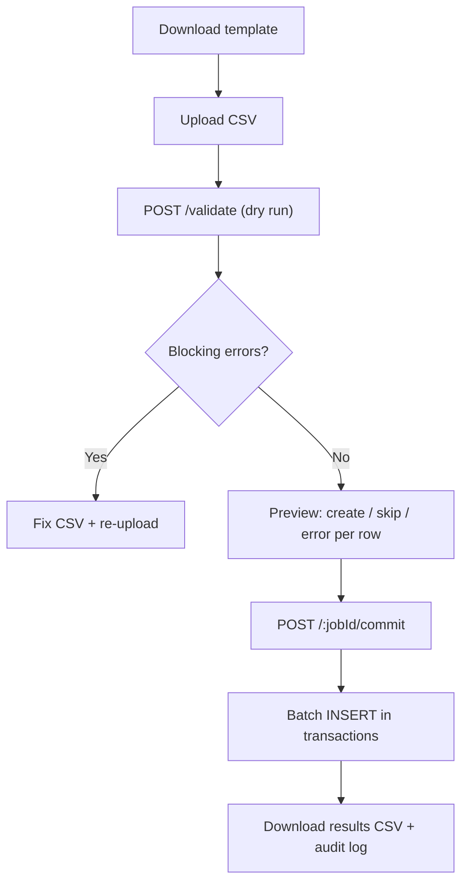

# Bulk CSV Import — Clients & Realtor Management

> **Status:** Proposed (not implemented)  
> **Access:** `platform_owner` only  
> **Surfaces:** `/admin/clients` · `/admin/brokers` (Realtor Management)  
> **Related:** [ROLES_AND_PERMISSIONS.md](./ROLES_AND_PERMISSIONS.md), [REALTOR_MANAGEMENT_MB_ACCESS_PLAN.md](./REALTOR_MANAGEMENT_MB_ACCESS_PLAN.md), [OWNERSHIP_MODEL.md](./OWNERSHIP_MODEL.md)

---

## Table of contents

1. [Executive summary](#1-executive-summary)
2. [Ownership rules](#2-ownership-rules)
3. [Client import](#3-client-import)
4. [Realtor / people import](#4-realtor--people-import)
5. [Access control](#5-access-control)
6. [Workflow](#6-workflow)
7. [Validation pipeline](#7-validation-pipeline)
8. [API surface](#8-api-surface)
9. [Database artifacts](#9-database-artifacts)
10. [UI/UX](#10-uiux)
11. [Phasing](#11-phasing)
12. [Non-goals (v1)](#12-non-goals-v1)
13. [Edge test scenarios](#13-edge-test-scenarios)
14. [Implementation checklist](#14-implementation-checklist)
15. [Source file index](#15-source-file-index)

---

## 1. Executive summary

Platform owners need a **safe, validated** way to bulk-create:

| Import type | Target table(s) | Key controlled field |
|-------------|-----------------|----------------------|
| **Clients** | `clients` | `lead_source` → `clients.source` |
| **People** | `brokers` (+ optional `broker_profiles`) | `partner_type` → `brokers.role` |

**Every record created by bulk import is owned by the platform owner performing the import** — no broker-email columns in CSV.

**Pattern:** Download template → upload → **dry-run validate** → preview → **commit** → downloadable results CSV.

**Passwords:** Not collected. `clients.password_hash` remains `NULL` (passwordless portal; 100% of existing clients have NULL today). `brokers` has no password column.

---

## 2. Ownership rules

All imports attribute ownership to the **logged-in platform owner** (`req.brokerId` from `verifyBrokerSession`).

| Entity | DB column | Value on bulk insert |
|--------|-----------|----------------------|
| **Client** | `assigned_broker_id` | Importer’s broker id |
| **Partner realtor** | `created_by_broker_id` | Importer’s broker id |
| **Mortgage banker** | `created_by_broker_id` | Importer’s broker id |

**Rationale:** Bulk onboarding is a platform-owner administrative action. Mortgage bankers (`admin`) and partner realtors (`broker`) cannot run imports.

**Audit:** `bulk_import_jobs.uploaded_by_broker_id` + `audit_logs` entry with row counts and file SHA-256 (never full CSV body in logs).

---

## 3. Client import

### 3.1 DB mapping (`clients`)

| CSV column | DB column | Required | Notes |
|------------|-----------|----------|--------|
| `first_name` | `first_name` | **Yes** | NOT NULL, max 100 |
| `last_name` | `last_name` | **Yes** | NOT NULL, max 100 |
| `middle_name` | `middle_name` | No | Max 100 |
| `email` | `email` | No | Unique `(tenant_id, email)`; empty → placeholder (same as `handleCreateClient`) |
| `phone` | `phone` + `normalized_phone` | No | Unique `(tenant_id, normalized_phone)` when set (`uq_clients_tenant_norm_phone`) |
| `alternate_phone` | `alternate_phone` | No | Must differ from `phone` |
| `date_of_birth` | `date_of_birth` | No | `YYYY-MM-DD` |
| `address_street` | `address_street` | No | |
| `address_unit` | `address_unit` | No | |
| `address_city` | `address_city` | No | |
| `address_state` | `address_state` | No | 2-letter US when provided |
| `address_zip` | `address_zip` | No | 5 or 9 digit |
| `citizenship_status` | `citizenship_status` | No | DB enum (see below) |
| **`lead_source`** | **`source`** | **Yes** | Controlled enum (§3.2) |
| `external_ref` | — | No | Echoed in results CSV only |

**Auto-set (not in CSV):**

| Column | Value |
|--------|--------|
| `assigned_broker_id` | Importer (platform owner) |
| `tenant_id` | `MORTGAGE_TENANT_ID` (1) |
| `status` | `active` |
| `income_type` | `W-2` (matches `handleCreateClient`) |
| `password_hash` | `NULL` |
| `email_verified` | `0` |

**Post-insert side effects (configurable, default on):**

- Thread backfill: link `conv_phone_*` / orphan threads by phone last-10 (same SQL as `handleCreateClient`)
- Welcome email: **off by default** in bulk

### 3.2 Lead source enum (`lead_source` → `clients.source`)

`clients.source` is `varchar(100)` in schema, but the app uses a **controlled vocabulary** (`LeadSourceCategory` in `@shared/api.ts`, UI in `ClientDetailPanel.tsx`).

**CSV column `lead_source` is required on every row.**

| Value | Label |
|-------|--------|
| `current_client_referral` | Current Client Referral |
| `past_client` | Past Client |
| `past_client_referral` | Past Client Referral |
| `personal_friend` | Personal Friend |
| `realtor` | Realtor |
| `advertisement` | Advertisement |
| `business_partner` | Business Partner |
| `builder` | Builder |
| `other` | Other |

**Rejected in bulk CSV:** `public_wizard` (system-reserved), any unknown string.

**Citizenship enum (optional):** `us_citizen` · `permanent_resident` · `non_resident` · `other`

### 3.3 Client CSV template

File: `encore_clients_import_template.csv`

```csv
first_name,last_name,middle_name,email,phone,alternate_phone,date_of_birth,address_street,address_unit,address_city,address_state,address_zip,citizenship_status,lead_source,external_ref
Maria,Flores,,maria.flores@example.com,(562) 555-0100,,1985-03-15,123 Main St,,Whittier,CA,90601,us_citizen,past_client,CRM-1001
John,Reyes,,,(909) 555-0199,,,,,,,,,realtor,CRM-1002
```

---

## 4. Realtor / people import

### 4.1 DB mapping (`brokers` + optional `broker_profiles`)

| CSV column | DB column | Required | Notes |
|------------|-----------|----------|--------|
| `first_name` | `first_name` | **Yes** | Min 2 chars (match BrokerWizard) |
| `last_name` | `last_name` | **Yes** | Min 2 chars |
| `email` | `email` | **Yes** | NOT NULL; unique per tenant |
| `phone` | `phone` | No | Duplicate check vs other brokers |
| **`partner_type`** | **`role`** | **Yes** | Enum → DB role (§4.2) |
| `license_number` | `license_number` | No | |
| `specializations` | `specializations` | No | Pipe `\|` separated → JSON array |
| `office_address` | `broker_profiles.office_address` | No | Creates profile row if any profile field set |
| `office_city` | `broker_profiles.office_city` | No | |
| `office_state` | `broker_profiles.office_state` | No | |
| `office_zip` | `broker_profiles.office_zip` | No | |
| `bio` | `broker_profiles.bio` | No | Max 500 chars |
| `external_ref` | — | No | Results CSV only |

**Auto-set:**

| Column | Value |
|--------|--------|
| `created_by_broker_id` | Importer (platform owner) |
| `role` | Mapped from `partner_type` |
| `status` | `active` |
| `public_token` | `UUID()` |
| `email_verified` | `0` |
| `timezone` | `America/Los_Angeles` |

**Not in CSV:** `twilio_caller_id`, `twilio_phone_sid`, voice/voicemail fields, `platform_owner` role.

### 4.2 Partner type enum (`partner_type` → `brokers.role`)

| CSV `partner_type` | Meaning | `brokers.role` |
|--------------------|---------|----------------|
| `realtor` | Partner realtor | `broker` |
| `mortgage_banker` | Mortgage banker | `admin` |

**Rejected:** `platform_owner`, empty, or any other value.

### 4.3 Specializations allowlist

Must match `BrokerWizard.tsx`:

Conventional Loans, FHA Loans, VA Loans, USDA Loans, Jumbo Loans, Refinancing, First-Time Home Buyers, Investment Properties, Commercial Loans, Reverse Mortgages.

### 4.4 Realtor CSV template

File: `encore_realtors_import_template.csv`

```csv
first_name,last_name,email,phone,partner_type,license_number,specializations,office_address,office_city,office_state,office_zip,bio,external_ref
Jane,Agent,jane.agent@example.com,(714) 555-0200,realtor,DRE1234567,"FHA Loans|First-Time Home Buyers",100 Main St,Whittier,CA,90603,Top LA agent,REALTOR-501
Alex,Banker,alex.banker@example.com,(562) 555-0300,mortgage_banker,NMLS987654,,15111 Whittier Blvd,Whittier,CA,90603,Senior LO,MB-102
```

---

## 5. Access control

| Layer | Rule |
|-------|------|
| API middleware | `verifyBrokerSession` + `requirePlatformOwner` |
| UI | “Import CSV” visible only when `user.role === 'platform_owner'` |
| Feature flag (recommended) | `BULK_CSV_IMPORT_ENABLED=1` — off in prod until P1 verified |
| Roles blocked | `admin`, `broker`, legacy `superadmin` (unless explicitly extended later) |

---

## 6. Workflow



### Commit options (UI defaults)

| Option | Default |
|--------|---------|
| Duplicate email in DB | **Skip** row (warning in preview) |
| Duplicate phone in DB | **Skip** row (warning in preview) |
| Link existing `conv_phone_*` threads | **On** |
| Send welcome emails | **Off** |
| Commit mode | **Partial success** (good rows commit; bad rows reported) |

---

## 7. Validation pipeline

### Layer 0 — File

- UTF-8 encoding (reject UTF-16 with clear message)
- Max 5 MB file size
- Max **500** client rows / **200** realtor rows per job
- RFC 4180 CSV (quoted fields, embedded commas)
- Reject `.xlsx` with instruction to export as CSV

### Layer 1 — Header

- Strict allowlist — **unknown column → fail entire file**
- Missing required column → fail entire file
- Optional template version comment: `# encore_import_version=1`

### Layer 2 — Row schema

Yup schemas in `shared/bulk-import.ts` (shared client + server).

Error shape per row:

```json
{
  "row_number": 4,
  "column": "lead_source",
  "code": "INVALID_ENUM",
  "message": "lead_source must be one of: past_client, realtor, ..."
}
```

### Layer 3 — Cross-row

- Duplicate `email` within file (clients + realtors)
- Duplicate `normalized_phone` within file (clients)
- Duplicate broker `email` / phone within file

### Layer 4 — DB preflight (read-only)

- Existing email → skip or error (policy)
- Existing phone → skip or error (policy)
- No broker lookup required (assignment automatic)

### Layer 5 — Commit guards

- Re-run layers 2–4 at commit time (stale job protection)
- Batches of 50 rows with savepoints
- Idempotent commit: second commit on same `jobId` → `409 Already committed`

### Layer 6 — Security

- **Reject forbidden columns:** `password`, `password_hash`, `ssn`, `social_security`, `twilio_*`
- Strip CSV formula injection: leading `=`, `+`, `-`, `@` in cell values
- Do not log full CSV; log SHA-256 + counts only

---

## 8. API surface

| Method | Path | Auth | Purpose |
|--------|------|------|---------|
| `GET` | `/api/admin/bulk-import/templates/clients.csv` | Owner | Download client template |
| `GET` | `/api/admin/bulk-import/templates/realtors.csv` | Owner | Download realtor template |
| `POST` | `/api/admin/bulk-import/validate` | Owner | `multipart`: `file`, `entity=clients\|realtors`, `options` JSON |
| `POST` | `/api/admin/bulk-import/:jobId/commit` | Owner | Commit staged job |
| `GET` | `/api/admin/bulk-import/:jobId` | Owner | Job status + report |

**Redux:** `client/store/slices/bulkImportSlice.ts` — `validateBulkImport`, `commitBulkImport` thunks. Components dispatch only; no axios in pages.

**Swagger:** Update `api/swagger.yaml` when implemented.

---

## 9. Database artifacts

### 9.1 Staging table (new migration)

```sql
CREATE TABLE bulk_import_jobs (
  id INT NOT NULL AUTO_INCREMENT,
  tenant_id INT NOT NULL DEFAULT 1,
  entity ENUM('clients', 'realtors') NOT NULL,
  uploaded_by_broker_id INT NOT NULL,
  file_name VARCHAR(255) NOT NULL,
  file_sha256 CHAR(64) NOT NULL,
  status ENUM('validated', 'committed', 'expired', 'failed') NOT NULL DEFAULT 'validated',
  options_json JSON NULL,
  preview_json JSON NULL,
  result_json JSON NULL,
  row_count INT NOT NULL DEFAULT 0,
  created_count INT NOT NULL DEFAULT 0,
  skipped_count INT NOT NULL DEFAULT 0,
  error_count INT NOT NULL DEFAULT 0,
  expires_at DATETIME NOT NULL,
  created_at DATETIME DEFAULT CURRENT_TIMESTAMP,
  committed_at DATETIME NULL,
  PRIMARY KEY (id),
  KEY idx_bulk_import_tenant_status (tenant_id, status),
  KEY idx_bulk_import_uploader (uploaded_by_broker_id, created_at)
);
```

- Preview JSON TTL: **1 hour** (`expires_at`)
- Scheduled cleanup cron or expire-on-read

### 9.2 Results CSV (after commit)

```csv
row_number,external_ref,status,entity_id,owner_broker_id,message
2,CRM-1001,created,420018,270004,
3,CRM-1002,skipped,,,duplicate phone (client_id=750015)
4,CRM-1003,error,,,invalid lead_source: facebook
```

`owner_broker_id` = importer id (confirms assignment).

---

## 10. UI/UX — Import wizard (preview before commit)

**Recommendation:** Yes — this should be a first-class **multi-step wizard**, not a single upload + blind POST. The validate call runs **silently after upload**; the user spends time on a rich **Review & summary** screen before the commit POST. That is the main safety valve for platform owners importing hundreds of rows.

| POST | When | User sees |
|------|------|-----------|
| `POST /validate` | After file drop (step 2 → 3) | Loading / “Analyzing…” — **no DB writes** |
| `POST /:jobId/commit` | User clicks **Import N records** on review step | Progress bar — **DB writes** |

### 10.1 Entry points

| Page | Control | Icon |
|------|---------|------|
| `/admin/clients` | **Import clients** | `Upload` + owner-only badge |
| `/admin/brokers` | **Import people** | `Upload` + owner-only badge |

Component: `BulkImportWizard.tsx` (reusable `entity: 'clients' | 'realtors'` prop).  
Pattern: same shell as `GroupConversationWizard.tsx` — `Dialog`, step indicator, `ChevronLeft` / `ChevronRight`, `animate-in` transitions.

### 10.2 Wizard flow (5 steps)


| Step | Title | Purpose |
|------|--------|---------|
| **1** | Get started | Template download, enum cheat sheet, ownership callout |
| **2** | Upload | Drag-and-drop zone; triggers validate on success |
| **3** | **Review summary** | **Hero screen** — stats + filterable table; **no commit yet** |
| **4** | Confirm | Options toggles + explicit confirm CTA |
| **5** | Done | Success animation, download results CSV, link to list |

User **cannot** reach step 4 unless step 3 has `error_count === 0` **or** user acknowledges partial import (at least one `will_create` row).

### 10.3 Step 1 — Get started

- Headline: **Import clients** / **Import partner people**
- **Download template** button (primary outline) → `GET /templates/*.csv`
- Collapsible **Field reference** card:
  - Required columns highlighted
  - `lead_source` or `partner_type` enum pills (copyable)
- Info banner (primary/5 background):

  > All records will be assigned to **you** (`{owner name}`). No passwords are collected.

- **Continue** → step 2

### 10.4 Step 2 — Upload

- Large **drag-and-drop** zone (`border-dashed`, hover glow)
- Accept `.csv` only; show file name + size after select
- On drop: dispatch `validateBulkImport` → full-width loader with steps:
  1. Reading file…
  2. Checking headers…
  3. Validating rows…
  4. Checking database…
- On validate failure (file-level): stay on step 2, show error card with fix hints
- On success: auto-advance to **step 3** with preview payload from Redux

### 10.5 Step 3 — Review summary (core UX)

This is the **“cool summary before POST (commit)”** screen.

#### Summary header — animated stat cards

Four cards in a responsive grid (`grid-cols-2 md:grid-cols-4`), numbers **count up** on mount (`framer-motion` or CSS):

| Card | Color | Value |
|------|-------|--------|
| **Ready to import** | Green | `will_create_count` |
| **Skipped** | Amber | `skipped_count` (duplicates) |
| **Errors** | Red | `error_count` |
| **Total rows** | Muted | `row_count` |

Subtitle: `{file_name}` · validated {time ago} · expires in 59m

#### Breakdown charts (entity-specific)

**Clients:** horizontal bar — rows per `lead_source` (only `will_create` rows).  
**Realtors:** donut — `realtor` vs `mortgage_banker` split.

Helps PO spot wrong distribution (e.g. 400 rows all `other` by mistake).

#### Ownership strip

Compact strip with avatar + text:

> **{N} clients** will be assigned to you · Lead source controlled per row

#### Filterable preview table

- Sticky header; `ScrollArea` max-h `50vh`
- **Filter chips:** All · Ready · Skipped · Errors (with counts)
- **Search:** name, email, phone, `external_ref`
- Columns (clients): `row #`, status icon, name, email, phone, `lead_source` badge, message
- Columns (realtors): `row #`, status, name, email, `partner_type` badge, message
- Row status:
  - Ready → green `CheckCircle`
  - Skipped → amber `MinusCircle` + tooltip (e.g. “Email exists — client #750015”)
  - Error → red `XCircle` + error message column
- Click row → **expand drawer** with full normalized row JSON (read-only)

#### Blocking vs non-blocking

| `error_count` | UX |
|---------------|-----|
| `> 0` and `will_create === 0` | Red banner: fix CSV and re-upload. **Continue disabled.** |
| `> 0` and `will_create > 0` | Amber banner: “{e} rows will not be imported. {c} ready.” **Continue allowed.** |
| `0` | Green banner: “All rows ready.” |

#### Actions on step 3

- **Back** → re-upload (clears job id)
- **Download error report** → CSV of error/skipped rows only (client-generated from preview JSON)
- **Continue** → step 4 (only if `will_create > 0`)

### 10.6 Step 4 — Confirm & options

Repeat mini-summary: **You are about to import {N} {clients|people}.**

| Option | Default | Control |
|--------|---------|---------|
| Link existing phone threads | On | Switch |
| Send welcome emails | Off | Switch |
| Duplicate policy | Skip | Read-only label in v1 |

**Large confirm button:**

`Import {N} clients` / `Import {N} people`

Optional safeguard for **N > 100**: checkbox “I have reviewed the summary and understand these records will be assigned to me.”

On click → `commitBulkImport(jobId)` → advance to step 5 with progress overlay.

### 10.7 Step 5 — Results

- Success checkmark animation (`animate-in zoom-in`)
- Stats: created / skipped / failed (from commit response)
- **Download full results CSV** (primary)
- **View imported clients** / **View people** → navigate to list with optional `?import_job={id}` filter
- **Import another file** → reset wizard to step 1

### 10.8 Mobile & accessibility

- Full-screen dialog on `< md`; step indicator collapses to “Step 3 of 5”
- Preview table → card list on mobile (one card per row)
- Filter chips horizontal scroll
- `aria-live` on validate/commit status
- Keyboard: Enter on step 4 triggers confirm only when checkbox satisfied

### 10.9 Redux state (`bulkImportSlice`)

```typescript
interface BulkImportState {
  wizardOpen: boolean;
  wizardStep: 0 | 1 | 2 | 3 | 4; // 0-based index
  entity: 'clients' | 'realtors' | null;
  jobId: string | null;
  fileName: string | null;
  preview: BulkImportPreview | null;  // from validate response
  commitResult: BulkImportCommitResult | null;
  validating: boolean;
  committing: boolean;
  error: string | null;
  tableFilter: 'all' | 'ready' | 'skipped' | 'error';
  searchQuery: string;
}
```

### 10.10 Copy (required strings)

- “All imported clients are assigned to you.”
- “All imported realtors are created under your account.”
- “Review every row before importing. Nothing is saved until you confirm.”
- `lead_source` and `partner_type` must match the template exactly.

### 10.11 Why this matters

| Without review wizard | With review wizard |
|----------------------|-------------------|
| PO discovers bad enum after 500 inserts | Caught at validate; 0 commits |
| Duplicate phones create support tickets | Skipped rows visible with existing id |
| Wrong lead source poisons metrics | Bar chart shows distribution instantly |
| Fear of bulk tools | Confidence → adoption |

---

## 11. Phasing

| Phase | Scope | Est. |
|-------|--------|------|
| **P1** | Client import, **Import wizard (steps 1–5)**, validate/commit API, `lead_source` enum, owner assignment, smoke tests BI-001–BI-070 + BI-120–BI-128 | ~2 wk |
| **P2** | Realtor import in same wizard, `partner_type` enum, `broker_profiles`, smoke tests BI-071–BI-090 | ~1 wk |
| **P3** | Upsert by email, `realtor_prospects` template | Later |

---

## 12. Non-goals (v1)

- Passwords / `password_hash` (stays NULL)
- SSN / `ssn_encrypted` / credit data
- Twilio / voice provisioning via CSV
- Loan applications or pipeline stages
- `platform_owner` role via CSV
- Non-owners running import
- Update/merge existing records (create-only v1)
- `public_wizard` as bulk `lead_source`
- `realtor_prospects` table (separate template in P3)

---

## 13. Edge test scenarios

Tests are grouped by ID prefix **`BI-`** (Bulk Import). Implement in `scripts/smoke-test-bulk-import.ts` with:

```bash
npm run validate:bulk-import
# Unit-only (no DB): SMOKE_UNIT_ONLY=1 npm run validate:bulk-import
```

**Safety:** DB tests use `@bulk-import-smoke.local` emails, unique phone suffixes, and **always ROLLBACK** (same pattern as `smoke-test-realtor-management.ts`).

### 13.1 Access control & feature flag

| ID | Scenario | Expected |
|----|----------|----------|
| BI-001 | `platform_owner` calls `POST /validate` with valid clients CSV | `200`, job id, preview rows |
| BI-002 | `admin` (mortgage banker) calls `POST /validate` | `403` |
| BI-003 | `broker` (partner realtor) calls `POST /validate` | `403` |
| BI-004 | Unauthenticated request | `401` |
| BI-005 | `BULK_CSV_IMPORT_ENABLED=0` | `404` or `503` with feature disabled message |
| BI-006 | Owner calls `GET /templates/clients.csv` | `200`, correct headers row |
| BI-007 | Owner commits another owner’s `jobId` | `403` or `404` (job scoped to uploader) |
| BI-008 | Commit expired job (`expires_at` in past) | `410 Gone` |
| BI-009 | Double commit same `jobId` | `409 Already committed` |
| BI-010 | Owner without `platform_owner` role in JWT but DB says owner | `403` (trust DB role from session) |

### 13.2 File & header validation

| ID | Scenario | Expected |
|----|----------|----------|
| BI-011 | Empty file | Fail: `EMPTY_FILE` |
| BI-012 | Header only, zero data rows | Fail: `NO_DATA_ROWS` |
| BI-013 | Unknown column `facebook_id` | Fail entire file: `UNKNOWN_COLUMN` |
| BI-014 | Missing required `lead_source` column (clients) | Fail entire file: `MISSING_COLUMN` |
| BI-015 | Missing required `partner_type` column (realtors) | Fail entire file: `MISSING_COLUMN` |
| BI-016 | File > 5 MB | Fail: `FILE_TOO_LARGE` |
| BI-017 | 501 client rows | Fail: `ROW_LIMIT_EXCEEDED` |
| BI-018 | UTF-16 encoded file | Fail: `INVALID_ENCODING` |
| BI-019 | Column `password` in header | Fail: `FORBIDDEN_COLUMN` |
| BI-020 | Column `ssn` in header | Fail: `FORBIDDEN_COLUMN` |
| BI-021 | `.xlsx` uploaded with wrong content-type | Fail: `INVALID_FILE_TYPE` |
| BI-022 | Header row wrong order but all columns present | Pass (column order irrelevant) |
| BI-023 | Duplicate header names | Fail: `DUPLICATE_HEADER` |
| BI-024 | UTF-8 BOM present | Pass (strip BOM) |
| BI-025 | Windows CRLF line endings | Pass |

### 13.3 Client row validation

| ID | Scenario | Expected |
|----|----------|----------|
| BI-030 | Valid minimal row: first, last, `lead_source=past_client` only | Preview: `will_create` |
| BI-031 | Missing `first_name` | Row error: `REQUIRED` |
| BI-032 | Missing `last_name` | Row error: `REQUIRED` |
| BI-033 | Missing `lead_source` | Row error: `REQUIRED` |
| BI-034 | `lead_source=public_wizard` | Row error: `INVALID_ENUM` |
| BI-035 | `lead_source=Facebook` (wrong case) | Row error: `INVALID_ENUM` |
| BI-036 | `lead_source=realtor` | Pass; `source='realtor'` on insert |
| BI-037 | Invalid email `not-an-email` | Row error: `INVALID_EMAIL` |
| BI-038 | Valid email with spaces trimmed | Pass; stored lowercase trimmed |
| BI-039 | Empty email | Pass; placeholder `noemail_*@noemail.placeholder` |
| BI-040 | Phone `(562) 555-0100` | Pass; `normalized_phone='5625550100'` |
| BI-041 | Phone `+15625550100` | Pass; same normalized last 10 |
| BI-042 | Phone `123` (too short) | Row error: `INVALID_PHONE` |
| BI-043 | `alternate_phone` same as `phone` | Row error: `DUPLICATE_PHONE_FIELDS` |
| BI-044 | `date_of_birth=2030-01-01` (future) | Row error: `INVALID_DATE` |
| BI-045 | `date_of_birth=01/15/1985` (wrong format) | Row error: `INVALID_DATE` |
| BI-046 | `address_state=California` | Row error: `INVALID_STATE` |
| BI-047 | `address_state=ca` | Pass; stored `CA` |
| BI-048 | `citizenship_status=us_citizen` | Pass |
| BI-049 | `citizenship_status=alien` | Row error: `INVALID_ENUM` |
| BI-050 | Cell value `=cmd\|' /C calc'!A0` | Sanitized or row error: `FORMULA_INJECTION` |

### 13.4 Client cross-row & DB conflicts

| ID | Scenario | Expected |
|----|----------|----------|
| BI-051 | Two rows same email in file | Second row error: `DUPLICATE_IN_FILE` |
| BI-052 | Two rows same phone in file | Second row error: `DUPLICATE_IN_FILE` |
| BI-053 | Email exists in DB (real client) | Preview: `skip` (default policy) |
| BI-054 | Phone exists in DB (`uq_clients_tenant_norm_phone`) | Preview: `skip` |
| BI-055 | Placeholder email collision (`noemail_*`) | Pass; unique placeholder per row |
| BI-056 | Email exists, phone new | Skip (email wins) |
| BI-057 | Phone exists, email new | Skip (phone wins) |
| BI-058 | Commit after validate: email taken by new row between validate and commit | Skip at commit with `STALE_CONFLICT` |
| BI-059 | 100 valid rows commit | `created_count=100`, all `assigned_broker_id=importer` |
| BI-060 | Mixed valid + invalid rows partial commit | Valid created; invalid in results CSV |

### 13.5 Client ownership & side effects

| ID | Scenario | Expected |
|----|----------|----------|
| BI-061 | After create, `assigned_broker_id` = importer | DB assert |
| BI-062 | `income_type` = `W-2` | DB assert |
| BI-063 | `password_hash` IS NULL | DB assert |
| BI-064 | `status` = `active` | DB assert |
| BI-065 | Phone matches orphan `conv_phone_*` thread | Thread linked (`client_id` set) when option on |
| BI-066 | Welcome email option off | No email sent (mock assert) |
| BI-067 | Welcome email option on, real email | One email per created row (mock) |
| BI-068 | Welcome email option on, placeholder email | No email for that row |
| BI-069 | `lead_source=past_client` in metrics query | Appears in broker lead source breakdown |
| BI-070 | Importer is platform owner id 270004 | All rows `assigned_broker_id=270004` |

### 13.6 Realtor row validation

| ID | Scenario | Expected |
|----|----------|----------|
| BI-071 | Valid realtor: `partner_type=realtor` | Preview: `will_create`, `role=broker` |
| BI-072 | Valid MB: `partner_type=mortgage_banker` | Preview: `will_create`, `role=admin` |
| BI-073 | `partner_type=platform_owner` | Row error: `INVALID_ENUM` |
| BI-074 | `partner_type=broker` (DB value, not CSV value) | Row error: use `realtor` not `broker` |
| BI-075 | Missing email | Row error: `REQUIRED` |
| BI-076 | Duplicate email in file | Row error: `DUPLICATE_IN_FILE` |
| BI-077 | Email exists in `brokers` | Preview: `skip` |
| BI-078 | Phone exists on another broker | Preview: `skip` or error per policy |
| BI-079 | `specializations="FHA Loans\|Invalid Loan"` | Row error: `INVALID_SPECIALIZATION` |
| BI-080 | `bio` 501 chars | Row error: `MAX_LENGTH` |
| BI-081 | `first_name` 1 char | Row error: `MIN_LENGTH` |
| BI-082 | Profile fields without broker insert fields | N/A — broker row always created first |

### 13.7 Realtor ownership & profiles

| ID | Scenario | Expected |
|----|----------|----------|
| BI-083 | `created_by_broker_id` = importer for realtor | DB assert |
| BI-084 | `created_by_broker_id` = importer for mortgage_banker | DB assert |
| BI-085 | `public_token` unique UUID per row | DB assert |
| BI-086 | Office fields provided | `broker_profiles` row created |
| BI-087 | No office fields | No `broker_profiles` row (or empty — pick one, document) |
| BI-088 | MB can see imported realtor in scoped list only if `created_by_broker_id` matches | Realtor mgmt scope test |
| BI-089 | Imported realtor not visible to unrelated MB | `GET /api/brokers?scope=managed` |
| BI-090 | Platform owner sees imported realtor in full directory | `GET /api/brokers` |

### 13.8 CSV edge cases (robust parsing)

| ID | Scenario | Expected |
|----|----------|----------|
| BI-091 | Field with embedded comma in quotes: `"Flores, Maria"` | Parsed as single first_name |
| BI-092 | Field with embedded newline in quotes | Parsed correctly |
| BI-093 | Empty quoted string `""` for email | Treated as empty |
| BI-094 | Trailing commas on row | Ignored or error (strict: error) |
| BI-095 | Row with wrong column count | Row error: `COLUMN_COUNT_MISMATCH` |
| BI-096 | All whitespace `first_name` | Row error: `REQUIRED` after trim |
| BI-097 | Unicode names `José`, `O'Brien` | Pass (UTF-8) |
| BI-098 | Emoji in name | Pass or warn per policy |
| BI-099 | Scientific notation phone `5.62E+09` | Row error: `INVALID_PHONE` |
| BI-100 | Leading zeros in zip `090601` | Pass as string or normalize to 90601 |

### 13.9 Concurrency & abuse

| ID | Scenario | Expected |
|----|----------|----------|
| BI-101 | Two validate requests same file same user | Two distinct job ids |
| BI-102 | Commit while second validate in flight | No cross-contamination |
| BI-103 | Rate limit: 10 validates in 1 minute | `429` (optional) |
| BI-104 | SHA-256 logged matches uploaded file | Audit integrity |

### 13.10 Regression (1:1 / existing flows)

| ID | Scenario | Expected |
|----|----------|----------|
| BI-110 | Manual `POST /api/clients` after bulk import | Unchanged behavior |
| BI-111 | Manual `POST /api/brokers` after bulk import | Unchanged behavior |
| BI-112 | Client list ownership filter for MB | Bulk clients assigned to owner visible per ownership rules |
| BI-113 | Phone uniqueness: manual create rejects phone imported in bulk | `409` conflict |
| BI-114 | Metrics `lead_sources` count includes bulk `past_client` rows | Dashboard correct |

### 13.11 Wizard UI & UX (preview before commit)

| ID | Scenario | Expected |
|----|----------|----------|
| BI-120 | Non-owner does not see Import button on Clients / Brokers | Button hidden |
| BI-121 | Step 2 upload triggers validate only (no commit) | Network: one `POST /validate`, zero commit |
| BI-122 | Step 3 shows correct counts from preview JSON | Cards match `will_create` / `skipped` / `error` |
| BI-123 | Step 3 filter chip “Errors” hides ready rows | Table filtered |
| BI-124 | Step 3 search by email narrows rows | Client-side filter works |
| BI-125 | `error_count > 0` and `will_create === 0` | Continue to step 4 disabled |
| BI-126 | Step 4 confirm triggers single `POST /commit` | One commit per job |
| BI-127 | Back from step 3 to step 2 clears job or warns on re-validate | No stale commit |
| BI-128 | Step 5 download results CSV | File contains row_number + status |
| BI-129 | Mobile viewport: preview uses card layout | No horizontal overflow break |
| BI-130 | `N > 100` requires acknowledgment checkbox before commit | Button disabled until checked |
| BI-131 | Lead source breakdown chart matches ready rows only | Chart data correct |
| BI-132 | Expired job on step 4 commit | Toast + redirect to step 2 |

### 13.12 Test data conventions

```text
Email pattern:  bulk-{testId}-{uuid}@bulk-import-smoke.local
Phone pattern:  562555{4-digit test suffix}  (unique per test)
external_ref:   BI-0XX
Rollback:       always ROLLBACK in DB tests
```

### 13.13 Acceptance criteria (P1 + P2 done)

- [ ] All **BI-001–BI-070** pass (clients)
- [ ] All **BI-071–BI-090** pass (realtors)
- [ ] All **BI-091–BI-100** pass (parser)
- [ ] **BI-110–BI-114** pass (regression)
- [ ] **BI-120–BI-132** pass (wizard UI)
- [ ] `npm run validate:all` green with `validate:bulk-import` added
- [ ] Swagger updated
- [ ] `DESIGN_SYSTEM.md` — Import button placement noted

---

## 14. Implementation checklist

### Shared

- [ ] `shared/bulk-import.ts` — enums, Yup schemas, phone normalize, parse CSV
- [ ] `shared/api.ts` — `BulkImportValidateResponse`, `BulkImportJob`, row result types

### API (`api/index.ts`)

- [ ] `requirePlatformOwner` on all bulk routes
- [ ] `handleBulkImportValidate`, `handleBulkImportCommit`, template handlers
- [ ] Reuse insert logic from `handleCreateClient` / `handleCreateBroker` (extract shared helpers)
- [ ] `swagger.yaml` paths + schemas

### DB

- [ ] Migration `bulk_import_jobs`
- [ ] Optional: index on `clients.source` if metrics queries slow (not required v1)

### Client

- [ ] `bulkImportSlice.ts`
- [ ] `BulkImportWizard.tsx` — 5-step wizard with review summary (§10)
- [ ] `BulkImportSummaryCards.tsx`, `BulkImportPreviewTable.tsx` (reusable subcomponents)
- [ ] Entry points on `Clients` page + `Brokers.tsx` (owner only)

### Tests

- [ ] `scripts/smoke-test-bulk-import.ts`
- [ ] `package.json` → `"validate:bulk-import"`

### Docs / env

- [ ] `.env.example` → `BULK_CSV_IMPORT_ENABLED`
- [ ] `DESIGN_SYSTEM.md` — bulk import UI patterns

---

## 15. Source file index

| Area | Path |
|------|------|
| Client create rules | `api/index.ts` → `handleCreateClient` |
| Broker create rules | `api/index.ts` → `handleCreateBroker` |
| Lead source UI enum | `client/components/ClientDetailPanel.tsx` → `LEAD_SOURCES` |
| Lead source type | `shared/api.ts` → `LeadSourceCategory` |
| Broker wizard validation | `client/components/BrokerWizard.tsx` |
| Platform owner gate | `api/index.ts` → `requirePlatformOwner` |
| Client schema | `database/schema.sql` → `clients` |
| Broker schema | `database/schema.sql` → `brokers`, `broker_profiles` |
| Phone uniqueness | `database/migrations/20260526_120000_dedup_shared_phones_unique_constraint.sql` |
| Passwordless clients | `database/migrations/20260329_make_password_hash_nullable.sql` |
| Smoke test pattern | `scripts/smoke-test-realtor-management.ts` |

---

## Summary

| | Clients | Realtors |
|--|---------|----------|
| **Owner column** | `assigned_broker_id` = importer | `created_by_broker_id` = importer |
| **Required enum** | `lead_source` → `clients.source` | `partner_type` → `brokers.role` |
| **Enum values** | 9 lead sources (no `public_wizard`) | `realtor` \| `mortgage_banker` |
| **Who can import** | Platform owner only | Platform owner only |
| **Passwords** | Never — `password_hash` stays NULL | N/A |
