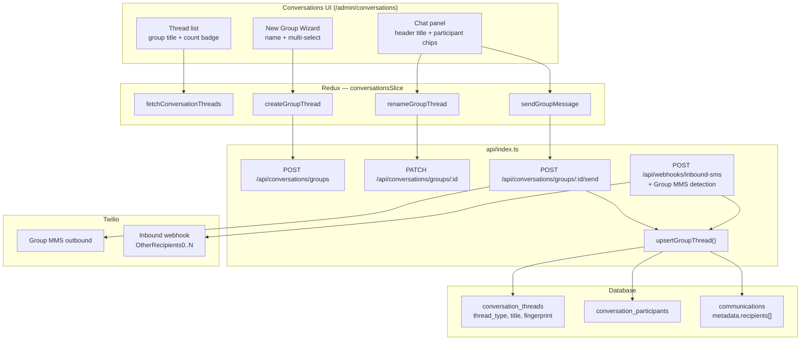
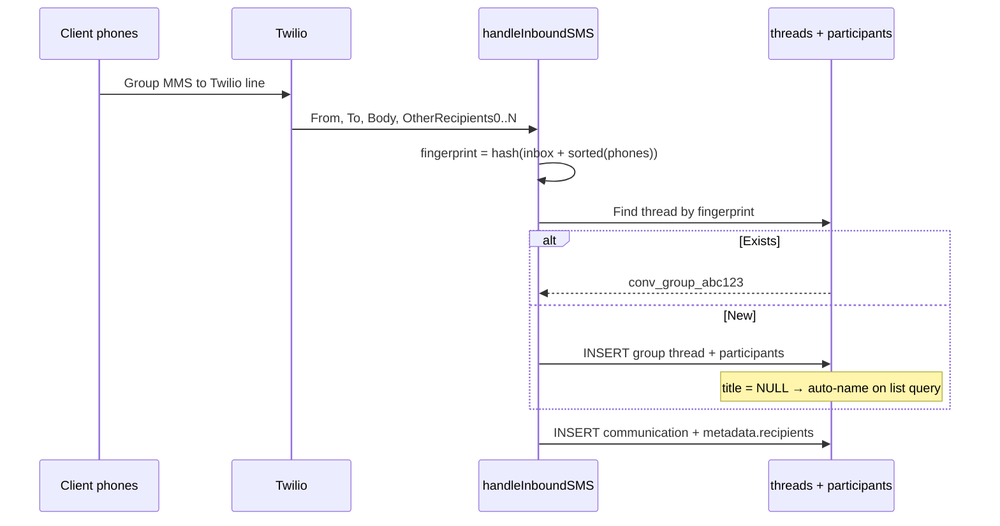

# Group Conversations Architecture

> **Status:** Implemented. **On by default in dev/preview** — **off in production** until `GROUP_CONVERSATIONS_ALLOW_PRODUCTION=1`. Master opt-out with `GROUP_CONVERSATIONS_ENABLED=0`. UI reads flag from `GET /api/admin/init` (no client build env needed).  
> **Scope:** SMS Group MMS + internal CRM team threads.  
> **Out of scope:** Email (`/admin/email` has its own thread model).

## Executive summary

Group conversations extend the Conversations inbox with:

- **`conv_group_{uuid}`** threads and `conversation_participants`
- **Outbound Group MMS** and **internal-only** team threads
- **Inbound Group MMS** via Twilio `OtherRecipients0..N` / `recipients[]` fingerprint matching
- **CRM integration:** Pipeline loan overlay, client detail groups list, loan-linked create wizard

Full product spec: [`GROUP_CONVERSATIONS_PROPOSAL.md`](./GROUP_CONVERSATIONS_PROPOSAL.md).

### SMS reality check (Jun 2025 audit)

| Expectation | SMS / 10DLC reality | Encore behavior |
|-------------|---------------------|-----------------|
| iMessage / WhatsApp-style group on each phone | **Not available** via Twilio Group MMS on most 10DLC routes; carriers deliver separate 1:1 SMS threads | Outbound sends **one SMS per recipient** from the business line |
| GHL shows one group thread | GHL mirrors Twilio 1:1 threads per contact | Expected — GHL is out of scope for Encore group UI |
| Team sees one unified thread | Achievable in CRM | **Encore group thread** aggregates outbound + inbound replies |
| Reply from participant lands in group | Requires webhook routing (not carrier Group MMS) | `processInboundGroupIndividualReply` + client-id fallback |

**Deploy note:** Inbound group routing runs on the **production webhook** (`/api/webhooks/inbound-sms`). Local/dev sends that write to prod DB still need prod deployed for replies to merge into the group thread.

---

## Implementation map (v1)

| Layer | Location |
|-------|----------|
| Migration | `database/migrations/20260605_120000_add_group_conversations.sql` |
| Pure helpers | `shared/group-conversations.ts` |
| API handlers | `api/index.ts` (group section inlined for Vercel) |
| Routes | `GET /api/conversations/config`, `POST/PATCH /api/conversations/groups`, participants, send, `by-application`, `by-client`, dev `simulate-inbound` |
| Redux | `client/store/slices/conversationsSlice.ts` |
| UI | `Conversations.tsx`, `GroupConversationWizard.tsx`, `LoanOverlay.tsx`, `ClientDetailPanel.tsx` |
| Smoke tests | `npm run validate:group-conversations` |
| **1:1 regression** | `npm run validate:direct-conversations` — ensures group migration did not break direct threads |

---

## Legacy audit (pre-implementation reference)

The sections below document the **before** state. Most gaps are now closed.

## Current state audit

### Database

| Artifact | Today | Group gap |
|----------|-------|-----------|
| `conversation_threads` | Single `client_id`, `client_phone`, `client_name` | No `thread_type`, no `title`, no fingerprint |
| `conversation_threads` | `UNIQUE(conversation_id)` | Group threads need `conv_group_{uuid}` namespace |
| `communications` | Single `to_user_id` / `to_broker_id` | No per-message recipient list |
| `communications.metadata` | JSON column exists | Not standardized for `recipients[]` |

### API (`api/index.ts`)

| Handler | Today | Group gap |
|---------|-------|-----------|
| `handleInboundSMS` | Reads `From`, `To`, `Body`, `NumMedia` only | No `OtherRecipients0..N` or `recipients[]` |
| `handleSendMessage` / `sendSMSMessage` | Twilio `messages.create({ to: single })` | No multi-recipient |
| `upsertConversationThread` | Single `recipientPhone` | No participant set |
| `handleGetConversationThreads` | Excludes email (`last_message_type != 'email'`) | Assumes one `client_name` per row |

### UI

| Component | Today | Group gap |
|-----------|-------|-----------|
| `NewConversationWizard.tsx` | Single `SelectedRecipient` | No multi-select |
| `Conversations.tsx` | Send/call via `currentThread.client_phone` | Composer and call button are 1:1 |
| Thread list | Shows `client_name` | No group title or participant preview |

### Documentation

| Doc | Status |
|-----|--------|
| `DESIGN_SYSTEM.md` | Describes unified inbox per client/loan — no groups |
| `OWNERSHIP_MODEL.md` | **Stale:** still mentions "participated in" visibility (removed in code to fix cross-broker leak) |
| `IDENTITY_SYNC_ARCHITECTURE.md` | Proposes `channel_identities` — not implemented |

---

## Product scope

### In scope (two group types, one data model)

| Type | `channel` | Carrier | Example |
|------|-----------|---------|---------|
| **Internal team thread** | `internal` | CRM-only | Banker + processor + realtor on a loan |
| **External SMS group** | `sms` | Twilio Group MMS | Client + co-borrower + realtor |

### Out of v1

- Email threads
- WhatsApp native groups (Twilio does not expose WA group management like a phone app)
- Conference / multi-party voice calls
- iMessage or personal-SIM group detection

---

## Group name — how it appears in the UI

Every group thread has a **display name** shown in the inbox and thread header. Resolution order:

| Priority | Source | Example |
|----------|--------|---------|
| 1 | **User-defined title** (`conversation_threads.title`) | `"Flores loan team"` |
| 2 | **Auto-generated from participants** (when title is null) | `"Maria Flores · John Realtor · Bob Co-borrower"` |
| 3 | **Phone fallback** (unknown external numbers only) | `"+1 (562) 555-1234 +2"` |

### Where the name appears

| Surface | Behavior |
|---------|----------|
| **Thread list (sidebar)** | Primary line = group title (or auto-generated name). Secondary line = last message preview. Badge = participant count (e.g. `3`). |
| **Thread header (chat panel)** | Full group title, editable via pencil icon. Participant chips below. |
| **New Group wizard** | Optional **Group name** field with placeholder `"e.g. Flores loan team"`. If left blank, auto-name is computed on create. |
| **Notifications / toasts** | Use group title when set; otherwise truncated auto-name. |

### Rules

- **Direct threads** — unchanged: show `client_name` (or phone for unknown senders).
- **Group threads** — never use `client_name` alone; use `title` or participant-derived name.
- **Rename** — `PATCH /api/conversations/groups/:id` with `{ title }`; updates list and header immediately via Redux.
- **Inbound auto-created groups** — no title on first message; auto-name from resolved participant display names; banker can rename later.

---

## Architecture diagram



### Inbound Group MMS sequence



---

## Thread identity

### Direct (unchanged)

```
conversation_id = conv_client_{clientId}
              OR conv_phone_{normalizedPhone}   -- unknown sender
thread_type     = direct
```

### Group (new)

```
conversation_id         = conv_group_{uuid}
thread_type             = group
participant_fingerprint = SHA256(inbox_number + "|" + sort(normalized_e164_phones))
title                   = optional user-defined name
```

**Why fingerprint:** The same person can text your Twilio line in a 1:1 thread and in a group with others. Matching on `From` alone attaches messages to the wrong thread.

---

## Database schema (migrations only)

> Per project rules: apply via `database/migrations/YYYYMMDD_HHMMSS_*.sql`, then update `database/schema.sql`.

```sql
-- Extend conversation_threads
ALTER TABLE conversation_threads
  ADD COLUMN thread_type ENUM('direct','group') NOT NULL DEFAULT 'direct',
  ADD COLUMN title VARCHAR(255) NULL COMMENT 'User-defined group name; NULL = auto-name from participants',
  ADD COLUMN participant_fingerprint CHAR(64) NULL COMMENT 'SHA256 — group threads only',
  ADD COLUMN channel ENUM('sms','whatsapp','internal') NOT NULL DEFAULT 'sms',
  ADD UNIQUE KEY idx_ct_tenant_fingerprint (tenant_id, participant_fingerprint);

CREATE TABLE conversation_participants (
  id INT NOT NULL AUTO_INCREMENT,
  tenant_id INT NOT NULL,
  conversation_id VARCHAR(100) NOT NULL,
  participant_type ENUM('client','broker','lead','external_phone') NOT NULL,
  client_id INT NULL,
  broker_id INT NULL,
  lead_id INT NULL,
  phone_e164 VARCHAR(20) NULL,
  display_name VARCHAR(255) NULL,
  role ENUM('owner','member') NOT NULL DEFAULT 'member',
  joined_at DATETIME NOT NULL DEFAULT CURRENT_TIMESTAMP,
  left_at DATETIME NULL,
  PRIMARY KEY (id),
  KEY idx_cp_conversation (tenant_id, conversation_id),
  KEY idx_cp_client (tenant_id, client_id),
  KEY idx_cp_phone (tenant_id, phone_e164)
);
```

### `communications.metadata` shape (group messages)

```json
{
  "recipients": ["+15551234567", "+15559876543"],
  "is_group_mms": true,
  "from_phone": "+15551111111"
}
```

---

## API endpoints

| Method | Path | Purpose |
|--------|------|---------|
| `POST` | `/api/conversations/groups` | Create group: `{ title?, channel, client_ids[], broker_ids[], phones[] }` |
| `PATCH` | `/api/conversations/groups/:id` | Rename: `{ title }` |
| `GET` | `/api/conversations/groups/:id/participants` | List members |
| `POST` | `/api/conversations/groups/:id/participants` | Add member (max ~10 for Group MMS) |
| `DELETE` | `/api/conversations/groups/:id/participants/:pid` | Remove member (`left_at`) |
| `POST` | `/api/conversations/groups/:id/send` | Outbound group SMS |

Extend `GET /api/conversations/threads` response:

```typescript
thread_type: 'direct' | 'group';
title?: string | null;           // user-defined; null = use display_name
display_name: string;              // resolved: title ?? auto-generated
participant_count?: number;
participants_preview?: { name: string; type: string }[];
```

---

## Shared types (`shared/api.ts`)

```typescript
export interface ConversationThread {
  // ...existing fields...
  thread_type: 'direct' | 'group';
  title?: string | null;
  display_name: string;            // always populated by API for list/header
  participant_count?: number;
  participants_preview?: ConversationParticipantPreview[];
}

export interface CreateGroupConversationRequest {
  title?: string;
  channel: 'sms' | 'internal';
  client_ids?: number[];
  broker_ids?: number[];
  phones?: string[];
}

export interface SendGroupMessageRequest {
  body: string;
  media_url?: string;
  media_content_type?: string;
}
```

---

## Inbound SMS changes

Parse legacy webhook fields and Event Streams `recipients[]`:

```typescript
const otherRecipients: string[] = [];
for (let i = 0; i < 10; i++) {
  const r = req.body?.[`OtherRecipients${i}`];
  if (r) otherRecipients.push(normalizeE164(r));
}
// Event Streams: req.body.recipients (JSON array)

if (otherRecipients.length > 0) {
  await resolveOrCreateGroupThread({ inbox: toPhone, from: fromPhone, others: otherRecipients });
} else {
  // existing direct path — unchanged
}
```

---

## UI specification

### New entry points

- **New → Direct message** — current `NewConversationWizard` (unchanged)
- **New → Group conversation** — new wizard:
  - **Group name** (optional text input)
  - Multi-select: clients, brokers, external phones
  - Channel: Internal / SMS (SMS disabled until Phase 2)

### Thread list row (group)

```
[avatar stack]  Flores loan team          2:34 PM
                Maria: Sounds good!        [3]
```

- Primary text: `display_name` (title or auto-generated)
- Badge: `participant_count`
- Stacked avatars or group icon when no photos

### Thread header (group)

```
Flores loan team  ✎
Maria Flores · John Realtor · Bob Smith
```

- Title is editable; saves via `renameGroupThread`
- Participant chips link to client/broker profiles where resolved

### Direct threads

No change — continue showing `client_name`.

---

## Ownership and visibility

A broker sees a group thread if **any** of:

1. `conversation_threads.broker_id = brokerId` (thread owner)
2. Broker is an active row in `conversation_participants`
3. Broker owns any **client participant** via existing 3-path loan ownership
4. `superadmin` — all threads

Do **not** reintroduce standalone "participated in thread" visibility (caused cross-broker leakage).

---

## Native phone group detection

| Scenario | Detectable? |
|----------|-------------|
| Group MMS including your **Twilio number** | Yes — `OtherRecipients0..N` or Event Streams `recipients[]` |
| Group on banker's personal cell | No |
| iMessage groups | No |
| Same contact in 1:1 and group with your line | Yes — different fingerprints → different threads |

---

## Phased rollout

| Phase | Deliverable | Duration (est.) |
|-------|-------------|-----------------|
| **1** | Migration, participants table, internal groups, group name in list/header, rename API | ~2 weeks |
| **2** | Outbound Twilio Group MMS, quota (segments × recipients) | ~1.5 weeks |
| **3** | Inbound fingerprint matching, Event Streams, smoke tests | ~1.5 weeks |

### Phase 1 checklist

- [ ] Migration: `thread_type`, `title`, `participant_fingerprint`, `conversation_participants`
- [ ] `POST /api/conversations/groups` + `PATCH` rename
- [ ] `display_name` resolver in `handleGetConversationThreads`
- [ ] Redux: `createGroupThread`, `renameGroupThread`
- [ ] `NewGroupConversationWizard` with optional name field
- [ ] Thread list + header show `display_name`
- [ ] Update `DESIGN_SYSTEM.md` (Conversations section)
- [ ] Fix `OWNERSHIP_MODEL.md` stale "participated in" bullet
- [ ] Update `api/swagger.yaml`

---

## What stays unchanged

- Email (`/admin/email`, `last_message_type = 'email'`)
- Direct SMS threading (`conv_client_{id}`)
- Broadcast threads (`broadcast-*` IDs)
- Reminder flows (1:1 per client)

---

## Related files

| Area | Path |
|------|------|
| Conversations UI | `client/pages/admin/Conversations.tsx` |
| New conversation | `client/components/NewConversationWizard.tsx` |
| Redux | `client/store/slices/conversationsSlice.ts` |
| API | `api/index.ts` — `upsertConversationThread`, `handleInboundSMS`, `handleGetConversationThreads` |
| Schema | `database/schema.sql` — `conversation_threads`, `communications` |
| Types | `shared/api.ts` |
| Design system | `docs/DESIGN_SYSTEM.md` |
| Ownership | `docs/OWNERSHIP_MODEL.md` |
