# Feature Proposal: Group Conversations (SMS / WhatsApp / Voice)

**Multi-party threads in the Conversations inbox**

> **Submitted to:** Platform Owners  
> **Date:** June 2, 2026  
> **Status:** Proposal — Awaiting Approval  
> **Scope:** `/admin/conversations` only — **email is explicitly out of scope** (lives in `/admin/email`)

---

## 1. Executive Summary

Today every conversation thread is **1:1**: one `client_id`, one `client_phone`, one `client_name`. Mortgage teams routinely coordinate with **multiple people on the same deal** — borrower + co-borrower + realtor, or banker + processor + partner — but the CRM cannot represent that as a single thread.

This proposal adds **group conversations** with a shared participant model, a **user-visible group name**, and (in Phase 2) Twilio **Group MMS** for carrier-native SMS groups when the banker's Twilio line is included.

**Email is not part of this work.** Email threads, mailboxes, CC/BCC, and `/admin/email` remain unchanged.

---

## 2. Current-State Audit

### 2.1 Database (`conversation_threads`, `communications`)

| What exists | Group gap |
|-------------|-----------|
| Single `client_id`, `client_phone`, `client_name` per thread | No multi-party identity |
| `UNIQUE(conversation_id)` — e.g. `conv_client_{id}`, `conv_phone_{digits}` | No `conv_group_{uuid}` namespace |
| `communications.to_user_id` / `to_broker_id` — one recipient | No per-message recipient list |
| `metadata` JSON on `communications` (unused for recipients) | No standard `{ recipients: [] }` shape |
| `internal_note` communication type exists | Not wired to multi-party UI |

### 2.2 API (`api/index.ts`)

| Handler | Behavior today | Group gap |
|---------|----------------|-----------|
| `handleInboundSMS` | Parses `From`, `To`, `Body`, `NumMedia` only | Ignores `OtherRecipients0..N` / Event Streams `recipients[]` |
| `handleSendMessage` | Single `recipient_phone` → Twilio `to: one` | No multi-recipient outbound |
| `upsertConversationThread` | Canonical `conv_client_{id}` merge logic | Assumes one phone per thread |
| `handleGetConversationThreads` | Excludes `last_message_type = 'email'` for Conversations page | List row assumes one `client_name` |

### 2.3 UI (`Conversations.tsx`, `NewConversationWizard.tsx`)

| Surface | Behavior today | Group gap |
|---------|----------------|-----------|
| Thread list | Shows `thread.client_name` | No group title, no participant stack |
| Thread header | Single contact name + phone | No participant chips |
| Composer / send | `currentThread.client_phone` (one number) | Cannot message multiple phones |
| New conversation | Single `SelectedRecipient` | No multi-select |
| Voice call button | Dials one `client_phone` | No conference (v2 epic) |

### 2.4 Documentation

| Doc | Status |
|-----|--------|
| `DESIGN_SYSTEM.md` | Describes 1:1 "per client/loan thread" — no groups |
| `OWNERSHIP_MODEL.md` | **Stale** — still lists "participated in thread" visibility; code removed that rule to fix cross-broker leakage |
| `IDENTITY_SYNC_ARCHITECTURE.md` | Proposes `channel_identities` table — **not implemented** |
| Group conversations | **No doc until this proposal** |

---

## 3. Group Name — Will It Appear?

**Yes.** Every group thread has a **display name** that is always visible in the Conversations UI. This is a first-class field, not an afterthought.

### 3.1 Storage

```sql
ALTER TABLE conversation_threads
  ADD COLUMN title VARCHAR(255) NULL
    COMMENT 'Group display name; NULL triggers auto-generated fallback';
```

- **Direct threads (unchanged):** continue using `client_name` as today. `title` stays `NULL`.
- **Group threads:** `title` is the primary label. `client_name` becomes a **denormalized fallback** for legacy list components during rollout.

### 3.2 Where the group name appears

| UI surface | What the user sees |
|------------|-------------------|
| **Thread list (sidebar)** | **Primary line:** group `title` (bold). **Secondary line:** truncated participant list, e.g. `Daniel · Julia · +1 (562)…` |
| **Thread header (chat view)** | **Large title** at top. Participant avatar chips directly below. |
| **Mobile thread list** | Same primary title; participant count badge, e.g. `3 people` |
| **Search** | Matches `title` **and** any participant `display_name` / CRM name |
| **Composer footer** | `Messaging: Flores loan team (3 people)` |
| **Notifications / toasts** | `"New message in Flores loan team"` |
| **Client detail panel** (if linked) | Group listed under Communications with its title |

### 3.3 How the name is set

| Source | When | Example |
|--------|------|---------|
| **User-defined at creation** | Broker types a name in the Group wizard (optional but encouraged) | `Flores purchase team` |
| **Loan-linked suggestion** | Wizard detects shared `application_id` | Pre-fill: `{Borrower last name} loan team` |
| **Auto-generated fallback** | No title provided (inbound Group MMS or quick-create) | `Alice Nguyen, Bob Reyes +1` |
| **Rename anytime** | Thread header → pencil icon → inline edit | User changes to `Flores · Realtor coordination` |

**Rule:** The UI **never** shows a blank or "Unknown Client" for groups. If `title` is NULL, the API computes `display_title` at read time from participant names (same algorithm as the auto-generated fallback).

### 3.4 Auto-generated title algorithm

```
1. Resolve display names for all active participants (CRM name > phone label).
2. Sort alphabetically by first name.
3. If count ≤ 2:  join with " & "     → "Alice Nguyen & Bob Reyes"
4. If count > 2:   first two + count → "Alice Nguyen, Bob Reyes +2"
5. Cap at 255 chars; ellipsis if needed.
```

Inbound Group MMS (no CRM match for some numbers) uses formatted phone for unknown slots: `Alice Nguyen, (562) 573-5110 +1`.

### 3.5 What carriers show vs what Encore shows

| Audience | Sees group name? |
|----------|------------------|
| **Encore Conversations UI** | **Always** — `title` or auto-generated `display_title` |
| **Recipient phones (SMS Group MMS)** | **No custom group name from Encore** — carriers show participant names or "Group message". Twilio does not expose a "group subject" field on standard Group MMS. |
| **Internal-only groups (Phase 1)** | **Yes** — name is CRM-only; only Encore users see it |

> **Product note:** The group name is an **Encore CRM label** for bankers. It does not change what appears on the borrower's phone lock screen. That is a carrier limitation, not a gap we can fix in v1.

---

## 4. Proposed Architecture

### 4.1 Two group types, one data model

| Type | `channel` | Carrier | Use case |
|------|-----------|---------|----------|
| **Internal team thread** | `internal` | CRM-only | Banker + processor + realtor coordinating (no SMS sent) |
| **External SMS group** | `sms` | Twilio Group MMS | Client + co-borrower + realtor on one text thread |

**Out of v1:** WhatsApp groups, conference voice calls, iMessage / personal-SIM groups.

### 4.2 System diagram

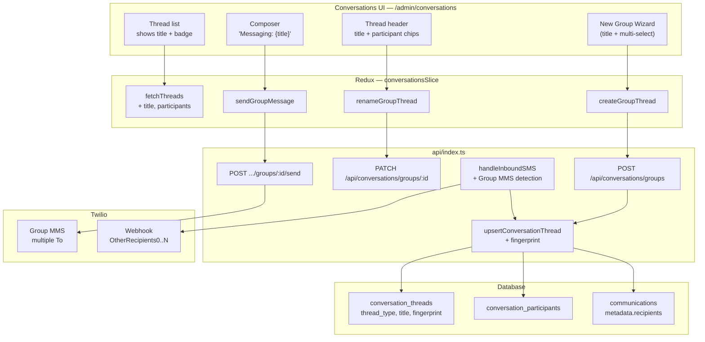

### 4.3 Thread identity

**Never overload `conv_client_{id}`.** Direct and group threads use separate ID namespaces.

```
DIRECT (unchanged):
  conversation_id = conv_client_{clientId}
                 OR conv_phone_{normalizedPhone}

GROUP (new):
  conversation_id = conv_group_{uuid}
  participant_fingerprint = SHA256(
    inbox_number + "|" + sort(normalized_e164_phones_of_all_participants_including_sender)
  )
  UNIQUE(tenant_id, participant_fingerprint)  -- prevents duplicate groups
```

**Why fingerprint:** If Alice texts your Twilio line 1:1 and also in a group with Bob, matching on `From` alone attaches messages to the wrong thread.

### 4.4 Inbound Group MMS sequence

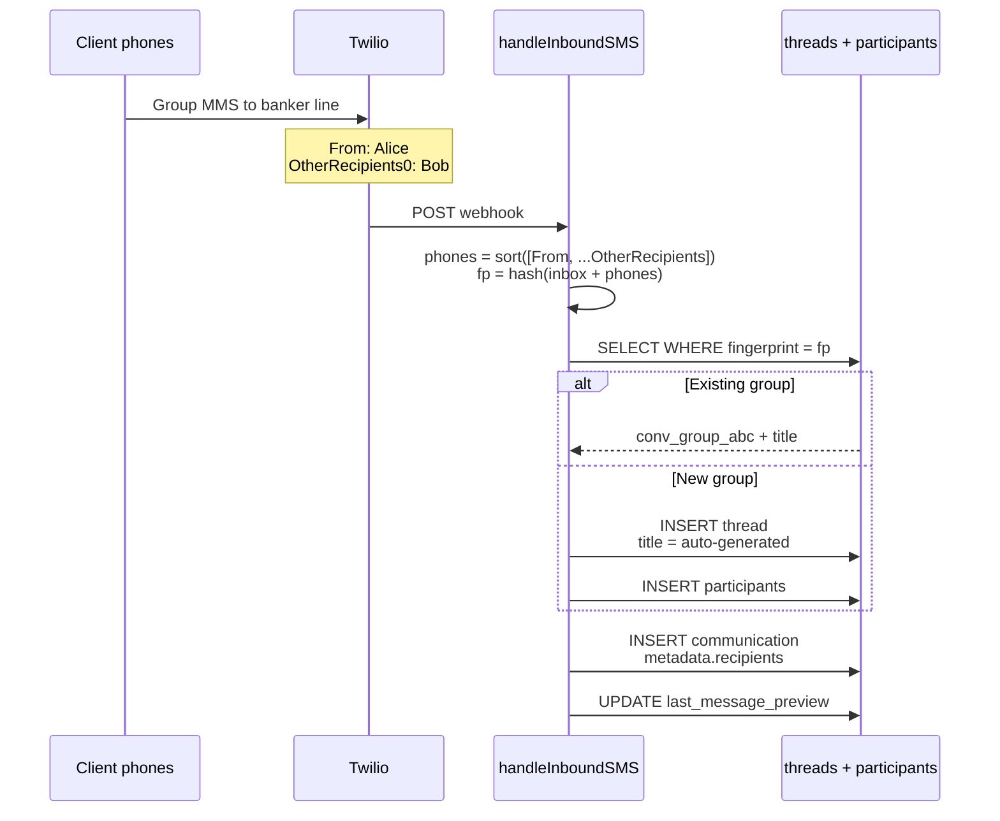

---

## 5. Database Schema

All changes via migration files in `database/migrations/` (never edit `schema.sql` directly).

### 5.1 Extend `conversation_threads`

```sql
ALTER TABLE conversation_threads
  ADD COLUMN thread_type ENUM('direct','group') NOT NULL DEFAULT 'direct',
  ADD COLUMN title VARCHAR(255) NULL COMMENT 'Group display name; API fills display_title if NULL',
  ADD COLUMN participant_fingerprint CHAR(64) NULL COMMENT 'SHA256 — group threads only',
  ADD COLUMN channel ENUM('sms','whatsapp','internal') NOT NULL DEFAULT 'sms',
  ADD COLUMN creation_source ENUM('encore','phone_synced') NOT NULL DEFAULT 'encore'
    COMMENT 'phone_synced = auto-created from inbound Group MMS',
  ADD UNIQUE KEY idx_ct_tenant_fingerprint (tenant_id, participant_fingerprint);
```

### 5.2 New `conversation_participants`

```sql
CREATE TABLE conversation_participants (
  id INT NOT NULL AUTO_INCREMENT,
  tenant_id INT NOT NULL,
  conversation_id VARCHAR(100) NOT NULL,
  participant_type ENUM('client','broker','lead','external_phone') NOT NULL,
  client_id INT NULL,
  broker_id INT NULL,
  lead_id INT NULL,
  phone_e164 VARCHAR(20) NULL,
  display_name VARCHAR(255) NULL,
  role ENUM('owner','member') NOT NULL DEFAULT 'member',
  joined_at DATETIME NOT NULL DEFAULT CURRENT_TIMESTAMP,
  left_at DATETIME NULL,
  PRIMARY KEY (id),
  KEY idx_cp_conversation (tenant_id, conversation_id),
  KEY idx_cp_client (tenant_id, client_id),
  KEY idx_cp_phone (tenant_id, phone_e164)
);
```

### 5.3 `communications.metadata` shape (groups)

```json
{
  "recipients": ["+15624490000", "+15625735110"],
  "is_group_mms": true,
  "from_phone": "+15623370000"
}
```

---

## 6. API Endpoints

| Method | Path | Purpose |
|--------|------|---------|
| `POST` | `/api/conversations/groups` | Create group: `{ title?, channel, application_id?, participants[] }` |
| `PATCH` | `/api/conversations/groups/:conversationId` | Rename: `{ title }`, or link loan |
| `GET` | `/api/conversations/groups/:conversationId/participants` | List members |
| `POST` | `/api/conversations/groups/:conversationId/participants` | Add member (max 10 for Group MMS) |
| `DELETE` | `/api/conversations/groups/:conversationId/participants/:id` | Soft-remove (`left_at`) |
| `POST` | `/api/conversations/groups/:conversationId/send` | Outbound group SMS |
| `GET` | `/api/conversations/threads` | **Extend** response with `thread_type`, `title`, `display_title`, `participant_count`, `participants_preview[]` |

### 6.1 Shared types (`shared/api.ts`)

```typescript
export interface ConversationThread {
  // ...existing fields...
  thread_type: "direct" | "group";
  title?: string | null;
  /** Always set for group threads — title or auto-generated */
  display_title?: string | null;
  participant_count?: number;
  participants_preview?: { name: string; type: string }[];
  /** encore = wizard-created; phone_synced = inbound Group MMS */
  creation_source?: "encore" | "phone_synced";
}

export interface CreateGroupConversationRequest {
  title?: string;
  channel: "sms" | "internal";
  application_id?: number;
  participants: Array<
    | { type: "client"; client_id: number }
    | { type: "broker"; broker_id: number }
    | { type: "phone"; phone: string; display_name?: string }
  >;
}
```

### 6.2 Inbound SMS change (sketch)

```typescript
const otherRecipients: string[] = [];
for (let i = 0; i < 10; i++) {
  const r = req.body?.[`OtherRecipients${i}`];
  if (r) otherRecipients.push(normalizeE164(r));
}

if (otherRecipients.length > 0) {
  await resolveOrCreateGroupThread({
    inbox: toPhone,
    from: fromPhone,
    others: otherRecipients,
    // title: null → server auto-generates display_title
  });
} else {
  // existing direct path — unchanged
}
```

---

## 7. UI Specification — Premium, Mobile-First

Design tokens: Inter, brand `primary` (`#F41F3B`), `rounded-lg` cards, `animate-in fade-in` transitions (see `DESIGN_SYSTEM.md`). Group UI must feel **distinct from 1:1** but not alien — same Conversations shell, elevated group affordances.

### 7.1 Visual language for groups

| Element | Direct thread | Group thread |
|---------|---------------|--------------|
| List avatar | Single initials circle | **Stacked avatar cluster** (max 3 overlapping circles, `+N` overflow) |
| List icon badge | Channel dot (SMS / call) | **`Users` icon** chip in `secondary` tint |
| Row accent | None | Subtle left border `border-l-2 border-primary/40` when unread |
| Header | Name + phone | **Title** (editable) + participant chips + loan pill |
| Message bubble | Standard | Inbound shows **sender name** above bubble in groups only |
| Source pill | — | `Synced from phone` \| `Created in Encore` \| `Internal` |

### 7.2 New group wizard (`GroupConversationWizard.tsx`)

Reusable wizard component (same pattern as `NewConversationWizard`).

```
[New ▼]
  ├── Direct message     ← unchanged
  └── Group conversation ← new (Users icon)
```

**Step 1 — People** (search-first, keyboard-friendly)

- Unified search: clients, brokers, leads, raw phone
- Selected people render as **animated chips** (`framer-motion` or CSS `animate-in slide-in-from-bottom-2`)
- **Smart suggestions** when loan is picked (Step 2): borrower, co-borrower, assigned realtor, loan officer
- Warning chips: missing phone (excluded from SMS), not opted-in for SMS blast (informational)
- Live counter: `4 of 10 participants` (Twilio cap)

**Step 2 — Name & channel**

- **Group name** — large input, auto-focus; live preview card shows how title will appear in thread list
- Loan linker: typeahead → pre-fills title `{BorrowerLastName} loan team` and participant suggestions
- Channel toggle:
  - **Internal** — team coordination, no carrier cost (default for banker-only groups)
  - **SMS Group MMS** — shows segment × recipient cost estimate via `BillingActionGate`
- **“Include my business line”** helper copy with copyable Twilio number (for native-phone sync — see §9)

**Step 3 — Review**

- Summary card: title, avatars, channel, linked loan, estimated cost
- Primary CTA: **Create group** with loading shimmer

### 7.3 Thread list row (group)

```
┌─────────────────────────────────────────┐
│ [○○○]  Flores purchase team       2:34p │  ← stacked avatars + bold title
│  👥    Daniel · Julia · Bob        (5)  │  ← participant preview + count
│        Thanks, I'll send the docs…      │  ← preview (truncate)
│        [Synced from phone]              │  ← source pill (if inbound-detected)
└─────────────────────────────────────────┘
```

- **Hover (desktop):** quick actions — Rename, Link loan, Mute
- **Swipe (mobile):** archive / mark read (match existing patterns)
- **Filter tab:** add **Groups** alongside SMS / WhatsApp / Calls
- **Empty state:** illustration + “Create a group for your loan team” CTA

### 7.4 Thread header (group)

```
┌─────────────────────────────────────────┐
│  ←  Flores purchase team         [✏️] [⋯]│
│      [DN][JV][BR][+2]   5 people         │  ← tappable chips, expand drawer
│      SMS · Loan #LA-240015 · Encore line │
├─────────────────────────────────────────┤
│  [Participants drawer — slide down]      │
│  • Daniel Carrillo (Client) — owner      │
│  • Julia Vázquez (Realtor)               │
│  • Bob Reyes (Co-borrower)               │
│  • + Add participant                     │
│  • Link to loan / Rename group           │
└─────────────────────────────────────────┘
```

- **Pencil:** inline rename with optimistic Redux update
- **⋯ menu:** Link loan, Add person, Convert to internal-only, Close thread
- **Participant chip tap:** slide-over `ClientDetailPanel` / broker panel without leaving chat
- **Loan pill tap:** navigate to pipeline loan

### 7.5 Message thread (group-specific)

- **Inbound SMS:** show `from_display_name` line above bubble (muted `text-xs`)
- **Outbound:** subtle footer `Sent to 5 people`
- **Internal notes:** amber left border + lock icon (team-only, never sent to carrier)
- **System events:** “Julia Vázquez added to group” — `communication_type: system_event`
- **MMS:** grid thumbnail layout unchanged; tap to expand

### 7.6 Composer (group)

```
┌─────────────────────────────────────────┐
│  Messaging: Flores purchase team (5)    │  ← sticky footer label
│  ┌─────────────────────────────────────┐ │
│  │ Type a message…                     │ │
│  └─────────────────────────────────────┘ │
│  [📎] [Template] [Send]                   │
└─────────────────────────────────────────┘
```

- `BillingActionGate` wraps Send for SMS groups (same fail-closed as 1:1)
- Template merge tags: `{{first_name}}` resolved **per recipient** on send (server-side)
- Character counter + segment math × participant count

### 7.7 Onboarding & discoverability

- **First-time banner** on Conversations (dismissible): “Text your whole loan team at once — or add your business line to a phone group to sync it here.”
- **Settings → My line** shows assigned Twilio number with **Copy** button
- Tooltip on `Synced from phone` pill explains name auto-generation + rename tip

### 7.8 Direct threads (unchanged)

Direct threads keep current layout — no group chrome, no regression.

---

## 8. Ownership & Visibility

Extend `handleGetConversationThreads` for group threads:

1. `ct.broker_id = requesting broker` (thread owner), **or**
2. Broker is an active row in `conversation_participants`, **or**
3. Broker owns any **client participant** via existing 3-path loan ownership, **or**
4. `superadmin` sees all (unchanged)

**Do not** reintroduce "participated in thread" as standalone visibility (caused cross-broker leakage).

Update `OWNERSHIP_MODEL.md` when implemented.

---

## 9. Native Phone Groups — Complete FAQ

This section is the **source of truth** for bankers, support, and engineering. It answers: *“I made a group on my phone — what happens in Encore?”*

### 9.1 Decision tree

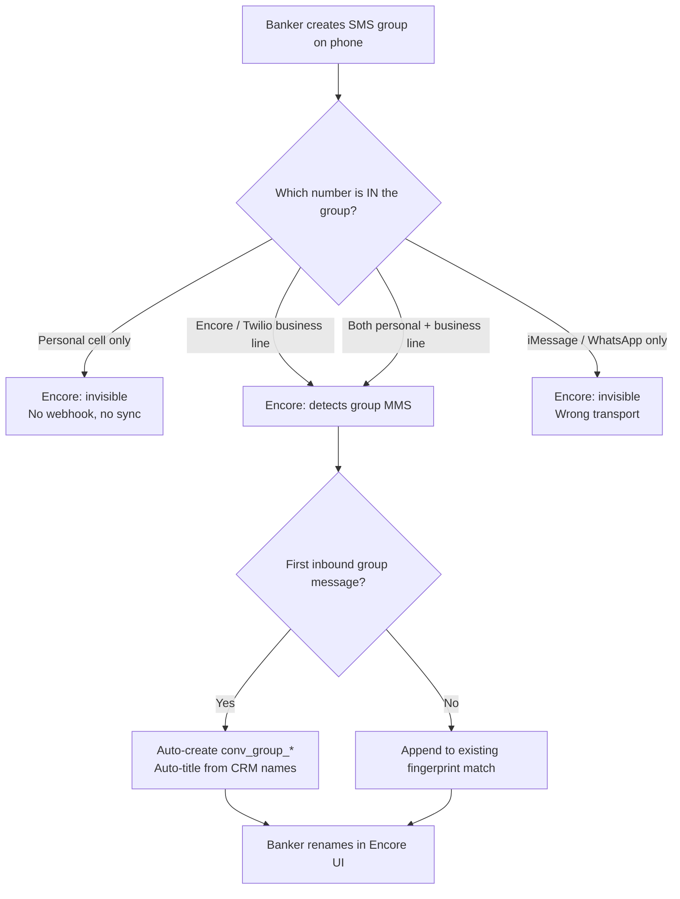

### 9.2 Scenario matrix (robust)

| # | Scenario | Thread created? | Participants resolved? | Phone group name imported? | Can reply from Encore to all? |
|---|----------|-----------------|------------------------|----------------------------|-------------------------------|
| 1 | Group on **personal cell**, 5 clients, no Twilio line | **No** | — | — | — |
| 2 | Group includes **Twilio business line**, 5 clients, first inbound SMS | **Yes** (auto) | **Yes** (phones + CRM match) | **No** — auto-title only | **Yes** (Group MMS outbound) |
| 3 | Same as #2, banker already named group on phone “Flores Team” | **Yes** | **Yes** | **No** — carrier does not send name to Twilio | **Yes** |
| 4 | Banker creates group **in Encore first**, then adds business line on phone | **Yes** (Encore) | **Yes** | Encore title already set | **Yes** — fingerprint matches same thread |
| 5 | Client texts banker line **1:1** and same client in **group** with others | **Two threads** | Both correct | 1:1 uses `client_name`; group uses `title` | **Yes** — separate fingerprints |
| 6 | **iMessage** group (blue bubbles) with business line | **No** | — | — | — |
| 7 | Group exceeds **10** participants (Twilio limit) | Partial | First 10 for outbound; inbound still logged | **No** | Outbound blocked with UI warning |
| 8 | Unknown number in group (not in CRM) | **Yes** | Phone shown as `(562) 573-5110` | **No** | **Yes** — stored as `external_phone` participant |
| 9 | Admin **renames** group in Encore after phone sync | N/A | N/A | Encore title **sticks** — does not overwrite on new messages | **Yes** |
| 10 | Someone **removed** from carrier group but old fingerprint | Thread kept | `left_at` set only on explicit remove; inbound may add back | N/A | Subset outbound may fail — show delivery errors per recipient |

### 9.3 What we detect vs what we cannot

| Data | From phone → Encore | Notes |
|------|----------------------|-------|
| Group exists (multi-recipient MMS) | **Yes** | `OtherRecipients0..N` or Event Streams `recipients[]` |
| Sender phone | **Yes** | `From` |
| Other participant phones | **Yes** | Up to Twilio’s recipient list |
| Message body + MMS media | **Yes** | Same as 1:1 |
| **Group name / subject from SMS app** | **No** | Not in Twilio webhook payload — iOS/Android do not transmit it |
| Who removed whom on phone | **No** | Carrier membership changes are opaque |
| Read receipts per participant | **No** | v1 — optional Twilio status callbacks later |

### 9.4 Auto-title vs phone name — product behavior

When a phone-created group syncs in:

1. **Immediately:** thread appears with `source = phone_synced` and pill **“Synced from phone”**
2. **Title:** server runs auto-title algorithm (§3.4) — e.g. `Alice Nguyen, Bob Reyes +3`
3. **Banner (once per thread):** “This group was detected from your phone. **Rename** to match your workflow.” → focuses rename input
4. **After rename:** `title` is user-owned; inbound messages **never** overwrite it
5. **Optional smart rename:** if all participants share one `application_id`, suggest `{Borrower} loan team` in banner CTA

**Encore name is CRM-only.** Recipient lock screens still show carrier default (“Group message” or participant list).

### 9.5 Banker playbook (support copy)

> **To sync a phone SMS group into Encore:**
>
> 1. Use your **assigned business line** (Settings → My line) — not your personal cell.
> 2. Create or open the group in your phone’s **SMS app** (green bubbles / RCS / carrier MMS — not iMessage).
> 3. Add your **business line** as a member of the group.
> 4. Send or receive at least one message — the group appears in Conversations within seconds.
> 5. Tap the thread → **rename** (pencil) to something your team recognizes, e.g. `Flores purchase team`.
>
> **Will my phone’s group name show up?** No — give it a name in Encore. Takes one tap.

### 9.6 Inbound resolution algorithm (engineering)

```typescript
// Pseudocode — only runs when otherRecipients.length > 0
async function resolveInboundGroupMms(event: InboundSmsEvent) {
  const inbox = normalizeE164(event.To);
  const phones = uniqueSorted([
    normalizeE164(event.From),
    ...event.otherRecipients.map(normalizeE164),
  ]);
  const fingerprint = sha256(`${inbox}|${phones.join(",")}`);

  let thread = await findGroupByFingerprint(fingerprint);
  if (!thread) {
    const participants = await resolveParticipantsFromPhones(phones);
    const displayTitle = buildAutoTitle(participants);
    thread = await createGroupThread({
      fingerprint,
      inbox,
      title: null,
      displayTitle,
      source: "phone_synced",
      participants,
      brokerId: await resolveBrokerForInbox(inbox),
    });
    await emitSystemEvent(thread, "Group detected from phone SMS");
  } else {
    await syncParticipants(thread, phones); // add new phones, never remove silently
  }

  await insertCommunication({
    conversationId: thread.conversation_id,
    direction: "inbound",
    fromPhone: event.From,
    metadata: { recipients: phones, is_group_mms: true, source: "phone_synced" },
  });

  // Direct 1:1 path is NOT invoked — fingerprint gate prevents mis-routing
}
```

### 9.7 Event Streams (recommended hardening)

Legacy webhooks + **Twilio Event Streams** (schema v6, `recipients` array) in parallel:

- Reduces missed `OtherRecipientsN` fields on some carriers
- Enables future delivery analytics per participant
- Feature-flag: `GROUP_MMS_EVENT_STREAMS=1`

### 9.8 Edge cases we handle in UI

| Edge case | UX |
|-----------|-----|
| New unknown phone in existing group | Toast: “New participant detected” + chip in header with **Add to CRM** link |
| Outbound to removed carrier member | Per-recipient failure badge on message; thread stays open |
| Duplicate Encore + phone create (same people) | Fingerprint dedupes → one thread |
| Banker has no Twilio line | Wizard SMS option disabled; tooltip links to admin for assignment |

---

## 10. CRM Integration — Why This Is Useful

Groups are not a chat novelty — they tie into the **loan workflow**.

### 10.1 Loan-centric actions

| CRM surface | Group behavior |
|-------------|----------------|
| **Pipeline loan card** | “Open group” if thread linked; “Create group” quick action with pre-filled participants |
| **Client detail panel** | Lists all groups the client is in; click → Conversations |
| **Loan application view** | **Suggested group** card: borrower + co-borrower + realtor + LO — one-click create |
| **Task completion** | Optional future: notify group when docs uploaded |
| **Audit logs** | `group_created`, `group_renamed`, `group_participant_added`, `group_message_sent` |

### 10.2 Smart participant resolution

On create or inbound sync:

1. Match phones → `clients` (last 10 digits)
2. Match → `brokers` (realtors)
3. Match → `leads`
4. Else → `external_phone` with formatted label

**CRM enrichment in thread:** participant chips show role badges — `Client`, `Realtor`, `Co-borrower`, `Unknown`.

### 10.3 Search & reporting

- Global Conversations search: title, participant names, phones, loan number
- Admin reports (future): messages per group, response time, active groups per loan stage

### 10.4 Ownership follows the deal

- Linking `application_id` grants visibility to loan owners (3-path model) even if they didn’t create the group
- `broker_id` on thread = creator / primary owner
- Internal groups: add bankers as `broker` participants without SMS cost

---

## 11. Non-Breaking Changes Contract

Implementation **must not** break existing production behavior. This is a hard requirement.

### 11.1 Database

| Rule | Detail |
|------|--------|
| Additive only | New columns with `DEFAULT`; new `conversation_participants` table |
| Existing rows | All stay `thread_type = 'direct'`, `title = NULL`, `participant_fingerprint = NULL` |
| `conversation_id` | **Never rename** existing IDs |
| UNIQUE fingerprint | Only enforced when `participant_fingerprint IS NOT NULL` (partial unique index if needed for MySQL compat) |

### 11.2 API

| Rule | Detail |
|------|--------|
| Response shape | **Additive** fields only on `ConversationThread` |
| Request shape | Existing `SendMessageRequest` unchanged; group send uses **new** endpoint |
| Direct inbound | `otherRecipients.length === 0` → **exact same code path** as today |
| Direct outbound | Unchanged when `thread_type !== 'group'` |
| Email | Zero changes |

### 11.3 UI

| Rule | Detail |
|------|--------|
| Direct threads | Identical rendering — guarded by `thread_type === 'group'` |
| Feature flag | `GROUP_CONVERSATIONS_ENABLED` — off = current UI only |
| Redux | New thunks; existing `fetchThreads` tolerates extra fields |

### 11.4 Rollback plan

1. Disable feature flag → UI hides group affordances
2. Group threads remain in DB but hidden from list query (`thread_type = 'group'` filter off)
3. Inbound group messages queue in `communications` without surfacing — or flag `tags: ['group_hold']` during canary

### 11.5 Test gates before merge

See **§13 Deep Robust Testing** for the full harness. Minimum before merge:

- `npm run validate:comms` — all existing 1:1 invariants pass
- `npm run validate:group-conversations` — all group flows + edge scenarios (synthetic data, rolled back)
- `npm run validate:direct-conversations` — 1:1 thread/message regression (synthetic + live read-only sanity; optional `SMOKE_API=1`)
- Feature flag off — UI identical to pre-implementation screenshots

---

## 12. End-to-End Flows — All Paths & Edge Scenarios

Every flow below must be implemented **and** covered by automated tests (§13). Flows are grouped by trigger; edge scenarios are inline.

### 12.0 Master flow map

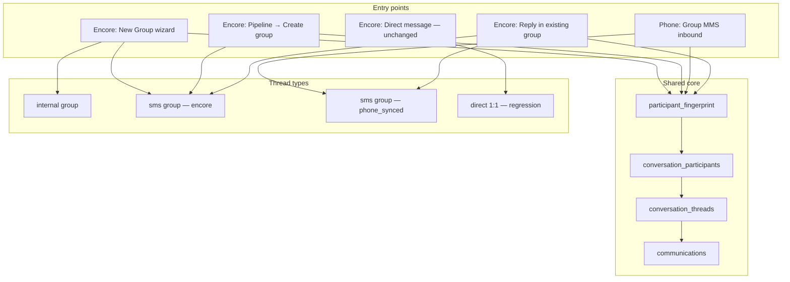

---

### Flow A — Create **internal** group in Encore (Phase 1)

**Actor:** Mortgage banker with `GROUP_CONVERSATIONS_ENABLED=1`

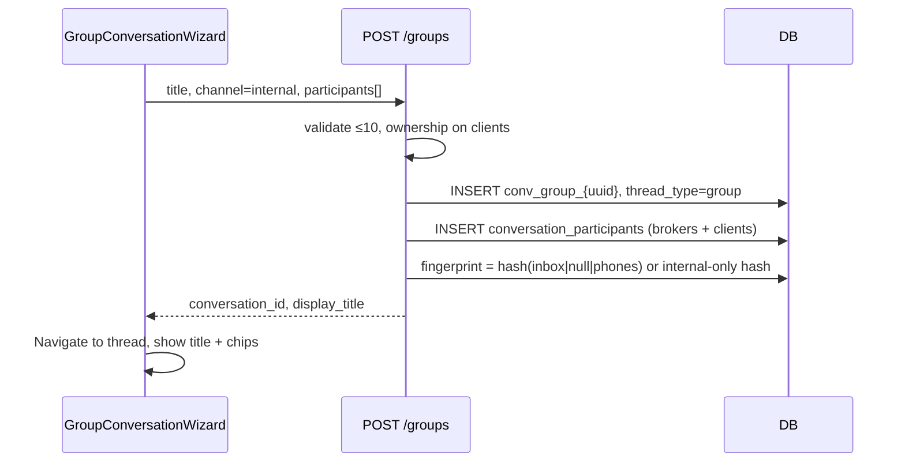

| Step | Happy path | Edge scenarios |
|------|------------|----------------|
| Select people | 2 brokers + 1 client | 0 participants → 400; 11 participants → 400; client owned by other broker → 403 |
| Name | User types `Flores team` | Empty → auto-title on response; 256+ chars → truncate |
| Channel | Internal | Client with no phone OK; no Twilio call |
| First message | Internal note | Not visible to clients; `communication_type=internal_note` |
| List | Appears in Groups filter | Not in email folder; `thread_type=group` |

**DB invariants after Flow A:**
- `thread_type = 'group'`, `channel = 'internal'`, `creation_source = 'encore'`
- `participant_fingerprint IS NOT NULL`
- `client_id` on thread may be NULL (group ≠ single client)
- N rows in `conversation_participants` = selected count

---

### Flow B — Create **SMS** group in Encore (Phase 2)

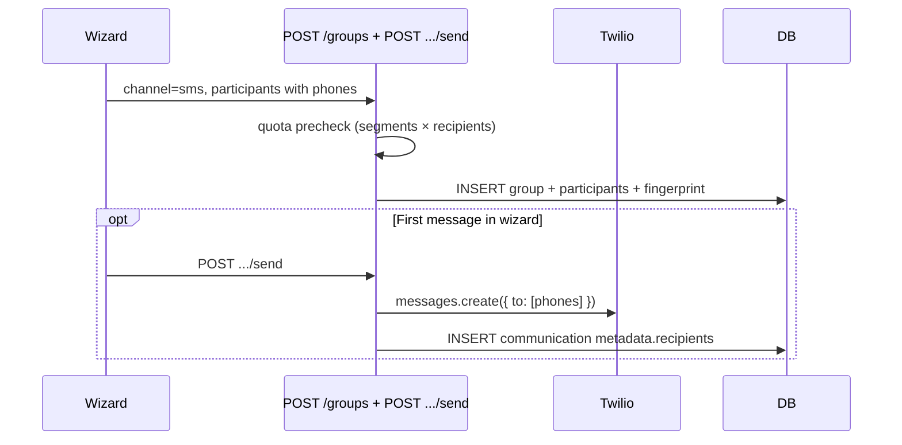

| Edge | Expected behavior |
|------|-------------------|
| Banker has no `twilio_caller_id` | SMS channel disabled in UI; API 400 if forced |
| One participant missing phone | Excluded with warning chip; cannot include in SMS send |
| `BillingActionGate` blocks | Send disabled; 402 from API |
| Duplicate fingerprint (same people + inbox) | Return existing `conversation_id` — no duplicate thread |
| Merge tag `{{first_name}}` | Server resolves per recipient in metadata |

---

### Flow C — **Phone-synced** inbound Group MMS (Phase 2)

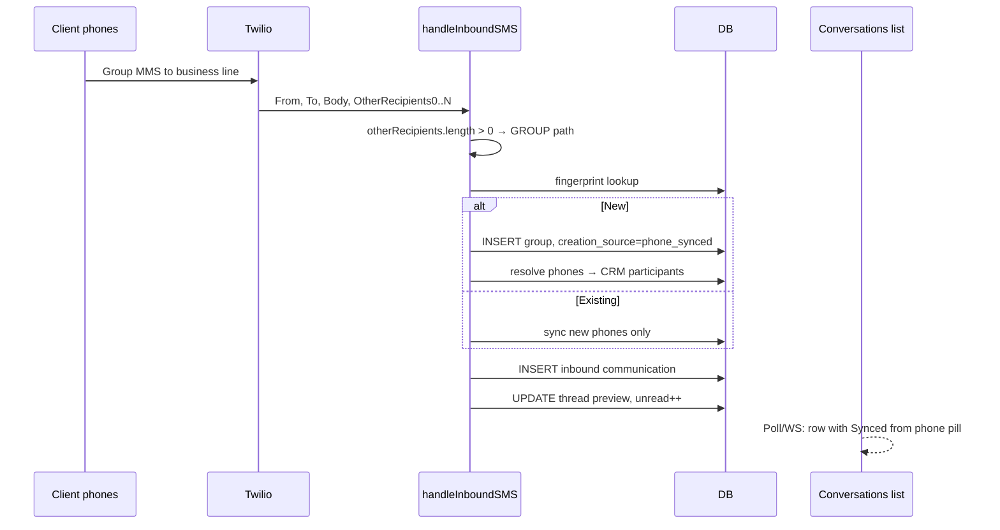

| Edge | Expected behavior |
|------|-------------------|
| `otherRecipients` empty | **Direct path only** — no group logic |
| Personal cell group (no Twilio in group) | No webhook → nothing created |
| iMessage group | No webhook → nothing created |
| Unknown phone in group | `external_phone` participant; formatted label |
| Same sender 1:1 + group | Two threads — different fingerprints |
| User renamed title earlier | Title **not** overwritten on new inbound |
| 11th person texts in | Inbound logged; outbound blocked at 10 with UI warning |
| Wrong `To` inbox (unassigned number) | Existing unassigned-line handling; group still created if resolved |

---

### Flow D — **Direct 1:1** regression (must not change)

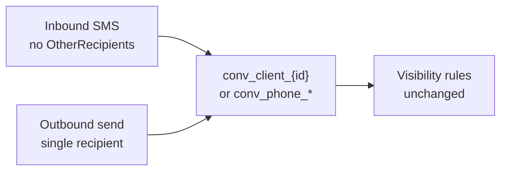

| Edge | Expected behavior |
|------|-------------------|
| Group flag off | Identical to pre-implementation |
| Inbound with empty OtherRecipients | Never touches fingerprint code |
| Existing thread list pagination | Count unchanged for direct-only filters |
| Broker cross-ownership guard | Still blocks unauthorized client SMS |

---

### Flow E — Reply in existing group

| Channel | Path |
|---------|------|
| Internal | `POST .../send` → internal_note only |
| SMS | `POST .../send` → Twilio multi-`to`; quota × N |

| Edge | Expected behavior |
|------|-------------------|
| Participant `left_at` set | Excluded from outbound list; warning if send fails |
| Thread `closed` | Composer disabled — same as direct |
| Partial Twilio failure | Per-recipient status in `metadata.delivery` |

---

### Flow F — Add / remove participant

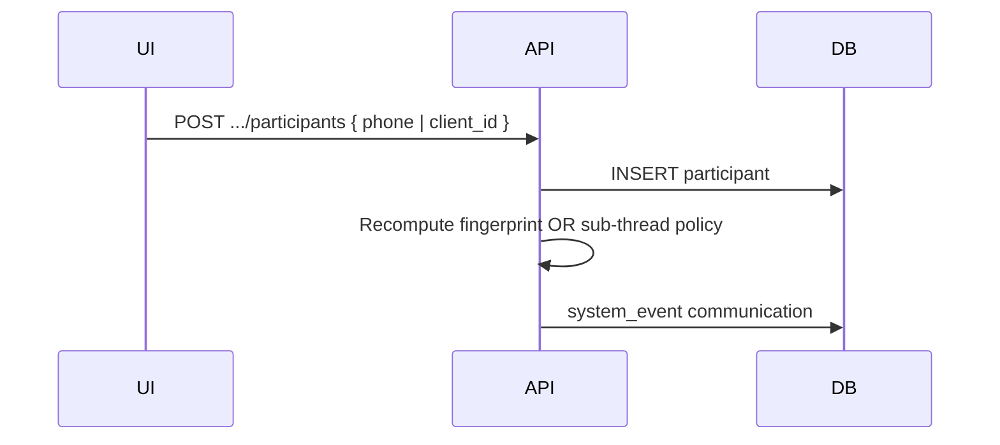

| Edge | Expected behavior |
|------|-------------------|
| Add 11th to SMS group | 400 — Twilio limit |
| Remove last client | Allowed — internal team thread can remain |
| Add creates new phone combo | **Policy:** new fingerprint = new thread OR block with “create new group” — **v1: block** to avoid silent thread splits |
| Phone sync adds member inbound | Auto-add participant; optional toast in UI |

---

### Flow G — Rename group

| Actor | Allowed? |
|-------|----------|
| Thread owner (`broker_id`) | Yes |
| `admin` / `superadmin` | Yes |
| Other broker with visibility | No — read only |
| Inbound message after rename | Title unchanged |

---

### Flow H — Link / unlink loan

| Action | Effect |
|--------|--------|
| `PATCH` with `application_id` | Loan pill in header; visibility extends to loan owners |
| Unlink | Visibility reverts to participant + owner rules only |
| Suggested title from loan | Offered once — user confirm |

| Edge | Expected behavior |
|------|-------------------|
| Loan owned by broker A; group created by broker B | Both see thread if 3-path ownership matches |
| Loan deleted | `application_id` SET NULL — thread survives |

---

### Flow I — Visibility & ownership

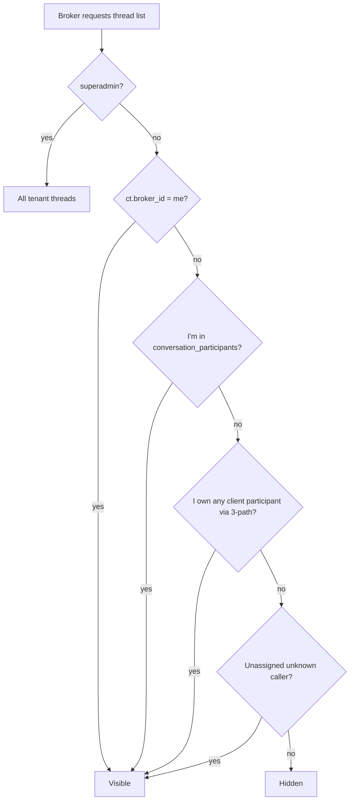

| Edge | Expected behavior |
|------|-------------------|
| Broker sent one message but doesn't own client | **Hidden** — no “participated in” leak |
| Admin + inactive assigned broker on thread | Admin recovery path — same as direct |
| Internal group: realtor participant | Realtor sees if `broker` participant row exists |

---

### Flow J — Billing & quota

| Event | Quota impact |
|-------|--------------|
| Internal message | None |
| Group SMS outbound | `segments × active_recipients` |
| Inbound group MMS | Inbound free; storage only |

| Edge | Expected behavior |
|------|-------------------|
| 402 quota exceeded mid-send | No communication row; user sees billing denial |
| Auth OTP / system | Unaffected |

---

### Flow K — Feature flag off (`GROUP_CONVERSATIONS_ENABLED=0`)

| Layer | Behavior |
|-------|----------|
| UI | No group wizard, no group rows, no pills — identical to today |
| API | `POST /groups` → 404 or 403 |
| Inbound group MMS | **Policy:** either hold in `tags: ['group_hold']` or process silently without list — **recommend hold + admin alert** during canary |

---

### 12.13 Cross-layer edge matrix (UI ↔ API ↔ DB)

| ID | Scenario | UI expectation | API expectation | DB expectation |
|----|----------|----------------|-----------------|--------------|
| E01 | Create internal group | Title + chips render | 201 + `display_title` | `thread_type=group`, N participants |
| E02 | Phone sync inbound | `Synced from phone` pill + banner | Group path only if `OtherRecipients` | `creation_source=phone_synced` |
| E03 | Direct inbound same broker | Unchanged row | No fingerprint call | `thread_type=direct` |
| E04 | Same person 1:1 + group | Two list rows | Two `conversation_id`s | Two fingerprints |
| E05 | Rename | Optimistic title update | `PATCH` 200 | `title` set; inbound doesn't clear |
| E06 | Duplicate create same people | Navigate to existing | 200 existing id | One fingerprint row |
| E07 | Cross-broker client add | Error toast | 403 | No insert |
| E08 | 11 participants SMS | Wizard blocks at 10 | 400 | — |
| E09 | Flag off | No group UI | Groups hidden/rejected | Rows may exist but filtered |
| E10 | Search by title | List filters | `GET threads?search=` hits `title` | — |
| E11 | Group + email filter | Not in `/admin/email` | `last_message_type != email` | — |
| E12 | Participant unknown phone | Chip shows formatted phone | `external_phone` type | `client_id` NULL |
| E13 | Closed thread | Composer disabled | 400 on send | `status=closed` |
| E14 | Quota block | `BillingActionGate` overlay | 402 | No outbound comm row |
| E15 | List `display_title` when `title` NULL | Never blank | Computed field in SELECT | `title` IS NULL OK |

---

## 13. Deep Robust Testing (No Real Data)

All group-conversation tests **must not** mutate production client data, send real SMS, or leave synthetic rows in the database after a run.

### 13.1 Testing principles

| Principle | Implementation |
|-----------|----------------|
| **No real clients touched** | Synthetic phones `+1555000XXXX`, emails `@smoke-group-conv.local` |
| **No real Twilio sends** | Mock Twilio client in test mode OR webhook-only injection via `POST` test harness |
| **DB always clean** | Wrap mutating tests in `BEGIN … ROLLBACK` (pattern: `smoke-test-realtor-management.ts`) |
| **Three layers** | Pure functions → API integration → DB invariant queries — same scenario ID across layers |
| **Regression first** | Direct 1:1 cases run before any group case in the suite |
| **Prod-safe read checks** | Optional read-only audits (like `smoke-test-voice-calls.ts`) — no INSERT |

### 13.2 Test pyramid

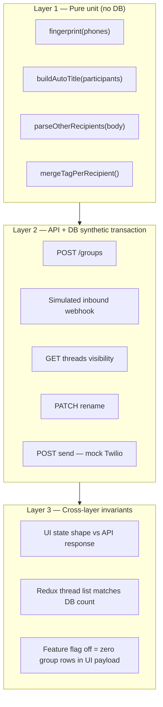

### 13.3 Harness: `scripts/smoke-test-group-conversations.ts`

New npm script: `npm run validate:group-conversations`

```bash
# DB + API tests — synthetic transaction, always rolled back
npx tsx scripts/smoke-test-group-conversations.ts

# Include HTTP calls against local dev server
SMOKE_API=1 npx tsx scripts/smoke-test-group-conversations.ts

# Skip DB (unit-only fingerprint/title tests)
SMOKE_UNIT_ONLY=1 npx tsx scripts/smoke-test-group-conversations.ts
```

**File structure (to implement with feature):**

```
scripts/smoke-test-group-conversations.ts   # runner, report, rollback
scripts/group-conv/fixtures.ts              # synthetic brokers, clients, phones
scripts/group-conv/webhook-payloads.ts      # Twilio inbound samples
scripts/group-conv/invariants.ts            # DB assertion helpers
scripts/group-conv/pure.ts                  # fingerprint, auto-title (exported for unit)
```

### 13.4 Synthetic fixture design

Each run uses a unique `runId = smoke-group-${Date.now()}`:

| Entity | Pattern | Example |
|--------|---------|---------|
| Client A | `+1555${runId.slice(-7)}1` | Fingerprint participant |
| Client B | `+1555${runId.slice(-7)}2` | Second participant |
| Unknown | `+1555${runId.slice(-7)}9` | `external_phone` |
| Broker (owner) | Insert in txn, email `runId-owner@smoke-group-conv.local` | Creates group |
| Broker (other) | `runId-other@smoke-group-conv.local` | 403 visibility tests |
| Inbox line | `+1555${runId.slice(-7)}0` | Synthetic `twilio_phone_numbers` row in txn |
| `conversation_id` | `conv_group_smoke_${runId}` | Never collides with prod |

All inserts use `tenant_id = MORTGAGE_TENANT_ID` inside a transaction **rolled back** in `finally`.

### 13.5 Mock Twilio inbound payloads (no carrier)

```typescript
// scripts/group-conv/webhook-payloads.ts
export const directInbound = {
  From: "+15551234567",
  To: "+15559876543",
  Body: "Hello direct",
  // no OtherRecipients → must route Flow D
};

export const groupInboundTwo = {
  From: "+15551234567",
  To: "+15559876543",
  Body: "Hello group",
  OtherRecipients0: "+15557654321",
};

export const groupInboundMax = {
  From: "+15550000001",
  To: "+15559876543",
  Body: "Max group",
  ...Object.fromEntries(
    Array.from({ length: 9 }, (_, i) => [`OtherRecipients${i}`, `+1555000000${i + 2}`]),
  ),
};
```

Inject via:
- **Option A:** Internal test route `POST /api/test/simulate-inbound-sms` (dev-only, `NODE_ENV=development`)
- **Option B:** Call `handleInboundSMS` logic through exported test helper
- **Never** POST to production Twilio webhook URL with real numbers

### 13.6 Test case catalog (maps to §12 edge matrix)

| Case ID | Flow | Layers | Assertion summary |
|---------|------|--------|-------------------|
| GC-001 | A | API+DB | Internal group create → participants count |
| GC-002 | A | API+DB | Auto-title when title omitted |
| GC-003 | B | API+DB | SMS group fingerprint uniqueness |
| GC-004 | B | API | Duplicate create returns same id |
| GC-005 | C | API+DB | `OtherRecipients0` creates `phone_synced` |
| GC-006 | C | API+DB | Second inbound same fingerprint → same thread |
| GC-007 | D | API+DB | Inbound without OtherRecipients → `thread_type=direct` |
| GC-008 | D | API+DB | Direct thread count unchanged after group tests |
| GC-009 | C+D | API+DB | Same phone 1:1 + group → two conversation_ids |
| GC-010 | E | API | Closed group → send 400 |
| GC-011 | F | API | Add participant → system_event row |
| GC-012 | F | API | 11th participant → 400 |
| GC-013 | G | API+DB | Rename persists after inbound |
| GC-014 | H | API | Link loan → visibility for loan owner broker |
| GC-015 | I | API | Cross-broker unauthorized → 403 on create |
| GC-016 | I | API | Other broker cannot see thread in GET list |
| GC-017 | J | API | Quota precheck called (mock — no consume) |
| GC-018 | K | API | Flag off → POST /groups 404 |
| GC-019 | — | Unit | `fingerprint` stable regardless of phone order |
| GC-020 | — | Unit | `buildAutoTitle` for 1, 2, 5 participants |
| GC-021 | C | API+DB | Unknown phone → `external_phone` participant |
| GC-022 | E | API+DB | `metadata.recipients` on group communication |
| GC-023 | — | API | `GET threads` includes `display_title` never null for groups |
| GC-024 | D | API | Email threads still excluded from conversations list |

### 13.7 DB invariant queries (post-action, inside txn)

```sql
-- Group thread integrity
SELECT COUNT(*) FROM conversation_threads ct
WHERE ct.conversation_id = ?
  AND ct.thread_type = 'group'
  AND ct.participant_fingerprint IS NOT NULL;

-- Participants match API payload
SELECT COUNT(*) FROM conversation_participants
WHERE conversation_id = ? AND left_at IS NULL;

-- Direct path never sets fingerprint
SELECT COUNT(*) FROM conversation_threads
WHERE thread_type = 'direct' AND participant_fingerprint IS NOT NULL;
-- expect 0 new rows in synthetic run

-- No group message in direct-only canonical client thread collision
SELECT conversation_id, COUNT(*) c FROM conversation_threads
WHERE tenant_id = ? AND participant_fingerprint = ?
GROUP BY conversation_id HAVING c > 1;
-- expect 0
```

### 13.8 UI verification (no E2E flakiness required for v1)

| Check | Method |
|-------|--------|
| Thread list shape | `SMOKE_API=1`: parse `GET /api/conversations/threads` — group rows have `thread_type`, `display_title`, `participants_preview` |
| Redux hydration | TypeScript compile + optional component test with mocked store |
| Flag off | API response with zero `thread_type=group` when flag disabled |
| Visual regression | Manual checklist pre-release; Percy/Chromatic optional later |

**UI manual checklist (staging, synthetic users only):**

1. Create internal group → title visible in list + header  
2. Rename → list updates without refresh  
3. Phone-synced fixture → pill + banner visible  
4. Direct thread side-by-side → no group chrome  
5. Mobile width → avatar stack not clipped  

### 13.9 CI / merge gates

```yaml
# .github/workflows or pre-merge locally
- npm run typecheck
- npm run validate:comms          # existing 1:1 — must pass
- npm run validate:group-conversations  # new — GC-001..GC-024
- GROUP_CONVERSATIONS_ENABLED=0 npm run validate:group-conversations  # GC-018, GC-008
```

### 13.10 Canary in production (no synthetic pollution)

| Phase | Production behavior |
|-------|---------------------|
| Deploy + flag **off** | Zero user impact; run read-only GC audit queries |
| Flag **on** for one test broker | Real groups allowed; monitor `audit_logs` |
| Full rollout | Enable tenant-wide |

Read-only prod audit (no writes):

```sql
-- Verify no direct threads were accidentally fingerprinted
SELECT COUNT(*) FROM conversation_threads
WHERE thread_type = 'direct' AND participant_fingerprint IS NOT NULL;

-- Verify conv_client_* count stable week-over-week
SELECT COUNT(*) FROM conversation_threads
WHERE conversation_id LIKE 'conv_client_%' AND status = 'active';
```

### 13.11 Failure triage map

| Symptom | Likely layer | First check |
|---------|--------------|-------------|
| Group message in wrong thread | API fingerprint | GC-006, GC-009 |
| Direct SMS broke | API regression | GC-007, GC-008 |
| Blank group title | API `display_title` | GC-002, GC-023 |
| Broker sees wrong group | API visibility | GC-016 |
| List shows group when flag off | UI + API filter | GC-018 |
| Duplicate groups same people | DB UNIQUE fingerprint | GC-003, GC-004 |
| UI chips ≠ API participants | Cross-layer | GC-001 + manual checklist |

---

## 14. Phased Rollout

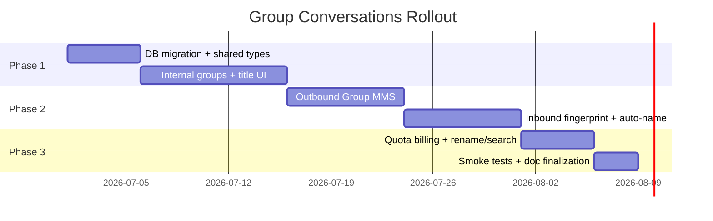

| Phase | Delivers | Group name |
|-------|----------|------------|
| **1 — Internal groups** | Participants table, create wizard, title in list + header, internal messages | User-set + auto-fallback + rename |
| **2 — SMS Group MMS** | Outbound multi-send, inbound detection, auto-create with generated title | Same; inbound groups get auto-name until user renames |
| **3 — Hardening** | Quota (segments × recipients), smoke tests, swagger | Search by title; notification copy uses title |

---

## 15. What Stays Unchanged

| Area | Reason |
|------|--------|
| **Email** (`/admin/email`, mailboxes, CC/BCC) | Separate product surface — out of scope |
| **Direct SMS** (`conv_client_{id}`) | No regression — fingerprint only for groups |
| **Broadcasts** (`broadcast-*` IDs) | Separate campaign system |
| **Reminder flows** | Stay 1:1 per client in v1 |

---

## 16. Related Documentation Updates (on implementation)

| File | Change |
|------|--------|
| `docs/DESIGN_SYSTEM.md` | Conversations module: direct + group threads, title display |
| `docs/OWNERSHIP_MODEL.md` | Group visibility; remove stale "participated in" bullet |
| `api/swagger.yaml` | New group endpoints |
| `shared/api.ts` | `ConversationThread`, `CreateGroupConversationRequest` |
| `scripts/smoke-test-group-conversations.ts` | GC-001..GC-024 case catalog (§13) |
| `package.json` | `validate:group-conversations` script |

---

## 17. Open Questions for Approval

1. **Max participants:** 10 (Twilio Group MMS US/CA limit) — confirm?
2. **Default channel for "quick group":** Internal first, or SMS if all have phones?
3. **Loan link required?** Optional in v1 — recommend optional with title suggestion only.
4. **Who can rename?** Thread owner + `admin`/`superadmin` — confirm?

---

## 18. Bottom Line

- The platform is **1:1 only today** across DB, API, UI, and docs.
- Group conversations need **participants table + `thread_type` + fingerprint inbound matching**.
- **The group name will always appear** in Encore: user-defined `title`, loan-based suggestion, or auto-generated `display_title` — in the thread list, header, search, composer, and notifications.
- **Phone-created SMS groups sync only when the Twilio business line is a member** — participants yes, phone app group name no; Encore rename + “Synced from phone” UX (§9).
- **All flows and edge scenarios** are catalogued in §12 (Flows A–K + cross-layer matrix E01–E15).
- **Deep testing without real data** — synthetic fixtures, transaction rollback, 24 automated cases (GC-001..GC-024), three-layer pyramid (§13).
- **No breaking changes** — additive schema/API, feature flag, direct 1:1 path untouched (§11).
- **CRM value** — loan-linked groups, pipeline quick actions, participant resolution, audit trail (§10).
- **Premium UI** — stacked avatars, source pills, sender labels in bubbles, onboarding banner (§7).
- Carriers do **not** show Encore's group name on recipient phones; that is expected.
- **Email is ignored** — this proposal applies only to `/admin/conversations`.
