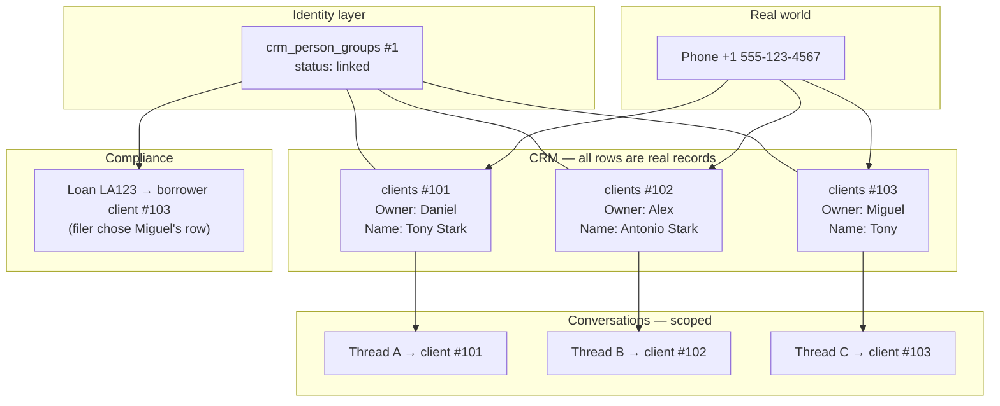
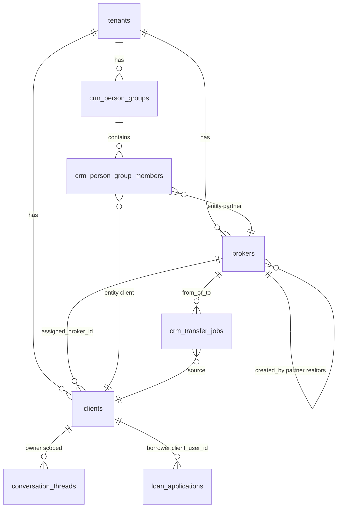
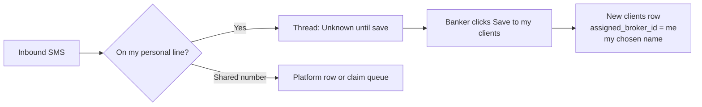
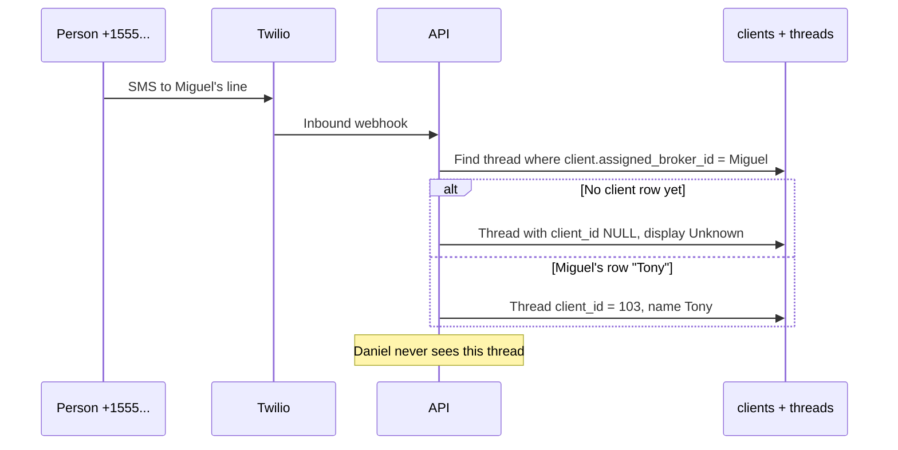
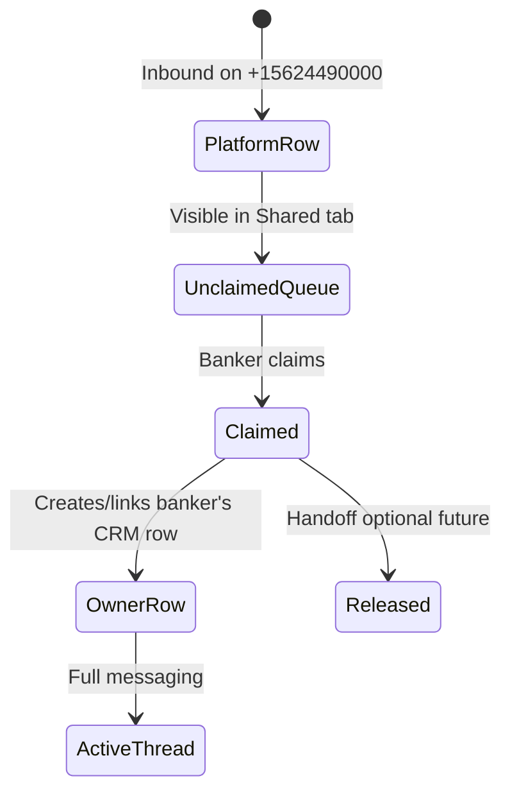
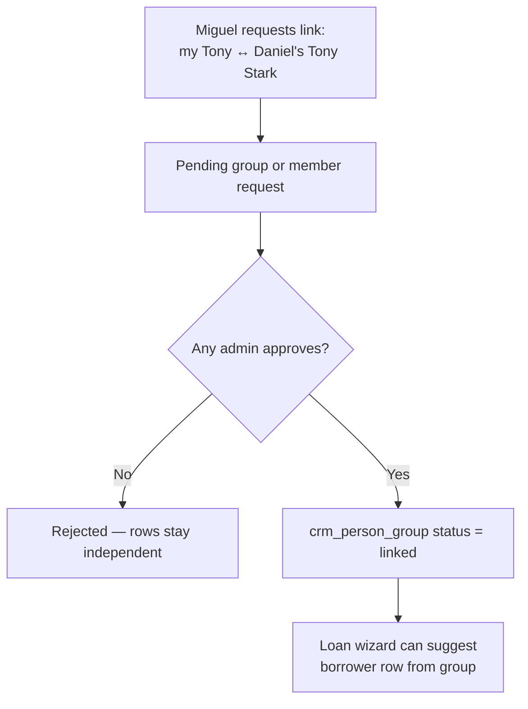
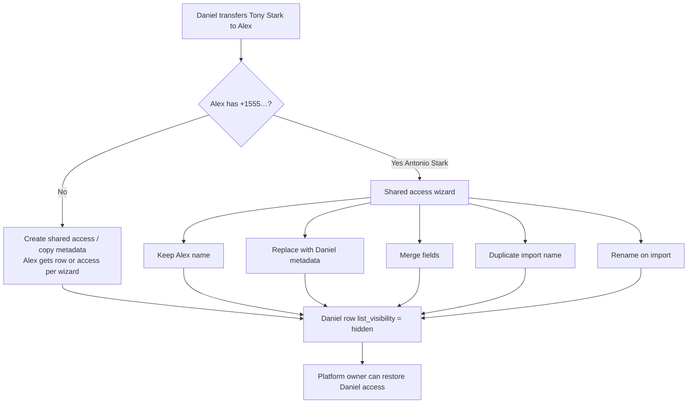
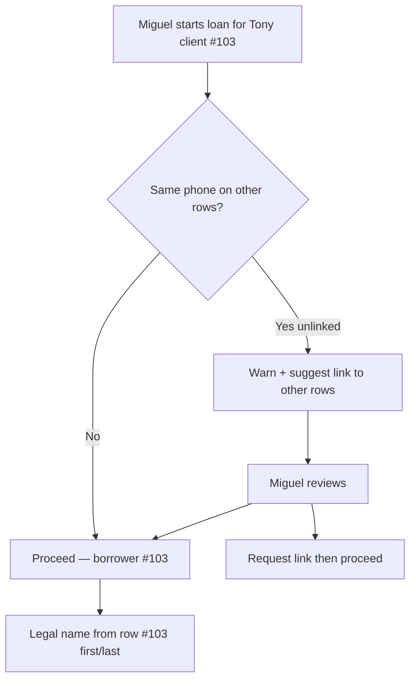

# Per-Owner CRM, Conversations & Identity Linking

> **Status**: Approved product + architecture specification (pre-implementation)  
> **Supersedes**: `docs/PRIVATE_CONTACTS_ARCHITECTURE.md` (deprecated — separate “private contacts” layer)  
> **Business guide (non-technical):** [`PER_OWNER_CRM_BUSINESS_GUIDE.md`](./PER_OWNER_CRM_BUSINESS_GUIDE.md)  
> **Related**: `docs/IDENTITY_SYNC_ARCHITECTURE.md` (webhook idempotency, channel identities — complementary)  
> **Last updated**: June 2, 2026

---

## 1. Executive summary

Encore Mortgage needs a CRM where **every mortgage banker owns their own client and realtor records**, even when the **same phone number** appears on multiple bankers’ lists under **different saved names**. Everything remains in the CRM (`clients`, `brokers` for partner realtors, `leads`) — there is **no parallel address book**.

When Daniel, Alex, and Miguel each save `+1 555-123-4567` as **Tony Stark**, **Antonio Stark**, and **Tony**, the system stores **three CRM rows**. Conversations, calendar fields, and list views are scoped to **the owner’s row**. When relationships overlap, **identity linking**, **transfer**, and **merge wizards** provide the “CRM magic” — never silent overwrites.

This document is the single source of truth for product decisions, data model, UX flows, scenarios, migration, and rollout.

---

## 2. Glossary (CRM language)

| Term | Meaning |
|------|---------|
| **Owner** | The mortgage banker (`assigned_broker_id` on clients/leads, or `created_by_broker_id` on partner realtors) |
| **CRM row** | A record in `clients` or `brokers` (role=`broker`) belonging to one owner |
| **Same phone, multiple rows** | Intentional — each owner’s list can contain the same `normalized_phone` with different names |
| **Identity link group** | Admin-approved connection: “these CRM rows represent the same real person” |
| **Borrower of record** | The one client row used for loan applications and legal/compliance documents |
| **People view** | Platform-owner UI grouping rows by phone number |
| **Platform row** | Client record owned by the tenant/platform until a banker claims a shared-inbox thread |
| **Soft remove** | Row hidden from owner’s list; retained for audit; platform owner can restore |

**Retired concept:** “Private contacts” as a separate entity outside CRM. Display names **are** CRM `first_name` / `last_name` on **owner-scoped rows**.

---

## 3. Approved product decisions

### 3.1 Core CRM model

| Decision | Choice |
|----------|--------|
| Same phone, different names | **Separate CRM row per owner** (Daniel / Alex / Miguel each have their own row) |
| Duplicate phone policy | **Allow per owner** — relax `uq_clients_tenant_norm_phone` to include owner |
| Unknown inbound on personal line | Show **“Unknown”** until banker manually saves to CRM |
| Default save flow | **Create CRM client + link conversation** (not messaging-only) |
| Realtors | **Same per-owner model** as clients |
| Calendar (DOB, etc.) | **Owner row only** — no inheritance from another banker’s copy |
| Link vs merge | **Both** — link for day-to-day; merge when admin confirms duplicate |
| Legal name on loan docs | **Borrower row** `first_name` / `last_name` (not chat nickname) |

### 3.2 Conversations & inbox

| Decision | Choice |
|----------|--------|
| Thread links to | **Owner’s `client_id`** (per-owner client row) |
| Cross-broker thread visibility | **Never** — Miguel does not see Daniel’s threads |
| Personal line messaging | **Always allow** reply on my assigned Twilio line |
| Shared company number | **Claim queue**; thread starts as **platform row** until claimed |
| Shared inbox contact ownership | **Claimer’s** CRM row after claim |

### 3.3 Transfer & sharing

| Decision | Choice |
|----------|--------|
| Transfer semantics | **Copy / shared access** (not destructive move by default) |
| Target already has same phone | **Shared access** — no overwrite |
| Name conflict on transfer | **Wizard** — pick official name or keep both |
| Sender after transfer | **Hidden from list**; **platform owner can restore** |

### 3.4 Identity linking & loans

| Decision | Choice |
|----------|--------|
| Link “same person” | Any MB **requests**; **any admin** approves |
| Loan borrower row | **Loan filer picks** at application time |
| Unlinked duplicate at loan time | **Warn + auto-suggest link**; proceed after review |
| SMS blast / marketing | **Dedupe by phone** — one message per number |

### 3.5 Platform owner

| Decision | Choice |
|----------|--------|
| Clients list | **People view** — group by phone, expand banker copies |
| Messaging | Global messaging access (existing `platform_owner` behavior) |

---

## 4. Current architecture (audit summary)

### 4.1 What exists today

```
communications.conversation_id  →  conversation_threads (UNIQUE conversation_id)
conversation_threads.client_id  →  clients.id
conversation_threads.broker_id    →  handler / line owner
conversation_threads.client_name  →  global denormalized cache (first writer wins)
clients                           →  UNIQUE (tenant_id, normalized_phone)  ← blocks per-owner rows
```

### 4.2 Current pain points

| Issue | Example |
|-------|---------|
| One client per phone tenant-wide | Miguel cannot have “Tony” if Daniel has “Tony Stark” on same number |
| Global thread name | All viewers see same `client_name` |
| Permission mismatch | Miguel **sees** Daniel’s thread but gets **403** “assigned to another broker” on send |
| `conv_client_{id}` collapse | One thread per client id, not per owner |
| Transfer | Reassignment changes global record; no multi-owner copy model |

### 4.3 APIs & UI affected

- `GET /api/conversations/threads`, `POST /api/conversations/send`, save-contact, lookup-contact  
- Twilio inbound SMS/voice webhooks  
- `client/pages/admin/Conversations.tsx`, `Clients.tsx`, `Brokers.tsx`, `ClientDetailPanel.tsx`  
- Loan creation wizard, SMS blast, calendar birthday queries  

---

## 5. Target architecture

### 5.1 Conceptual model



### 5.2 Design principles

1. **CRM-native** — no shadow contact store.  
2. **Owner-scoped lists** — bankers see only their rows (+ shared queue + platform tools).  
3. **Never silent overwrite** on transfer/import — always wizard.  
4. **One borrower per loan** — filer selects row; legal fields from that row.  
5. **Blast dedupes by phone** — compliance-friendly marketing.  
6. **Backwards compatible migration** — legacy threads and IDs preserved; phased flags.

---

## 6. Database schema (proposed)

### 6.1 Change to `clients`

```sql
-- Replace tenant-wide phone unique with per-owner unique
ALTER TABLE clients
  DROP INDEX uq_clients_tenant_norm_phone;

ALTER TABLE clients
  ADD UNIQUE KEY uq_clients_tenant_owner_norm_phone
    (tenant_id, assigned_broker_id, normalized_phone)
  COMMENT 'Same phone allowed for different owners; one row per owner per phone';

-- Optional: visibility after soft-remove transfer
ALTER TABLE clients
  ADD COLUMN list_visibility ENUM('active','hidden','archived') NOT NULL DEFAULT 'active',
  ADD COLUMN hidden_reason VARCHAR(100) DEFAULT NULL,
  ADD COLUMN hidden_at DATETIME DEFAULT NULL;
```

Apply analogous constraints to partner realtors (`brokers` role=`broker`) via `(tenant_id, created_by_broker_id, normalized_phone)`.

### 6.2 Identity link group

```sql
CREATE TABLE crm_person_groups (
  id              INT NOT NULL AUTO_INCREMENT,
  tenant_id       INT NOT NULL,
  status          ENUM('pending','linked','merged','rejected') NOT NULL DEFAULT 'pending',
  canonical_client_id INT DEFAULT NULL COMMENT 'Set when merged; borrower-of-record default',
  created_by_broker_id INT NOT NULL,
  approved_by_broker_id INT DEFAULT NULL,
  approved_at     DATETIME DEFAULT NULL,
  notes           TEXT DEFAULT NULL,
  created_at      DATETIME DEFAULT CURRENT_TIMESTAMP,
  PRIMARY KEY (id),
  KEY idx_cpg_tenant_status (tenant_id, status)
);

CREATE TABLE crm_person_group_members (
  id              INT NOT NULL AUTO_INCREMENT,
  tenant_id       INT NOT NULL,
  group_id        INT NOT NULL,
  entity_type     ENUM('client','broker','lead') NOT NULL,
  entity_id       INT NOT NULL,
  role            ENUM('member','borrower_of_record') NOT NULL DEFAULT 'member',
  joined_at       DATETIME NOT NULL DEFAULT CURRENT_TIMESTAMP,
  PRIMARY KEY (id),
  UNIQUE KEY uq_member (tenant_id, entity_type, entity_id),
  KEY idx_cpgm_group (group_id)
);
```

### 6.3 Transfer jobs

```sql
CREATE TABLE crm_transfer_jobs (
  id                  INT NOT NULL AUTO_INCREMENT,
  tenant_id           INT NOT NULL,
  from_broker_id      INT NOT NULL,
  to_broker_id        INT NOT NULL,
  source_entity_type  ENUM('client','broker') NOT NULL,
  source_entity_id    INT NOT NULL,
  status              ENUM('pending','review','completed','cancelled') NOT NULL DEFAULT 'pending',
  resolution_json     JSON DEFAULT NULL,
  created_by_broker_id INT NOT NULL,
  completed_at        DATETIME DEFAULT NULL,
  PRIMARY KEY (id)
);
```

### 6.4 Conversation threads (additive)

```sql
ALTER TABLE conversation_threads
  ADD COLUMN owner_client_scope_broker_id INT DEFAULT NULL
    COMMENT 'Denormalized: clients.assigned_broker_id for thread client_id',
  ADD KEY idx_ct_owner_scope (tenant_id, owner_client_scope_broker_id, client_id);
```

Thread visibility rule: requesting broker sees thread iff  
`owner_client_scope_broker_id = :me` OR shared-queue rules OR platform-owner people tools.

### 6.5 Entity relationship diagram



---

## 7. Functional areas

### 7.1 Per-owner client lists

**Behavior:** Each mortgage banker’s **Clients & Leads** list shows only rows where `assigned_broker_id = me` and `list_visibility = active`.

**Create paths:**

- Manual **+ New Client**
- **Save unknown sender** from Conversations
- Claim shared-inbox thread → create or link row
- Bulk import (assigns to importer)



### 7.2 Conversations

**Thread ↔ CRM binding:** `conversation_threads.client_id` must reference a client owned by the viewing banker (or platform row / post-claim row).

**Personal line:** Banker **always** may send on threads tied to their line and their client row — fixes the 403 “assigned to another broker” error when viewing **own** threads.

**Never cross-view:** Daniel’s threads do not appear in Miguel’s sidebar.



### 7.3 Shared inbox (claim queue)



| Stage | CRM record | Who sees thread |
|-------|------------|-----------------|
| Unclaimed | Platform-owned client row | All MBs in Shared queue (read); compose disabled until claim |
| Claimed | Claimer’s `clients` row | Claimer in Mine tab; others lose compose access |

### 7.4 Identity linking (“same person”)



**Rules:**

- Request: any mortgage banker.  
- Approve: any admin (`admin` or `platform_owner`).  
- Link does **not** merge names or delete rows.  
- **Borrower of record** flag on one member when filer selects at loan time.

### 7.5 Transfer (copy / shared access)



**After transfer (Daniel):** row **hidden** from Daniel’s list — not deleted. Platform owner can restore.

### 7.6 Loans



### 7.7 SMS blast

One send per **`normalized_phone`** per campaign — even if three CRM rows exist.

### 7.8 Platform owner — People view

```
Phone +1 555-123-4567  [3 copies ▼]
  ├─ Daniel Carrillo's list   Tony Stark      (client #101)  [Link] [Transfer] [Merge]
  ├─ Alex Gomez's list        Antonio Stark   (client #102)
  └─ Miguel Flores's list     Tony            (client #103)  ← borrower on LA…
```

### 7.9 Calendar

Birthday on Daniel’s row only. Miguel’s copy without DOB shows no birthday until Miguel enters it on **his** row.

### 7.10 Merge (admin-confirmed)

When admin confirms duplicate:

1. Select survivor row (usually borrower of record or most complete).  
2. Repoint FKs: loans, threads, documents → survivor.  
3. Other rows → `list_visibility = archived`, members removed from active group.  
4. Audit log with before/after.

---

## 8. Scenario walkthroughs

### Scenario A — Same phone, three names (core case)

| Step | Actor | Action | Result |
|------|-------|--------|--------|
| 1 | Daniel | Saves +1 555… as **Tony Stark** | `clients #101`, owner Daniel |
| 2 | Alex | Saves same phone as **Antonio Stark** | `clients #102`, owner Alex |
| 3 | Miguel | Saves same phone as **Tony** | `clients #103`, owner Miguel |
| 4 | Each | Texts from personal line | Three separate threads, three names |
| 5 | Daniel | Opens Conversations | Sees **Tony Stark** only — not Miguel’s thread |

### Scenario B — Miguel messaging error (fixed)

| Before | After |
|--------|-------|
| Miguel sees Daniel’s thread, 403 on send | Miguel **never** sees Daniel’s thread |
| — | Inbound on **Miguel’s line** → Unknown or **Tony** (his row) → send **always allowed** |

### Scenario C — Unknown caller

| Step | Result |
|------|--------|
| New number texts Miguel’s line | Thread shows **Unknown** |
| Miguel replies without saving | **Blocked or prompt** — product: save required before reply (configurable strict mode) |
| Miguel saves as **Tony** | `clients #103` created, thread linked, name updates |

### Scenario D — Daniel transfers to Alex (Alex already has Antonio Stark)

| Step | Result |
|------|--------|
| 1 | Daniel initiates transfer of Tony Stark |
| 2 | System detects Alex’s row with same phone |
| 3 | Wizard: shared access options (keep / replace / merge / duplicate name / rename) |
| 4 | Daniel’s row **hidden** from his list |
| 5 | Alex retains **Antonio Stark** unless he chose replace/merge |
| 6 | Platform owner can restore Daniel’s visibility |

### Scenario E — Loan with duplicate rows

| Step | Result |
|------|--------|
| 1 | Miguel files loan on **Tony** (#103) |
| 2 | System detects Daniel’s **Tony Stark** (#101) same phone |
| 3 | Warning + **suggest link** to group |
| 4 | Miguel proceeds after review; borrower = **#103** |
| 5 | Loan docs use **#103 legal first/last**, not nickname |

### Scenario F — Link request

| Step | Result |
|------|--------|
| 1 | Miguel requests link #103 ↔ #101 |
| 2 | Admin (any) approves |
| 3 | Group created; rows stay separate |
| 4 | Future loans can pick borrower from group |

### Scenario G — Shared inbox claim

| Step | Result |
|------|--------|
| 1 | SMS to +15624490000 | Platform row + unclaimed queue entry |
| 2 | Miguel claims | Miguel’s client row created/linked, compose enabled |
| 3 | Daniel | Sees queue item until claimed; after claim, not in Daniel’s Mine tab |

### Scenario H — SMS blast

| Step | Result |
|------|--------|
| Campaign targets segment including #101, #102, #103 | **One SMS** to +1 555… |
| Audit | Log notes deduped recipients |

### Scenario I — Partner realtor same model

| Step | Result |
|------|--------|
| Daniel saves realtor Jane Doe +1 999… | `brokers` partner row, `created_by_broker_id = Daniel` |
| Miguel saves same phone as **Jane** | Separate partner row for Miguel |
| Transfer/link | Same wizard patterns as clients |

### Scenario J — Merge after link

| Step | Result |
|------|--------|
| 1 | Linked group exists (#101, #102, #103) |
| 2 | Platform owner merges → survivor #103 |
| 3 | #101, #102 archived; threads repointed |
| 4 | Single borrower record for compliance |

### Scenario K — Platform owner restore

| Step | Result |
|------|--------|
| Daniel’s row hidden after transfer | Daniel does not see in list |
| Platform owner restores | `list_visibility = active` for Daniel |
| Shared access with Alex | Both may have access per transfer resolution |

---

## 9. API changes (summary)

Feature flag: `PER_OWNER_CRM_ENABLED` (+ production allow flag + pilot broker IDs).

### 9.1 New endpoints

| Method | Path | Purpose |
|--------|------|---------|
| GET | `/api/crm/people` | Platform owner people view (group by phone) |
| POST | `/api/crm/person-groups` | Request link |
| POST | `/api/crm/person-groups/:id/approve` | Admin approve/reject |
| POST | `/api/crm/person-groups/:id/merge` | Admin merge members |
| POST | `/api/crm/transfers` | Start transfer job |
| GET | `/api/crm/transfers/:id` | Transfer status + conflicts |
| POST | `/api/crm/transfers/:id/resolve` | Submit wizard decisions |
| POST | `/api/conversations/shared/:id/claim` | Claim shared-queue thread |
| GET | `/api/clients` | **Scoped** to `assigned_broker_id = me` (unless platform people view) |

### 9.2 Modified behavior

| Endpoint | Change |
|----------|--------|
| `GET /api/conversations/threads` | Filter by owner scope; Shared tab for queue |
| `POST /api/conversations/send` | Permission = thread owner’s client row + line rules; remove false 403 |
| `POST /api/conversations/:id/save-contact` | Creates **my** client row (allow same phone as other owners) |
| Loan create | Duplicate-phone suggest + link prompt |
| SMS blast | Dedupe recipients by `normalized_phone` |

**Legacy:** Existing fields (`client_name`, `conversation_id`) retained through migration.

---

## 10. UI / UX specification

### 10.1 Navigation

| Tab / area | Contents |
|------------|----------|
| **Conversations → Mine** | My lines, my client rows |
| **Conversations → Shared** | Claim queue (company number) |
| **Clients & Leads** | My rows only (`assigned_broker_id = me`) |
| **Realtor Management** | My partner rows only |
| **People** (platform owner) | Phone-grouped view across all owners |

### 10.2 Conversation header badges

| Badge | Meaning |
|-------|---------|
| **My line** | Personal Twilio number |
| **Shared · Unclaimed** | Queue item |
| **Shared · Claimed by you** | You own the claim |
| **Linked to N others** | Member of identity group |
| **Borrower on LA…** | This row is borrower of record |

Replace confusing **“Managed by Daniel”** on **own** threads with context-appropriate badges. Show **“CRM assigned to …”** only when viewing linked group context, not as send blocker.

### 10.3 Wizards (required)

1. **Transfer conflict** — 5 options (keep / replace / merge / duplicate import / rename)  
2. **Link approval** — admin queue  
3. **Merge** — pick survivor, field-level merge preview  
4. **Loan duplicate phone** — suggest link, pick borrower row  
5. **Save unknown** — name form → creates owner-scoped client row  

---

## 11. Security & permissions

| Action | Who |
|--------|-----|
| View own client list | Owner |
| View people view | Platform owner |
| Approve link | Any admin |
| Merge | Platform owner (recommended) or any admin |
| Restore hidden row | Platform owner |
| Message on personal line | Line owner on own client row |
| Claim shared thread | Any MB; first claim wins (conflict policy TBD: lock) |
| SMS blast dedupe | System enforced |

All queries enforce `tenant_id`. Row-level scope via `assigned_broker_id` / `created_by_broker_id`.

Audit: link, transfer, merge, hide, restore → `audit_logs`.

---

## 12. Performance

| Query | Index |
|-------|-------|
| My clients | `(tenant_id, assigned_broker_id, list_visibility)` |
| Phone lookup per owner | `(tenant_id, assigned_broker_id, normalized_phone)` UNIQUE |
| People view by phone | `(tenant_id, normalized_phone)` on clients |
| My threads | `(tenant_id, owner_client_scope_broker_id, last_message_at)` |
| Group members | `(group_id)` |

People view for 100k+ rows: paginate by phone clusters; optional materialized `phone_cluster_summary` table in phase 2.

---

## 13. Migration plan

| Phase | Work | Risk |
|-------|------|------|
| **0** | New tables + columns; flags off | None |
| **1** | Relax phone UNIQUE → per-owner UNIQUE; backfill `list_visibility` | Medium — validate prod duplicates |
| **2** | Backfill `owner_client_scope_broker_id` on threads from `clients.assigned_broker_id` | Low |
| **3** | Pilot: scoped client lists + thread filters (Miguel, Daniel) | Medium |
| **4** | Transfer + link APIs + wizards | Medium |
| **5** | Shared claim queue + platform rows | Medium |
| **6** | Loan suggest + blast dedupe | Low |
| **7** | People view + merge tooling | Medium |

**Rollback:** Flag off → legacy global phone unique temporarily re-enabled only if no duplicate-owner rows created in pilot.

Existing conversations: **never delete**; repoint `client_id` only via explicit merge with audit.

---

## 14. Risk assessment

| Risk | Mitigation |
|------|------------|
| Compliance: multiple client rows per person | Borrower of record + merge path + audit |
| Blast still duplicates | Hard dedupe by phone in sender |
| Claim race (two bankers) | Optimistic lock on claim; second gets clear error |
| Thread fragmentation | Per-owner `client_id` binding; migration backfill |
| Loan on wrong row | Wizard + suggest link |
| Admin merge data loss | Soft-archive losers; 30-day restore |

---

## 15. Testing strategy

- Unit: per-owner phone UNIQUE, dedupe blast, permission matrix  
- Integration: Scenario A–K automated  
- E2E: Miguel never sees Daniel thread; send succeeds on own line  
- Regression: legacy `conv_client_*` still load  
- Security: IDOR on other owner’s `client_id`  

---

## 16. Relationship to other docs

| Document | Relationship |
|----------|--------------|
| `IDENTITY_SYNC_ARCHITECTURE.md` | Keep for webhook idempotency, `channel_identities`, provider mappings — **orthogonal** to per-owner CRM rows |
| `GROUP_CONVERSATIONS.md` | Group threads inherit owner-scope rules for external participants |
| `PRIVATE_CONTACTS_ARCHITECTURE.md` | **Deprecated** — do not implement separate messaging_contacts layer |

---

## 17. Open implementation details (minor)

| Item | Default recommendation |
|------|------------------------|
| Strict “must save before reply” on Unknown | Config flag; default **prompt** on first send attempt |
| Claim race | First claim wins; show toast to second banker |
| Platform row `assigned_broker_id` | `NULL` or sentinel platform broker id |
| Email conversations | Phase 2 — same owner-scoped client row by email per owner |

---

## 18. Decision log (complete)

All product answers captured June 2026:

- Per-owner CRM rows; allow duplicate phone per owner  
- Conversations per owner client row; no cross-broker thread visibility  
- Personal line always message; shared inbox claim queue + platform row  
- Unknown until manual save  
- Transfer = copy/shared access; name wizard; Daniel hidden + PO restore  
- Link: any MB request, any admin approve; loan filer picks borrower; suggest link at loan  
- Blast dedupe by phone; legal name from borrower row  
- Link + merge both supported  
- Realtors same model; calendar owner-row only  
- Platform owner people view  

---

_Document owner: Engineering + Product_  
_Next step: Phase 0 migration draft + update `shared/api.ts` types for person groups and transfer jobs._
