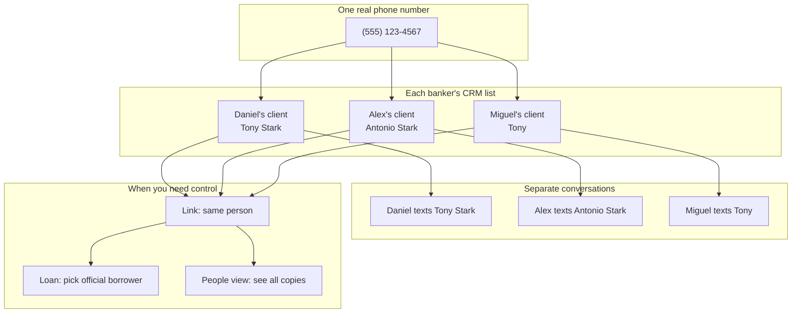
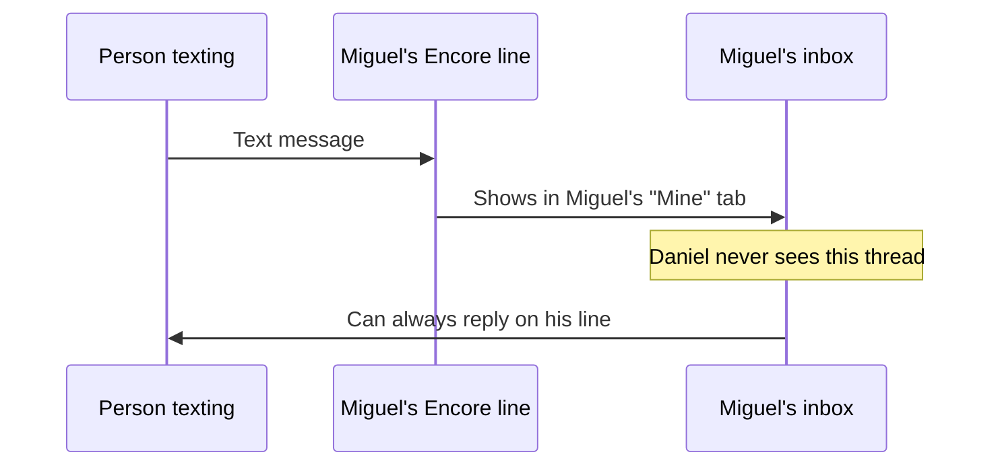
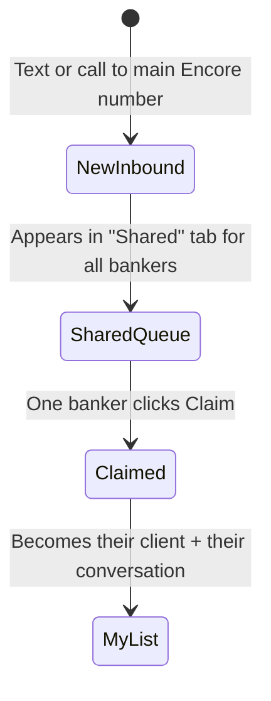
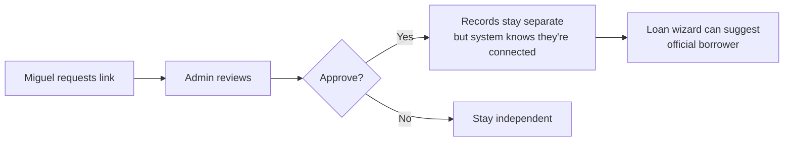
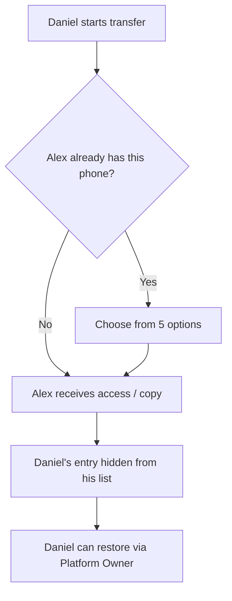
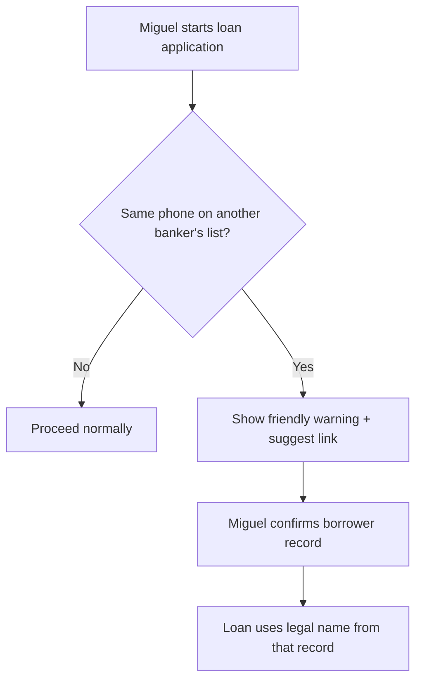

# Encore CRM & Conversations — Proposal for Leadership

---

## In one minute

Today, Encore tries to treat **one phone number = one client record** for the whole company. That causes confusion: wrong names in text threads, bankers seeing conversations they cannot reply to, and transfers that overwrite someone else’s work.

**The proposal:** Every mortgage banker keeps **their own client and realtor list** in the CRM — even when two bankers save the **same phone number** under **different names**. When the system discovers it’s probably the same real person, **you** get guided tools to link, transfer, or merge records — **never silent overwrites**.

Everything stays inside Encore’s CRM. There is no separate “side address book.”

---

## The problem we’re solving (in plain English)

### What bankers experience today

| Problem                                 | Real example                                                                                                                     |
| --------------------------------------- | -------------------------------------------------------------------------------------------------------------------------------- |
| **One name for everyone**               | Daniel saves a contact as “Tony Stark.” Miguel might see that same name — or a different thread — and get blocked from replying. |
| **“Assigned to another broker” errors** | Miguel opens a conversation, types a message, and sees: _“This contact is assigned to another broker.”_                          |
| **Cannot save the same phone twice**    | If Daniel already has `(555) 123-4567`, Miguel cannot add that number to **his** list as “Tony.”                                 |
| **Transfers are all-or-nothing**        | Moving a relationship to another banker can clash with how they already saved that person.                                       |
| **Shared company line is unclear**      | Texts to the main Encore number — who owns the follow-up?                                                                        |

### What we want instead

Think of it like **each banker’s phone and CRM list working the way personal cell phones do** — but still connected to Encore’s loans, compliance, and reporting.

- Daniel’s list: **Tony Stark**
- Alex’s list: **Antonio Stark**
- Miguel’s list: **Tony**

**Same phone. Three names. Three legitimate CRM entries.**  
When it matters for a **loan** or **company-wide view**, the system helps you connect the dots.

---

## The big idea (visual)



---

## Simple glossary

| Term                   | What it means for you                                                                |
| ---------------------- | ------------------------------------------------------------------------------------ |
| **My client list**     | Clients & Leads assigned to **me** — what I manage day to day                        |
| **My realtor list**    | Partner realtors **I** added in Realtor Management                                   |
| **Same person link**   | “These two CRM entries are the same human” — names can still differ                  |
| **Borrower of record** | The **one** client entry used on the official loan file                              |
| **People view**        | **Your** special screen: one phone number → expand to see every banker’s copy        |
| **Shared queue**       | Texts/calls to the **company main number** waiting for a banker to **claim**         |
| **Claim**              | “I’m taking this conversation” — it moves into **my** list and **my** responsibility |
| **Transfer**           | Share or hand off a relationship to another banker — with choices, not surprises     |
| **Merge**              | Combine duplicate entries into **one** official record (when you confirm)            |

---

## What changes for each role

### Mortgage bankers (Miguel, Alex, etc.)

| Area                             | What they get                                                                                      |
| -------------------------------- | -------------------------------------------------------------------------------------------------- |
| **Clients & Leads**              | Only **their** clients — not everyone else’s private list                                          |
| **Conversations**                | **Mine** tab (their lines + their clients) and **Shared** tab (company number queue)               |
| **Personal line**                | If someone texts **their** Encore number, they can **always reply** on that thread                 |
| **Unknown callers**              | Shows **“Unknown”** until they save the person to **their** client list with **their** chosen name |
| **Same phone as another banker** | **Allowed** — they save their own name in their own list                                           |
| **Calendar**                     | Birthdays and notes on **their** copy only — not pulled from someone else’s entry                  |

### You (Daniel — Platform Owner)

| Area                   | What you get                                                                |
| ---------------------- | --------------------------------------------------------------------------- |
| **People view**        | See `(555) 123-4567` once, expand to all banker copies underneath           |
| **Link & merge tools** | Connect duplicates, approve “same person” requests, merge when ready        |
| **Restore access**     | If a transfer hides a client from someone’s list, **you can bring it back** |
| **Messaging**          | You can still message broadly (platform owner access)                       |
| **Oversight**          | Audit trail when links, transfers, and merges happen                        |

### Partner realtors

Same idea as clients: **each banker** can have **their own** realtor entry for the same phone, with **their own** saved name.

---

## How conversations work

### Personal lines (each banker’s own Encore number)



- Miguel **does not** see Daniel’s text threads.
- Daniel **does not** see Miguel’s.
- No more opening a thread and getting blocked from sending.

### Company main number (shared line)



| Stage                          | What happens                                                    |
| ------------------------------ | --------------------------------------------------------------- |
| **New message on main number** | Everyone sees it in **Shared** (like a front desk queue)        |
| **Before claim**               | Can read context; **cannot** reply until someone claims it      |
| **After claim**                | That banker owns follow-up; entry goes on **their** client list |

---

## Saving a new contact

When a banker gets a text from a number they don’t recognize:

1. Conversation shows **“Unknown”** (not a random wrong name).
2. Banker clicks **Save to my clients** and enters **their** name (e.g. “Tony”).
3. That creates a **real CRM client** on **their** list — not a sticky note outside the system.
4. Future messages show **their** name in **their** inbox.

---

## When two bankers know the same person

### Example: three names, one phone

| Banker | Saves as      | In their Conversations |
| ------ | ------------- | ---------------------- |
| Daniel | Tony Stark    | “Tony Stark”           |
| Alex   | Antonio Stark | “Antonio Stark”        |
| Miguel | Tony          | “Tony”                 |

**This is normal and allowed.**

### When someone asks: “Are these the same person?”



- **Any banker** can **request** a link.
- **Any admin** can **approve** or deny.
- Linking does **not** force one name on everyone.
- It **does** help loans and your People view stay accurate.

---

## Transferring a client to another banker

**Transfer means: share or hand off — not “delete and hope.”**

### If Alex already has that phone saved

The system **detects the duplicate** and shows **choices** — it never silently replaces Alex’s “Antonio Stark” with Daniel’s “Tony Stark.”

| Option                         | What it means                                                |
| ------------------------------ | ------------------------------------------------------------ |
| **Keep their name**            | Alex keeps “Antonio Stark”; Daniel’s details don’t overwrite |
| **Replace with imported info** | Alex chooses to adopt Daniel’s fields                        |
| **Merge**                      | Pick best of both (name, email, notes, etc.)                 |
| **Add as duplicate name**      | e.g. “Tony Stark (from Daniel)”                              |
| **Rename during transfer**     | Pick a new name as part of the handoff                       |

### After Daniel transfers to Alex

- Daniel’s copy is **hidden from his daily list** (not destroyed).
- **You** can **restore** Daniel’s access if needed.
- History is preserved for compliance.



---

## Loans and compliance

**Important rule:** A loan still has **one official borrower** — even if three bankers have three CRM entries for the same phone.

| Situation                                                   | What happens                                                                                          |
| ----------------------------------------------------------- | ----------------------------------------------------------------------------------------------------- |
| Miguel starts a loan for **Tony** (his entry)               | Legal loan documents use **Miguel’s client record’s legal first/last name** — not nicknames from chat |
| System notices Daniel also has **Tony Stark** on same phone | **Warning + suggestion** to link the records — Miguel reviews and continues                           |
| Miguel picks which record is the borrower                   | That record is the **borrower of record** for the loan file                                           |
| Text blast to marketing list                                | **One text per phone number** — even if three CRM entries exist (no triple spam)                      |



---

## Merge (when you’re ready to clean up)

**Link** = “same person, separate entries still OK.”  
**Merge** = “combine into one official record.”

When **you** (or an admin) confirm a merge:

1. Choose the **survivor** record (usually the one tied to an active loan).
2. Conversations, documents, and loan history move to that record.
3. Other copies are **archived** — not erased — with a full audit trail.
4. You can review what changed.

Use **link** day to day; use **merge** when you want a single clean record.

---

## Your special view: People

As Platform Owner, you get a **People** screen organized by **phone number**:

```
📞 (555) 123-4567                    [ 3 banker copies ▼ ]

   Daniel Carrillo     Tony Stark        ·  active loan: —
   Alex Gomez          Antonio Stark     ·  active loan: —
   Miguel Flores       Tony              ·  active loan: LA19602677 ✓

   [ Link records ]  [ Transfer ]  [ Merge ]  [ View all messages ]
```

This is how you see the **whole company picture** without forcing every banker to share one name.

---

## Calendar and birthdays

- If **you** save a birthday on **your** client copy, **only your calendar** uses it.
- Miguel’s copy of the same phone **does not automatically** get your birthday.
- He adds his own details if he needs them on **his** record.

This avoids privacy leaks (the issue where one banker saw another’s client birthdays on the calendar).

---

## Real stories — before and after

### Story 1 — Miguel’s error message (fixed)

| Before                            | After                                                                   |
| --------------------------------- | ----------------------------------------------------------------------- |
| Miguel sees Daniel’s conversation | Miguel **only** sees conversations on **his lines** and **his clients** |
| He tries to reply → error         | On **his** thread, he **always** can reply                              |
| Confusing “Managed by Daniel”     | Clear labels: **My line**, **Shared · Unclaimed**, **Claimed by me**    |

### Story 2 — Same client, different names

Daniel recruits a partner as **Tony Stark**. Miguel met the same person at an event and saved **Tony**. Both stay in the CRM under their own lists. When Miguel submits a loan, the system uses **Miguel’s legal name fields** on **Miguel’s record** — and optionally suggests linking to Daniel’s entry.

### Story 3 — Handoff from Daniel to Alex

Daniel transfers a relationship to Alex. Alex already had the same phone as **Antonio Stark**. The system asks what to do — Alex keeps his name unless he chooses otherwise. Daniel’s daily list no longer shows the client, but **you** can restore visibility if the handoff was a mistake.

### Story 4 — Main company line

A lead texts the main Encore number. All bankers see it in **Shared**. Miguel claims it first — it becomes **his** client and **his** conversation. Daniel is not stuck with a thread he cannot send on.

### Story 5 — Marketing text blast

A campaign includes three CRM entries for the same phone. The person receives **one text**, not three. Safer for compliance and client experience.

---

## What stays the same (reassurance)

- **All data stays in Encore** — clients, loans, conversations, realtors.
- **Existing conversations are not deleted** when we roll this out.
- **Loan compliance** still requires one official borrower per application.
- **You keep platform-owner oversight** — plus a clearer People view.
- **Rollout is gradual** — we can pilot with a few bankers before company-wide.

---

## Rollout plan (non-technical)

| Phase                         | What you’ll notice                                                           | Risk                     |
| ----------------------------- | ---------------------------------------------------------------------------- | ------------------------ |
| **1 — Foundation**            | Behind the scenes; no daily change                                           | None                     |
| **2 — Pilot**                 | Selected bankers (e.g. you + Miguel) get new inbox tabs and own client lists | Low — small group        |
| **3 — Transfer & link tools** | Wizards when handing off clients or connecting duplicates                    | Medium — training needed |
| **4 — Shared queue**          | Main company number uses Claim workflow                                      | Medium                   |
| **5 — Company-wide**          | Everyone on new model; People view live for you                              | Planned comms + training |
| **6 — Merge tools**           | Admins can consolidate records when ready                                    | Low                      |

If something goes wrong during pilot, we can **switch back** to the old behavior without losing data.

---

## Training checklist (for your team)

**Mortgage bankers should know:**

- [ ] My client list ≠ everyone’s client list
- [ ] Same phone on my list needs **my** saved name
- [ ] **Mine** vs **Shared** tabs in Conversations
- [ ] Claim before replying on the main company number
- [ ] Save unknown callers to **my** clients before treating them as full leads
- [ ] Request “same person link” when they suspect a duplicate
- [ ] Loan filing: confirm **which record** is the official borrower

**Admins should know:**

- [ ] Approve or deny link requests
- [ ] Use transfer wizard options — never force overwrite
- [ ] When to **link** vs **merge**

**You should know:**

- [ ] People view by phone
- [ ] Restore hidden clients after transfers
- [ ] Final merge decisions for messy duplicates

---

## FAQ

**Q: Is this a second contact list outside the CRM?**  
**A:** No. Every saved name is a **real client or realtor record** in Encore — owned by that banker.

**Q: Can two bankers use different names for the same phone forever?**  
**A:** Yes, for day-to-day work. For loans, one record becomes the **official borrower**. You can **link** or **merge** when you want alignment.

**Q: Will this create duplicate loans or duplicate people in compliance reports?**  
**A:** No — one borrower per loan, blast deduped by phone, and merge path when you want one record.

**Q: What happens to old text threads?**  
**A:** They remain. We connect them to the right owner over time without deleting history.

**Q: Can Miguel still not message Daniel’s clients?**  
**A:** Miguel should **not see** Daniel’s private threads. On **Miguel’s own line** and **Miguel’s own client entry**, he messages freely.

**Q: Who approves “same person” links?**  
**A:** Any admin mortgage banker (including you).

**Q: If I transfer a client away, is it gone forever?**  
**A:** Hidden from the sender’s list — **you** can restore. Data is kept for audit.

---

## Decisions already approved (summary)

These are locked in from your working sessions with the product team:

- Separate CRM entry per banker for the same phone (different names OK)
- Conversations tied to **that banker’s** client entry
- Bankers **never** see each other’s private conversation lists
- Personal line → **always** can reply
- Main company number → **claim queue**
- Unknown caller → show **Unknown** until saved
- Transfer → **share/hand off** with wizard; no silent overwrite
- Link → any banker requests, any admin approves
- Loan → filer picks official borrower; system warns on duplicates
- Marketing SMS → **one message per phone**
- Realtors follow the **same rules** as clients
- Calendar details stay on **each banker’s own copy**
- You get **People view** grouped by phone

---

## Next step

Engineering will build this in phases starting with a **pilot** (recommended: your account + Miguel Flores) so you can validate the inbox and client list behavior before rolling out to the full team.

**Questions or changes?** Note them on this doc or schedule a 30-minute walkthrough — we can adjust before Phase 2 pilot.

---

_Companion technical specification: [`docs/PER_OWNER_CRM_ARCHITECTURE.md`](./PER_OWNER_CRM_ARCHITECTURE.md)_
