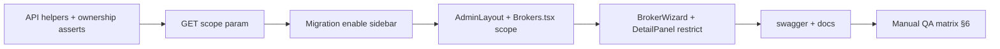

# Realtor Management — Mortgage Banker Access

**Status:** **Implemented** (2026-06-20) — see [ROLES_AND_PERMISSIONS.md](./ROLES_AND_PERMISSIONS.md)  
**Related:** [ROLES_AND_PERMISSIONS.md](./ROLES_AND_PERMISSIONS.md), [OWNERSHIP_MODEL.md](./OWNERSHIP_MODEL.md), `brokers.created_by_broker_id`

---

## 1. Goal

Enable **Mortgage Bankers** (`admin`) to use **Realtor Management** (`/admin/brokers`) with **ownership scoping**:

| Actor | Realtor Management scope |
|-------|---------------------------|
| **Mortgage Banker** (`admin`) | CRUD **Partner Realtors only** where `brokers.created_by_broker_id = their broker id` |
| **Platform Owner** (`platform_owner`) | Full directory: platform owners, mortgage bankers, and realtors |

**Non-goals for this change** (avoid scope creep / breaking changes):

- Do not change global loan/client/conversation ownership rules.
- Do not change default `GET /api/brokers` behavior for existing dropdown callers unless using an explicit new `scope` param.
- Do not promote mortgage bankers to platform owner via UI (remains SQL/manual).

---

## 2. Current state (audit)

### 2.1 Ownership field (already in DB)

```sql
-- database/schema.sql — brokers.created_by_broker_id
COMMENT 'The admin/Mortgage Banker who created this partner broker'
FOREIGN KEY (created_by_broker_id) REFERENCES brokers(id) ON DELETE SET NULL
```

Partner import migration (`20260409_010000_import_realtor_partners.sql`) set many realtors to `created_by_broker_id = 1` (legacy platform admin). **Mortgage bankers will not see those realtors** until a platform owner reassigns `created_by_broker_id` or a data backfill runs.

### 2.2 UI today

| Layer | Behavior | Issue |
|-------|----------|-------|
| **Sidebar** (`AdminLayout.tsx` ~274–278) | `hidden: !isPlatformOwner` | MB never sees menu item |
| **Page** (`Brokers.tsx`) | Title **"Realtor Management"**; `isAdmin` enables Add/Actions | Page exists but MB cannot load list |
| **Settings** (`Settings.tsx` ~616) | Section `brokers` labeled "People Management", **locked** | MB seed `is_visible=0`; owner cannot toggle |
| **Route** (`AppRoutes.tsx`) | No role guard | URL reachable but API fails |

### 2.3 API today

| Endpoint | Who passes auth today | Ownership on target | Gap |
|----------|----------------------|---------------------|-----|
| `GET /api/brokers` | **platform_owner only** | N/A | MB gets **403** — blocks page |
| `POST /api/brokers` | admin, platform_owner | Sets `created_by_broker_id = creator` when `role=broker` | MB can POST `role: admin` — **must block** |
| `PUT /api/brokers/:id` | admin, platform_owner | **None** | MB could edit **any** broker by ID — **critical** |
| `DELETE /api/brokers/:id` | admin, platform_owner | **None** | Same — **critical** |
| `GET/PUT …/profile`, share-link, avatar | admin, platform_owner | **None** | Same |
| `PATCH …/sms-opt-in` | admin, platform_owner | **None** | Same |
| `POST …/convert-to-client` | **verifyBrokerSession only** | **None** | **Unauthenticated role check** — **critical** |

### 2.4 Client today

| Component | Uses | Issue |
|-----------|------|-------|
| `Brokers.tsx` | `fetchBrokers()` | 403 for MB |
| `fetchMortgageBankers()` | `GET /api/brokers?role=admin` | 403 for MB (needs separate scope) |
| `BrokerWizard.tsx` | Role select: Partner \| Mortgage Banker | MB can pick **Mortgage Banker** — must restrict |
| `BrokerDetailPanel.tsx` | Edit role, MB assignment, SMS opt-in | No ownership guard client-side |
| `NewLoanWizard`, `Calendar`, `Conversations`, etc. | `fetchBrokers()` no scope | Today **403 for MB** — unchanged if default GET stays owner-only |

---

## 3. Target behavior (spec)

### 3.1 Ownership rule (single source of truth)

```typescript
// Pseudocode — implement once in api/index.ts
function canManageRealtor(requesterRole, requesterId, targetRow): boolean {
  if (requesterRole === "platform_owner") return true;
  if (requesterRole !== "admin") return false;
  return (
    targetRow.role === "broker" &&
    targetRow.created_by_broker_id === requesterId
  );
}
```

**Mortgage banker may never** (API enforced):

- List/edit/delete brokers with `role IN ('admin', 'platform_owner')`
- Create brokers with `role !== 'broker'`
- Change `role` or `created_by_broker_id` on a record they do not own
- Touch realtors with `created_by_broker_id IS NULL` or assigned to another MB

**Platform owner may:**

- List/create/edit/deactivate all roles (existing wizard already supports Partner + Mortgage Banker; not `platform_owner` via API types — keep that)

### 3.2 `GET /api/brokers` — add `scope` query param (backward compatible)

**Default (no `scope`) — unchanged:**

- `platform_owner` → all active brokers (existing behavior)
- everyone else → **403** (existing behavior)

**New scopes:**

| `scope` | Mortgage Banker | Platform Owner |
|---------|-----------------|----------------|
| `realtors` | `role='broker' AND created_by_broker_id = :brokerId` | All active brokers (all roles) — management grid |
| `mortgage-bankers` | `role IN ('admin','platform_owner')` active | Same |

**Rejected combinations:**

- MB calling default (no scope) → 403
- MB passing `role=admin` filter without scope → 403
- Partner (`broker`) → 403 for all broker directory endpoints

This avoids breaking `Calendar`, `Conversations`, `ClientDetailPanel` transfer picker, etc., which call `fetchBrokers()` without scope today (they already fail silently for MB).

### 3.3 Sidebar visibility

Replace hard-coded owner gate with section permissions:

```typescript
// AdminLayout.tsx — brokers menu item
{
  id: "brokers",
  label: "Realtor Management",  // align with page title
  path: "/admin/brokers",
  hidden: !isSectionVisible("brokers", true, false),
  // platform_owner: isSectionVisible returns true always
}
```

Remove `brokers` from `PLATFORM_OWNER_LOCKED_SECTIONS` so owner can disable MB access again via Settings if needed.

---

## 4. Exact file changes (checklist)

### Phase A — API core (required before UI)

#### `api/index.ts`

1. **Add helpers** (near other auth helpers, ~5120):

   - `isPlatformOwnerRole(role: string): boolean`
   - `isMortgageBankerOrOwner(role: string): boolean`
   - `async function getBrokerRow(id: number): Promise<Row | null>`
   - `async function assertCanManageBrokerTarget(req, targetId): Promise<Row>` — throws/returns 403

2. **`handleGetBrokers`** (~16524):

   - Allow `admin` + `platform_owner` when `scope` is `realtors` or `mortgage-bankers`
   - Implement SQL filters per §3.2
   - Keep default branch owner-only

3. **`handleCreateBroker`** (~16657):

   - If requester is `admin`:
     - Force `role = 'broker'` (ignore body)
     - Force `created_by_broker_id = brokerId`
     - Reject if body tries `admin` / `platform_owner`
   - If `platform_owner`: keep current behavior + post-create `created_by_broker_id` via follow-up PUT (already in UI)

4. **`handleUpdateBroker`** (~16775):

   - Load target row first
   - `assertCanManageBrokerTarget`
   - If requester is `admin`:
     - Reject `role` changes
     - Reject `created_by_broker_id` changes (always owned by self)
   - If `platform_owner`: allow all fields (consider guard: cannot deactivate last platform owner — optional)

5. **`handleDeleteBroker`** (~16960): same ownership assert before soft-delete

6. **Admin sub-handlers** — add `assertCanManageBrokerTarget` after role check:

   - `handleGetBrokerShareLinkByAdmin` (~17149)
   - `handleGetBrokerProfileByAdmin` (~17226)
   - `handleUpdateBrokerProfileByAdmin` (~17284)
   - `handleUpdateBrokerAvatarByAdmin` (~17426)
   - Inline `PATCH …/sms-opt-in` (~34914)

7. **`handleConvertBrokerToClient`** (~16447):

   - Require `admin` or `platform_owner`
   - Require target `role === 'broker'`
   - Apply ownership assert for `admin`
   - Optionally restrict convert to owned realtors only

8. **`PLATFORM_OWNER_LOCKED_SECTIONS`** (~32416): remove `"brokers"`

9. **Comments**: replace "admin/superadmin only" with accurate role names

#### `api/swagger.yaml`

- Document `GET /api/brokers` query param `scope=realtors|mortgage-bankers`
- Document 403 matrix for MB vs owner
- Document create/update restrictions for MB

---

### Phase B — Database

#### New migration `database/migrations/YYYYMMDD_HHMMSS_enable_realtor_management_for_admin.sql`

```sql
-- Enable Realtor Management sidebar for Mortgage Bankers (tenant 1)
UPDATE broker_role_section_permissions
SET is_visible = 1, updated_at = NOW()
WHERE tenant_id = 1
  AND broker_role = 'admin'
  AND section_id = 'brokers';
```

**Optional data migration** (separate file, run only after business approval):

```sql
-- Example: assign orphaned partners to MB id=3 (Daniel) — DO NOT run blindly
-- UPDATE brokers SET created_by_broker_id = 3
-- WHERE tenant_id = 1 AND role = 'broker' AND created_by_broker_id = 1 AND ...;
```

Do **not** edit `database/schema.sql` unless migration changes structure (this one does not).

---

### Phase C — Shared types

#### `shared/api.ts`

```typescript
export type BrokerListScope = "realtors" | "mortgage-bankers";

export interface FetchBrokersParams {
  page?: number;
  limit?: number;
  sortBy?: string;
  sortOrder?: "ASC" | "DESC";
  search?: string;
  role?: string; // platform_owner + default scope only
  scope?: BrokerListScope;
}
```

---

### Phase D — Redux

#### `client/store/slices/brokersSlice.ts`

1. Extend `FetchBrokersParams` with `scope`
2. Pass `scope` in axios `params`
3. **`fetchMortgageBankers`**: change to `params: { scope: 'mortgage-bankers', limit: 100 }` (drop `role: admin` alone)
4. Add **`fetchManagedRealtors`** thunk (alias) OR document that `Brokers.tsx` uses `fetchBrokers({ scope: 'realtors', ... })`

---

### Phase E — UI

#### `client/components/layout/AdminLayout.tsx`

- Brokers menu: `isSectionVisible("brokers", true, false)` instead of `!isPlatformOwner`
- Label: **"Realtor Management"** (optional consistency)

#### `client/pages/admin/Brokers.tsx`

- `const isPlatformOwner = currentBroker?.role === "platform_owner"`
- `doFetch`: pass `scope: isPlatformOwner ? undefined : 'realtors'`  
  (owner uses default or explicit all; MB uses `realtors`)
- Grid role column: MB only sees Partners — OK if API filters
- **Create button**: keep for `isAdmin`; wizard restricts MB to partners only
- Consider route guard `useEffect`: if partner role → redirect `/admin`

#### `client/components/BrokerWizard.tsx`

When `currentUser.role === 'admin'` (not platform_owner):

- Hide role `<Select>`; force `role: 'broker'`
- Hide "Assigned Mortgage Banker" dropdown; force `created_by_broker_id = currentUser.id`
- Skip `fetchMortgageBankers` for MB (optional optimization)

When `platform_owner`:

- Keep full role + MB assignment UI

#### `client/components/BrokerDetailPanel.tsx`

- Hide role / MB reassignment fields for MB editing owned realtors
- Keep SMS opt-in for MB on **owned partners only** (after API assert)

#### `client/pages/admin/Settings.tsx`

- Rename locked label `"People Management"` → **"Realtor Management"**
- Remove `locked: true` from `brokers` section **or** keep visible but not locked (after API removes from LOCKED list)

---

### Phase F — Documentation

| File | Update |
|------|--------|
| `docs/ROLES_AND_PERMISSIONS.md` | Matrix: MB gets Realtor Management (scoped); unlock `brokers` section |
| `docs/DESIGN_SYSTEM.md` | Sidebar table: MB sees Realtor Management when enabled |
| This file | Mark implemented + test plan when done |

---

## 5. Breaking change analysis

| Change | Breaks existing? | Mitigation |
|--------|------------------|------------|
| Default `GET /api/brokers` unchanged | **No** | Only add scoped access |
| MB gains list via `scope=realtors` | **No** | New capability |
| PUT/DELETE ownership enforce | **Yes for attackers** | MB could previously mutate any id — **security fix**, not regression for legitimate MB |
| `convert-to-client` auth added | **Yes if abused** | Endpoint was open — fix |
| Sidebar visible for MB | **No** | New feature |
| Legacy realtors with `created_by_broker_id=1` | **Visible gap for MB** | Platform owner reassigns or optional backfill |
| `fetchMortgageBankers` scope fix | **Fixes** BrokerWizard 403 for MB | Uses `scope=mortgage-bankers` |

---

## 6. Security test plan (must pass before deploy)

### Mortgage Banker (admin) tests

1. `GET /api/brokers` → **403**
2. `GET /api/brokers?scope=realtors` → only own partners
3. `GET /api/brokers?scope=realtors` → does **not** include other MB’s partners
4. `POST /api/brokers` with `role: admin` → **403** or forced to `broker`
5. `PUT /api/brokers/:otherMbId` → **403**
6. `PUT /api/brokers/:ownRealtorId` with `role: admin` → **403**
7. `DELETE /api/brokers/:otherRealtorId` → **403**
8. `GET /api/brokers/:ownRealtorId/profile` → **200**
9. `GET /api/brokers/:platformOwnerId/profile` → **403**
10. `POST /api/brokers/:id/convert-to-client` on non-owned id → **403**

### Platform owner tests

1. `GET /api/brokers?scope=realtors` → all active staff (all roles)
2. Create Mortgage Banker + Partner, assign MB on partner
3. Change `created_by_broker_id` on any partner
4. Deactivate any non-self broker

### UI tests

1. MB: sidebar shows **Realtor Management** after migration
2. MB: page loads grid, Add Realtor creates partner under self
3. MB: wizard does not show role / MB picker
4. Owner: full grid includes MB + owner rows; wizard unchanged
5. Partner: no sidebar item; direct URL → redirect or empty + 403

---

## 7. Recommended implementation order



**Deploy note:** Ship **API (Phase A) before or with UI (Phase E)** so MB never gets a visible menu that 403s on mutations. Migration can ship with UI.

---

## 8. Out of scope (follow-up tickets)

| Item | Why separate |
|------|--------------|
| `GET /api/brokers?scope=assignable` for client transfer / calendar | Different product rules; today MB already gets 403 |
| Route guard component for `/admin/brokers` | Nice-to-have; API is source of truth |
| Backfill `created_by_broker_id` for imported realtors | Business decision per MB |
| Wire `NewLoanWizard` `selectedBrokerId` to loan create API | Unrelated bug |
| Remove dead `superadmin` checks | Cleanup ticket |

---

## 9. Summary

The product **already has** Realtor Management UI and partial API (create/update/delete for `admin`), but:

1. **Menu + list are platform-owner-only** (`GET` 403 + hard-coded sidebar).
2. **Ownership is not enforced** on mutations — MB can change any broker if they know the ID.
3. **`convert-to-client` has no role check**.

The safe path is: **scoped `GET` + strict ownership asserts on every broker-targeting handler**, then **enable sidebar via DB seed/migration**, then **restrict wizard UI for MB**.

No schema enum changes required. Default `GET /api/brokers` stays owner-only to avoid breaking other screens.

---

*Audit date: June 2026. Re-review after implementation.*
