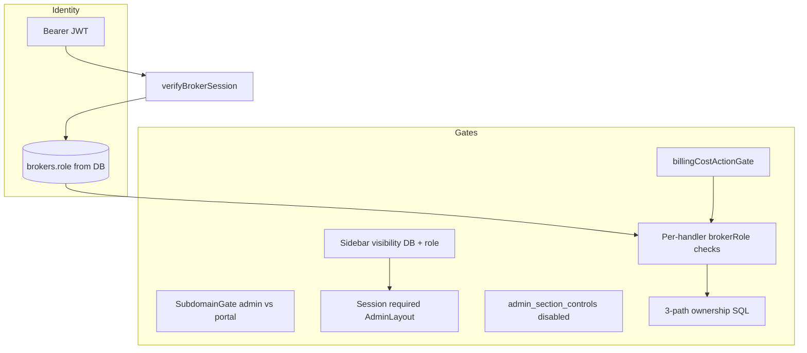

# Roles, Permissions & Access Control

**Encore Mortgage CRM · Authoritative reference · June 2026**

This document describes **who can do what** across the admin portal, client portal, and API. It reflects the live schema and code paths in `database/schema.sql`, `api/index.ts`, and the React admin shell.

For **data scoping** (how loans/clients are filtered to a broker), see also [OWNERSHIP_MODEL.md](./OWNERSHIP_MODEL.md).

---

## Table of contents

1. [Architecture overview](#1-architecture-overview)
2. [Identity types](#2-identity-types)
3. [Broker roles (canonical)](#3-broker-roles-canonical)
4. [Legacy `superadmin`](#4-legacy-superadmin)
5. [Authentication & authorization flow](#5-authentication--authorization-flow)
6. [Data access scopes](#6-data-access-scopes)
7. [UI access: sidebar & routes](#7-ui-access-sidebar--routes)
8. [Feature × role matrix](#8-feature--role-matrix)
9. [API authorization reference](#9-api-authorization-reference)
10. [Billing & metered actions](#10-billing--metered-actions)
11. [Client portal](#11-client-portal)
12. [Subdomain & host gates](#12-subdomain--host-gates)
13. [Configuration tables](#13-configuration-tables)
14. [Known gaps & inconsistencies](#14-known-gaps--inconsistencies)
15. [Recommendations](#15-recommendations)
16. [Source file index](#16-source-file-index)

---

## 1. Architecture overview

Authorization is **layered**, not a single RBAC matrix:



| Layer | Enforced where | Can be bypassed? |
|-------|----------------|------------------|
| Host/subdomain | `client/App.tsx` | No (redirect) |
| Login session | `AdminLayout`, `verifyBrokerSession` | No for API |
| Sidebar visibility | `broker_role_section_permissions` + hard-coded owner items | **Yes** — direct URL navigation |
| Section disabled | `admin_section_controls` | Partial — redirects to `/admin` when disabled |
| API role checks | Individual handlers in `api/index.ts` | No (403) |
| Ownership scoping | SQL in handlers | No for scoped roles |
| Billing ladder | `billingCostActionGate`, Stripe owner routes | No when enforce mode active |

**Important:** The frontend is **not** a security boundary. Any authenticated broker can type `/admin/broadcasts` in the address bar; the page may load partially, but **API calls return 403** for unauthorized roles.

---

## 2. Identity types

| Identity | Table | JWT `userType` | Portal |
|----------|-------|----------------|--------|
| **Broker staff** | `brokers` | `"broker"` | `admin.*` → `/admin/*` |
| **Borrower / client** | `clients` | `"client"` | `portal.*` → `/portal/*` |

Brokers and clients use **separate** login flows, JWT secrets paths, and middleware (`verifyBrokerSession` vs `verifyClientSession`).

---

## 3. Broker roles (canonical)

### Database source of truth

```sql
-- database/schema.sql — brokers.role
ENUM('broker', 'admin', 'platform_owner') NOT NULL DEFAULT 'broker'
```

Added in migration `20260527_160000_add_platform_owner_role.sql`.

### UI labels

| DB `role` | Product label | Typical user |
|-----------|---------------|--------------|
| `broker` | **Partner Realtor** | Referral partner; share-link loans |
| `admin` | **Mortgage Banker** | Loan officer (MB) |
| `platform_owner` | **Platform Owner** | Tenant operator (Encore leadership) |

TypeScript: `shared/api.ts` → `Broker.role: "broker" | "admin" | "platform_owner"`.

### Role capabilities (summary)

| Capability | `broker` | `admin` | `platform_owner` |
|------------|:--------:|:-------:|:----------------:|
| See own pipeline/clients (3-path) | ✓ | ✓ | ✓ |
| See **all** tenant loans/clients/documents | ✗ | ✗ | ✓ |
| Dashboard / metrics for whole tenant | ✗ | ✗ | ✓ |
| Conversations & email (global inbox) | ✗ | ✗ | **✗** (ownership-scoped for **all** roles) |
| Create brokers via API | ✗ | ✓ (partners only) | ✓ |
| List all brokers (`GET /api/brokers`) | ✗ | ✗ (use `scope=realtors`) | ✓ |
| Realtor Management UI | ✗ | ✓ (owned partners) | ✓ (full directory) |
| Reminder Flows UI | ✗ | ✗ | ✓ |
| Message Templates UI | ✗ | ✗ | ✓ |
| Broadcasts (SMS/email blasts) | ✗ | ✗ | ✓ |
| Billing / Stripe | ✗ | ✗ | ✓ |
| Update tenant settings | ✗ | ✓ | ✓ |
| Configure sidebar per role | ✗ | ✗ | ✓ |
| Toggle admin section controls | ✗ | ✓ | ✓ |
| MISMO export (UI) | ✗ | ✓ | ✓ |
| Assign loan in New Loan Wizard to another MB | ✓ (platform owner via `broker_user_id`) | self only | self only |

### Design intent (platform_owner migration)

From `20260527_160000_add_platform_owner_role.sql`:

- **platform_owner** = tenant-wide visibility for loans, clients, documents, reports.
- **Exclusive UI (platform owner only):** Reminder Flows, Communication Templates, Broadcasts, Billing.
- **Realtor Management:** Mortgage bankers manage **owned** partner realtors (`created_by_broker_id`); platform owner sees the full directory.
- **Conversations and Email stay ownership-scoped for ALL roles** — privacy preserved even for platform owners.

---

## 4. Legacy `superadmin`

### Status: **deprecated — not assignable**

| Evidence | Detail |
|----------|--------|
| DB enum | Never included `superadmin` |
| Assignable roles | Only `broker`, `admin`, `platform_owner` |
| Code references | ~22 in `api/index.ts`, ~8 in client components |
| Effect today | **Dead branches** — condition never true for real users |

The name **`superadmin`** was a pre–platform-owner concept for “see everything.” That role is now **`platform_owner`**, with the explicit exception that **conversations/email are not global**.

### Confusing variable names

| Location | Variable | Actually checks |
|----------|----------|-----------------|
| Dashboard stats, loan list scope | `isSuperAdmin` | `platform_owner` ✓ |
| Reminder flow executions | `isSuperAdmin` | `platform_owner` ✓ |
| **Conversations threads** | `isSuperAdmin` | `superadmin` ✗ **dead code** |

### Client UI still checks `superadmin`

These files include `user?.role === "superadmin"` (never true):

- `client/pages/admin/Settings.tsx`
- `client/components/NewLoanWizard.tsx`
- `client/components/LoanOverlay.tsx`
- `client/components/PreApprovalLetterModal.tsx`
- `client/components/RealtorProspectingBoard.tsx`

**Action:** Replace with `platform_owner` (or shared helper) in a future cleanup pass.

---

## 5. Authentication & authorization flow

### Broker login JWT claims

Set at login (`api/index.ts` ~11420):

| Claim | Purpose |
|-------|---------|
| `brokerId` | Primary key |
| `email` | Display / audit |
| `role` | Role **at login time** (informational) |
| `userType` | Must be `"broker"` |
| `jti` | Revocation |

### What the API actually trusts

`verifyBrokerSession` (`api/index.ts` ~10899):

1. Validates Bearer JWT + `userType === "broker"`.
2. Checks `jti` not revoked.
3. **Reloads broker row from DB** (`status = 'active'`).
4. Sets `(req as any).brokerRole = brokers[0].role` — **not** JWT `role`.

**Implication:** If an admin changes a broker’s role in the DB, the JWT `role` claim is stale until re-login, but **`brokerRole` on each request is always current**.

### Middleware helpers

| Helper | Purpose |
|--------|---------|
| `verifyBrokerSession` | All `/api/*` broker routes |
| `verifyClientSession` | Client portal routes |
| `requirePlatformOwner` | Billing Stripe + owner-only billing routes |
| `billingOwnerAuth` | `[verifyBrokerSession, requirePlatformOwner]` |
| `billingCostActionGate` | Blocks metered outbound actions when billing ladder says so |

---

## 6. Data access scopes

### Global vs ownership-scoped

| Resource | `platform_owner` | `admin` / `broker` |
|----------|------------------|---------------------|
| Loans (`loan_applications`) | All tenant rows | 3-path ownership only |
| Clients | All tenant rows | 3-path ownership only |
| Documents / task files | All tenant rows | 3-path ownership only |
| Dashboard aggregates | Tenant-wide | Scoped to owned loans |
| Realtor prospects | All tenant rows | `created_by_broker_id` OR `owner_broker_id` |
| **Conversation threads** | **Ownership rules** | **Ownership rules** |
| **Email mailboxes** | Own + assign rules | Own + assign rules |

### Four-path ownership (admin & broker)

A broker can access a client/loan if **any** path matches:

| # | Path | Column |
|---|------|--------|
| 1 | Direct client assignment | `clients.assigned_broker_id` |
| 2 | Mortgage banker on loan | `loan_applications.broker_user_id` |
| 3 | Partner on loan | `loan_applications.partner_broker_id` |
| 4 | MB owns the partner on the loan | `brokers.created_by_broker_id` via `partner_broker_id` |

Standard pattern: `hasGlobalLoanAccess = brokerRole === "platform_owner"` else `LOAN_OWNERSHIP_WHERE_SQL` / `assertLoanAccess()`.

### Conversation-specific rules (all roles)

Threads visible when the requesting broker:

- Is `thread.broker_id`, OR
- Thread is unassigned (`broker_id IS NULL`), OR
- Participated in thread, OR
- Loan linked via 3-path ownership, OR
- **(admin only)** Thread assigned to an **inactive** broker (recovery path)

**platform_owner does not bypass these rules** — by design.

---

## 7. UI access: sidebar & routes

### Route registration

`client/AppRoutes.tsx` wraps all `/admin/*` pages in `<AdminLayout>` with **no per-route role guard**. Protection is:

1. Session token required (redirect to `/broker-login`).
2. Sidebar hides items (`hidden: true`).
3. Disabled sections redirect to `/admin`.
4. API returns 403 on unauthorized actions.

### Sidebar logic (`AdminLayout.tsx`)

| Mechanism | Applies to |
|-----------|------------|
| `isPlatformOwner` → always show | `platform_owner` |
| `isSectionVisible(sectionId, adminDefault, brokerDefault)` | `admin`, `broker` — reads `broker_role_section_permissions` |
| Hard-coded `hidden: !isPlatformOwner` | Broadcasts, Billing, Reminder Flows, Templates |
| `isSectionVisible("brokers", …)` | Realtor Management — MB default **on** (migration `20260620_220000`) |
| `hasActiveMailbox` | Email menu item |
| `admin_section_controls.is_disabled` | All visible items — “Coming Soon” + redirect |

### Default sidebar visibility (seed)

From `20260527_160001_add_broker_role_section_permissions.sql`:

| Section | `admin` (MB) default | `broker` (Partner) default |
|---------|:--------------------:|:--------------------------:|
| Home, Pipeline, Clients, Calendar, Income Calc, Mortgi | ✓ | ✓ |
| Tasks, Documents, Conversations, Email, Reports, Settings | ✓ | ✗ |
| Reminder Flows, Templates | ✗ | ✗ |
| Realtor Management (`brokers`) | ✓ | ✗ |
| Broadcasts, Billing | ✗ (UI: owner only) | ✗ |

`platform_owner` bypasses this table entirely.

### Platform-owner-locked sections

Cannot be enabled for other roles via Settings (`PLATFORM_OWNER_LOCKED_SECTIONS` in `api/index.ts`):

- `reminder-flows`
- `communication-templates`

(`brokers` / Realtor Management is configurable per role; MB default visible via migration.)

---

## 8. Feature × role matrix

Legend: **G** = global tenant, **O** = ownership-scoped, **P** = platform_owner only, **A** = admin + platform_owner, **All** = any authenticated broker, **—** = N/A

### Core CRM

| Feature | Partner `broker` | MB `admin` | `platform_owner` |
|---------|:----------------:|:----------:|:----------------:|
| Home / dashboard stats | O | O | G |
| Loan pipeline (view) | O | O | G |
| Loan pipeline (move status) | O* | A + own | G + A check |
| Clients & leads (view) | O | O | G |
| Create client | All | All | All |
| Create loan (manual wizard) | All | All | All |
| Tasks (instance CRUD) | O | O | G |
| Documents | O | O | G |
| Calendar / scheduler | All | All | All |
| Income calculator | All | All | All |
| Mortgi AI chat | All† | All† | All† |
| Reports & analytics | O‡ | O‡ | G |
| Settings (read) | All | All | All |
| Settings (write tenant) | ✗ | A | A |

\* Must own loan via 3-path.  
† Subject to Mortgi enabled + billing gate.  
‡ Visibility via sidebar permissions; data scoped like other modules.

### Communications

| Feature | Partner | MB | Owner |
|---------|:-------:|:--:|:-----:|
| Conversations (SMS/voice threads) | O | O | O |
| Send SMS / place call | O + billing | O + billing | O + billing |
| Email inbox | O§ | O§ | O§ |
| Assign mailbox to another broker | self | A/P | A/P |
| Broadcasts | ✗ | ✗ | P |

§ Requires active mailbox; sidebar default hidden for partners.

### Platform administration

| Feature | Partner | MB | Owner |
|---------|:-------:|:--:|:-----:|
| Realtor Management UI | ✗ | O (owned partners) | G |
| List all brokers API (`GET /api/brokers`) | ✗ | O (`scope=realtors`) | G |
| List mortgage bankers (`scope=mortgage-bankers`) | ✗ | A | A |
| Create broker API | ✗ | A (partners only) | A |
| Reminder Flows UI | ✗ | ✗ | P |
| Reminder Flows API (CRUD) | All¶ | All¶ | All¶ |
| Message Templates UI | ✗ | ✗ | P |
| Role section permissions (PUT) | ✗ | ✗ | P |
| Admin section controls (PUT) | ✗ | A | A |
| Billing page / Stripe | ✗ | ✗ | P |
| Billing team notice banner | ✓ | ✓ | — (uses `/billing/access`) |

¶ **API gap:** Handlers only require `verifyBrokerSession`; UI hides section for non-owners.

### Partner / prospecting

| Feature | Partner | MB | Owner |
|---------|:-------:|:--:|:-----:|
| Realtor prospecting board | O | O | G |
| Pre-approval letter (set amount) | partner rules | A | A |
| MISMO export | ✗ | ✓ | ✓ |

---

## 9. API authorization reference

### Platform owner only (`brokerRole === "platform_owner"`)

| Endpoint group | Examples |
|----------------|----------|
| Broker directory (default `GET`) | `GET /api/brokers` (no scope) |
| Broadcasts | `GET/POST/PATCH/DELETE /api/realtor-broadcasts/*` |
| Billing owner | `GET /api/billing/access`, Stripe checkout/confirm/webhook handlers |
| Role permissions write | `PUT /api/admin/role-section-permissions` |
| SMS diagnostic | `GET /api/admin/sms-check` |

### Scoped broker lists (`admin` \| `platform_owner`, requires `scope`)

| Endpoint | Behavior |
|----------|----------|
| `GET /api/brokers?scope=realtors` | MB: owned partners only; owner: all staff |
| `GET /api/brokers?scope=mortgage-bankers` | Active MBs + platform owners (dropdowns) |

### Admin or platform owner (`admin` \| `platform_owner`)

| Endpoint group | Examples |
|----------------|----------|
| Create broker | `POST /api/brokers` |
| Tenant settings write | `PUT /api/settings` |
| Admin section controls write | `PUT /api/admin/section-controls` |
| Loan status PATCH | `PATCH /api/loans/:id/status` (plus ownership unless owner) |
| Pre-approval / certain loan mutations | Various `PATCH` handlers |
| Mortgi config write | `PUT /api/ai/config` |
| Mailbox assign to others | Email mailbox PATCH (also dead `superadmin` OR) |

### Any authenticated broker (`verifyBrokerSession` only)

Most read/write on **owned** data: loans, clients, tasks, conversations, send SMS/email (with ownership + billing gates), reminder flows CRUD, task templates, etc.

### Global read flag pattern

```typescript
const hasGlobalLoanAccess = brokerRole === "platform_owner";
// Used in: handleGetLoans, handleGetLoanDetails, handleGetClients, documents, etc.
```

### Dead `superadmin` OR patterns (harmless but stale)

Still present in:

- `handleGetConversationThreads` — `isSuperAdmin = brokerRole === "superadmin"`
- `handleUpdateLoanStatus` — allows `superadmin` alongside admin/owner
- `handleUpdateSettings`, `handleUpdateAdminSectionControls`
- Email mailbox assignment
- Notification query: `role IN ('admin', 'superadmin', 'platform_owner')`

---

## 10. Billing & metered actions

Billing uses a **separate ladder** from CRM roles. All broker roles can hit metered endpoints, but **`billingCostActionGate`** may block outbound actions.

| Role | Billing UI | API |
|------|------------|-----|
| `platform_owner` | Full `/admin/billing`, Stripe, `BillingSuspendedWall` | `/api/billing/access`, Stripe routes via `billingOwnerAuth` |
| `admin`, `broker` | Hidden from sidebar; `BillingTeamNoticeBanner` | `/api/billing/team-notice` (read-only) |

Shared logic: `shared/billing-access.ts`, `client/hooks/useBillingAccess.ts`, `client/components/billing/BillingActionGate.tsx`.

Metered actions (when enforce mode active): conversational SMS/email, broadcasts, scheduler create, Mortgi messages, voice, etc.

---

## 11. Client portal

| Aspect | Detail |
|--------|--------|
| Auth | `verifyClientSession`, JWT `userType: "client"` |
| Routes | `/portal/*`, `/client-login`, public apply wizard |
| Data access | Own client row, own loan applications, own tasks |
| Admin overlap | None — clients never receive broker JWT |

---

## 12. Subdomain & host gates

`SubdomainGate` in `client/App.tsx`:

| Host prefix | Allowed paths |
|-------------|---------------|
| `admin.*` | `/admin*`, `/broker-login` |
| `portal.*` | `/portal*`, `/client-login`, `/wizard`, `/apply`, `/scheduler` |

Wrong subdomain → redirect to default home for that host (prevents broker login on portal host confusion).

---

## 13. Configuration tables

| Table | Controls | Who can change |
|-------|----------|----------------|
| `brokers.role` | Primary RBAC | Platform owner via People Management (API) |
| `broker_role_section_permissions` | Sidebar for `admin` / `broker` | Platform owner (`PUT /api/admin/role-section-permissions`) |
| `admin_section_controls` | Disable section + tooltip | Admin or platform owner |
| `system_settings` | Tenant feature flags (Mortgi, billing, etc.) | Admin or platform owner (`PUT /api/settings`) |

---

## 14. Known gaps & inconsistencies

| # | Issue | Severity | Detail |
|---|-------|----------|--------|
| 1 | **`superadmin` dead code** | Medium (maint.) | 30+ references; never matches DB. Use `platform_owner`. |
| 2 | **`isSuperAdmin` naming** | Medium (maint.) | Means `platform_owner` in loans; means `superadmin` in conversations. |
| 3 | **No route-level role guards** | Low–Med | Hidden pages reachable by URL; API 403 only. |
| 4 | **Reminder flows API unguarded** | **High** | Any broker can CRUD flows via API though UI is owner-only. |
| 5 | **`GET /api/brokers` vs `fetchMortgageBankers`** | — | **Resolved:** `scope=mortgage-bankers` for dropdowns; default list remains owner-only. |
| 6 | **Create broker API vs Realtor Management UI** | — | **Resolved:** MB has scoped Realtor Management at `/admin/brokers`. |
| 7 | **New Loan Wizard broker assign** | — | **Resolved:** `broker_user_id` on create; platform owner may assign, MB self-only. |
| 8 | **JWT `role` claim stale** | Low | AuthZ uses DB; JWT role can mislead client-only checks until re-login. |
| 9 | **`OWNERSHIP_MODEL.md` outdated** | Med (docs) | Still lists `superadmin` as top role — superseded by this doc. |
| 10 | **Contact submissions route** | Low | Hidden in sidebar (`hidden: true`); API may still be reachable. |

---

## 15. Recommendations

### Short term (security)

1. Add `requirePlatformOwner` to reminder flow **write** handlers (POST/PUT/DELETE), or explicit role check matching UI.
2. Remove all `superadmin` string checks; replace with `platform_owner` or delete dead branches.
3. Add route guards in `AppRoutes.tsx` for owner-only pages (`/admin/broadcasts`, `/admin/billing`, etc.). Realtor Management (`/admin/brokers`) is allowed for MB with API ownership enforcement.

### Medium term (product)

4. ~~Wire `selectedBrokerId` from `NewLoanWizard`~~ **Done** — `broker_user_id` on `POST /api/loans/create`.
5. ~~Split `GET /api/brokers`~~ **Done** — `scope=realtors` and `scope=mortgage-bankers` for admin+ callers.
6. Tighten `CreateBrokerRequest.role` — today API accepts `broker` \| `admin` but not `platform_owner` (correct); document promotion path (DB/manual).

### Long term (architecture)

7. Centralize role helpers in `shared/roles.ts`: `isPlatformOwner`, `isMortgageBanker`, `canManageBrokers`, etc. — use in API **and** client.
8. Align `OWNERSHIP_MODEL.md` handler table with `platform_owner` global access flags.

---

## 16. Source file index

| Area | Path |
|------|------|
| DB role enum | `database/schema.sql` (~256) |
| Platform owner migration | `database/migrations/20260527_160000_add_platform_owner_role.sql` |
| Section permissions seed | `database/migrations/20260527_160001_add_broker_role_section_permissions.sql` |
| Shared types | `shared/api.ts` (`Broker`, `RoleSectionPermission`) |
| Billing access ladder | `shared/billing-access.ts` |
| API auth middleware | `api/index.ts` (`verifyBrokerSession`, `requirePlatformOwner`) |
| Loan global access | `api/index.ts` (`hasGlobalLoanAccess`) |
| Conversation scoping | `api/index.ts` (~26643+) |
| Broadcast gate | `api/index.ts` (`handleCreateBroadcast`, ~41064) |
| Admin init bootstrap | `api/index.ts` (`handleAdminInit`) |
| Routes (no role guard) | `client/AppRoutes.tsx` |
| Subdomain gate | `client/App.tsx` |
| Sidebar & session | `client/components/layout/AdminLayout.tsx` |
| Role permissions Redux | `client/store/slices/roleSectionPermissionsSlice.ts` |
| Section controls Redux | `client/store/slices/adminSectionControlsSlice.ts` |
| Billing UI hook | `client/hooks/useBillingAccess.ts` |
| Ownership deep dive | `docs/OWNERSHIP_MODEL.md` |
| Validate loan create (unrelated) | `scripts/validate-create-loan-schema.ts` |

---

## Appendix A — Quick role decision tree

```
Is user logged in as broker?
├─ No → client portal or public routes only
└─ Yes → read brokers.role from DB (not JWT)
    ├─ platform_owner → tenant-wide loans/clients/docs + owner-only admin features
    │                   → conversations/email STILL ownership-scoped
    ├─ admin → MB: own data via 3-path + many admin APIs
    └─ broker → partner: own data via 3-path, narrower sidebar defaults
```

---

## Appendix B — Promoting a user to platform owner

There is **no self-service UI** to grant `platform_owner`. Promotion is done via SQL (as in the migration):

```sql
UPDATE brokers SET role = 'platform_owner'
WHERE id = ? AND tenant_id = ? AND status = 'active';
```

User must **log out and back in** for client-side role-dependent UI (sidebar hard gates) to refresh; API picks up new role immediately via `verifyBrokerSession`.

---

*Last audited against `origin/main` codebase, June 2026. Re-audit after major auth or billing changes.*
